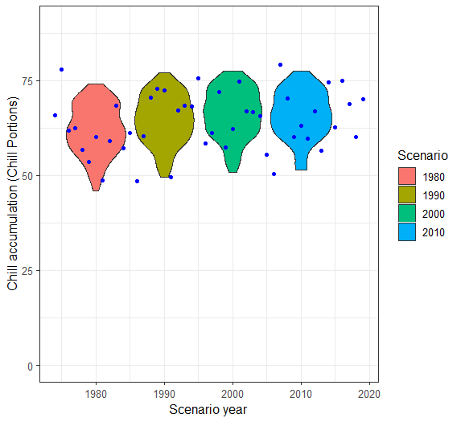

```{r setup, include=FALSE}
knitr::opts_chunk$set(echo = TRUE)
```

# Foreword

This R Markdown document is a final output for Tree Phenology using R (Winter Semester 2022). I am completing this file while sitting on my hard chair during a cold night in March. This document will be a "documentation" of how I learned R for the first time truly. With the help of the html guide for this course, notes from the lectures, and of Mr. Google.

I hope this work will be of use somehow to the course's creators-- a humble perspective from an R beginner who strove to learn things from bottom upwards. For sure, I will be forever grateful to the existence of this course because it introduced me to the tool I hope I will be using often in my career. *Prost!*

Additionally, since I am a self-proclaimed nerd who likes thoroughly dissecting concepts, each chapter will start with condensed descriptions of the themes discussed in class (and I use mathematical and logic operation symbols often to show relationships), but these are not complete regurgitation of what was discussed; some are seemingly trivial terms which are new to me, followed by the important bit-- the exercises and my take on them.

I hope this work of an R newbie is viewed with kindness and consideration. Admittedly, most of the time I just followed step by step the templates given as examples. As I came across problems, I attempted to troubleshoot and improvise what works and what does not, in order to progress in the exercises. My main aim in taking this course is to learn how R works in the context of scientific research.

# **03 Tree dormancy**

Dormancy prevents injury during winter. Triggered by environmental signals [photo-periods *f(latitudes*) + temperature f(*geographical location, photoperiods, climate*)], works through interaction of physiological processes.

Stages of dormancy:

1.  Dormancy establishment- environment signals (declining temp and photoperiod)

2.  Endo dormancy- tree's endogenous properties dictate this (chilling temp)

3.  Eco dormancy-acclimatization but not deeply dormant, no morphological /development changes. temperature- main environmental driver

    (warm temperatures)

4.  growth resumption

Physiological processes regulating dormancy:

-   Transport of water and solute stops (transport)

-   plant hormones and signaling compounds (Phyto-hormones)

-   actions of genes (genetics)

-   dynamics of non structural carbohydrates

Dormancy determination

Dormancy-\> prevents injuries. Cold is required to regain the capabilities to grow

Endo-dormancy, eco-dormancy (growth is prevented in unfavorable condition, heat exposure)

Empirical-\> growth chambers, shoots with buds collected in winter. 7 to 12 days. Buds growth or not. Longer exposure to chilling? Chill period, forcing period

Statistical-\> Long phenological datasets ) temp records. Based of long series of dates, previous temperature records. Calculates max, mean temperatures, flowering dates. Chilling and heat accumulation. Flowering dates with mean and max temperatures. Number of independent variables\> dependent variables (for PLS)

Chilling period-\> when model coefficients are + significant values (temperature delays bloom dates)

Forcing period-\> when model coefficients are -significant values (less temperature delays bloom dates)

*experimental* (empirical)

*statistical-* (dormancy determination) research purposes, collected in research centers. new commercial cultivars. Endodormancy break, chilling hours

Phenological datasets

Phenology in practical agriculture-\> irrigation scheduling (when water is mostly taken up)

Tree-\> budding, flowering, fruiting stages

Old vs BBCH scales

1.  letters from A to J- every 2 days during spring. earliest and latest state

2.  limitations; need for common phenology across the world

    -need for standardized scale

    -use of numbers is more practical than letters

Scales for plant growth stages

Cereals (BBCH, monocot, dicot)

-   stages easily recognizable in field
-   stages graded in order of appearance
-   2 digit code-\> Principal g. stage (0-9), secondary g. stage (0-9)


Exercise:

1.  Put yourself in the place of a breeder who wants to calculate the temperature requirements of a newly released cultivar. Which method will you use to calculate the chilling and forcing periods? Please justify your answer.

    To calculate temperature requirements of a newly-released cultivar, I would do **empirical** first (trial and error, actual field experiments); but this could take time and could be expensive because the researcher would have to wait seasons by seasons and replicate to have enough repetitions, simulate the conditions through controlled environment (growth chamber). **Statistical** can be done with available historical data (long phenological data), and it has to be "applicable" to the new cultivar, meaning, **more similarities than differences**. However, the two methods could be done in parallel since they require different sets of data anyway. Results can be compared to verify if the models generated through statistical method is acceptable enough.

<!-- -->

2.  Which are the advantages (2) of the BBCH scale compared with earlier scales?

    a\. Standardized across the globe

    b\. More specific (has primary and secondary classifications in contrast to old version that used single letters)

3.  Classify the following phenological stages of sweet cherry according to the BBCH scale:

    budding- 54

    flowering- 65

    fruiting- 87

{alt=""}

# **04 Climate change and impact projection**

**Drivers of climate change**

-   Sun-cyclic variability (evidence: sunspots). Small portion

-   Aerosols- suspension of particles (dust, fires, seasalts, manmade), deflects some sunlight from Earth-\> cooling effect. Major driver in industrial areas

-   Clouds- can have warming or cooling effect; depends on the type of cloud (varied effects depending on altitude, etc.). Lower= more sunlight reflected. Effect is very complex.

-   Ozone- tropospheric ozone (bad ozone, smog); stratospheric ozone (good ozone, blocks UV-B). +GHG -\> warming effect. Destroyed by CFCs (ozone hole in S hemisphere, was fixed when the world took notice and acted-\> *Montreal protocol of 1987*)

-   Surface albedo- properties of reflecting surface (land surface); light surfaces-\> more reflection, dark surfaces-\> less reflection

    -deforestation- raises albedo

    -drying-raises albedo

    -   feedback loop-accelerates whatever is in place

        -less ice/snow-\>lower albedo-\> less heat reflection-\>warming

-   GHGs (CO2, CH4, N2O)- atmospheric gases that absorb long-wave radiation (traps heat)-\> warming effect

    -N2O, CH4\~ agriculture

-   Long term drivers- trends in solar activity (star life cycle); ocean currents/continents; plants/animals (hypothetical)- imbalance of CO2 (heating due to higher CO2)-\> flipping between "Snowball Earth" and "Greenhouse Earth"; volcanic and meteorite activity; Milankovic cycles (variation in tilt, eccentricity, precession of Earth's orbit)

these factors are quantifiable: attribution studies

models have been crafted, compared to observed, and the recent increase(since industrialization) in global temperature can be explained by GHGE from human activities (burning of fossil fuels)

trends of CO2 emissions is still going up (new climatic territories)

degree of CO2 concentrations never seen by mankind, at high rates

**Recent warming**

Starting around 1980s, there is dramatic rise in global temperatures. Globally warmest years are very recent.

-\> Siberia (2020) \>8C warmer (possibility of +feedback=acceleration of warming effect)

Maunder minimum-\> minimal sunspots, low solar radiation

Industrialization- GHGEs

Global surface temperatures started with warming, then a long period of cooling.

+1.5C is optimistic expectation (global temperature increase), but still requires adaptation-\> +5C would cause major global changes unseen before by mankind

Rainfall is harder to predict than temperatures (no clear trends)

Moisture deficit in EU

Places with airports= good data (weather stations)

**Future Scenarios**

No way of validating which scenario is correct

-   GCM (Global Circulation Models)- computational effort (major drivers, feedbacks considered)

    Climate drivers

    Scenarios (fossil-intensive, low emissions, high emissions, intermediate)

-   RCPs (Representative Concentration Pathways)

    2.6, 4.5, 6.0, 8.5- additional radiative forcing; higher number, more heating (higher emissions)

    Downscaling (Dynamical downscaling, Statistical downscaling)- needed to increase resolution (more detail)

    GCM\>RCM\>Impact Model

    Statistical downscaling- higher resolution

    -\> use high resolution temp map, calculate diff between temperature map and average of pixel of RCM, delta change procedure (calculate bias), correct output using bias

    in chillR, weather generator is implemented to reduce timestep of climate scenarios (temporal downscaling)

-   Climate change projection process

    RCPs\> GCM \> downscaling (RCM) \> statistical downscaling\>Temperature, Precipitation, CO2 projections \> Impact projection (e.g. what will happen to a certain species; biological response)

    many ways to do process (no way to tell which is best), do all of the combinations and see what the models say

    gap: in context of agriculture, models are created by data scientists who are not agricultural experts, there are gaps

-   Risk assessment (agricultural context)- additional step needed to project impacts in agriculture

**Future temperatures**

RCP 8.5: rise of 2 to 11C in global temperatures

Tipping point- point of sudden transition to new state (poorly considered in impact projections)

-\> meltwater from Greenland dilutes salt concentration, less driver for global ocean currents (cold, salty water is heaviest); further slowing= transition of global climate to new state

-Greenland, arctic iceloss-\> weakened albedo

-Permafrost thawing-\> CO2 and methane release (more warming)

full of uncertainties

emissions can be translated to temperature increase

Paris Agreement: 1.5C increase only

-\> 2060, CO2 neutral atleast

**Impact Projection**

system response

-   Statistical models- climate parameters x impact measure; used to explain past trends and project future impacts

    -\> species distribution modeling- climate parameters x presence/absence of species

    ensemble modelling- using \>1 approach, check overlaps

    e.g. BiodiversityR package

    limitations- things change, statistical relationships may not remain true; missing important factors; assumption: species distribution is in equilibrium with climate (x agricultural setups); must state uncertainties explicitly

-   Process-based models- computation, data, simulation to get quantitative projection of performance (e.g. crop models, phenology models, etc.); complex since need to include all relevant system components

    projection of crop yields (limitations: does not consider real life threats-\> diseases, weeds, etc.)

    limitations- processes not completely understood; complex systems not modeled realistically; unclear uncertainties

    complexity vs precision (more parameters, more errors)- aim for intermediate complexity to minimize errors "sweet spot"

    express uncertainties and error estimates (always)

    yield projections are complex, more uncertainties

    *before doing such projections, make sure you have a way to quantify the uncertainties!*

-   Climate analogue models- comparing similar existing climates with projected climates; adaptation options

    limitations: (analog vs target) other factors may be too similar-\> cannot learn new things; other factors may be too different (e.g. cultural management, etc.)-\>too complex to model, huge uncertainties

Common limitations: climate data are scarce or poor quality; non-climatic factors also change through time, and difficult to project; CO2 can only be included in process-based models

Projecting climate-change impacts in complex agricultural systems:

need to understand what is happening: weather, climate, and crops + all other relevant factors affecting system performance; consider and communicate uncertainties

Exercise:

1.  Main drivers of climate change (decade to century scale), explain mechanism through which the currently most important driver affects our climate.

    *at century scale:* Sun (radiation), Aerosols (liquid,solid, mixed suspensions), Clouds (cooling and warming effect), Ozone (destroyed by CFCs, Montreal protocol of 1987), Surface albedo (reflects radiation) , GHGs, long term drivers (solar activity trends, ocean currents, plants vs animals, volcanic and meteorite activity, milankovic cycles)

    *mechanism through which most important driver affects climate:* rising concentration of GHGs-\> this is due to activities of mankind. CO2, CH4, and SO2 are released into the atmosphere. These stay in the atmosphere for very long periods and absorb long-wave radiation, which causes heating up of the Earth; thus causing "greenhouse effect".

2.  Explain briefly what is special about temperature dynamics of the recent decades, and why we have good reasons to be concerned.

    Industrial revolution led to sharp rise in global temperatures (land, ocean surface temperatures) never seen before by mankind. A world that is quickly becoming \>1.5C hotter than now would require tremendous adaption effort from future generations. Since we have not seen it before, the fear of uncertainty and looming feeling of doom is a great motivation to take GHGE reduction seriously; or else we might say 'hi' to dinosaurs sooner than we think.

3.  What does the abbreviation 'RCP' stand for, how are RCPs defined, and what is their role in projecting future climates?

    RCP: Representative Concentration Pathways. Each RCP is defined by additional radiative forcing; the higher the number, the higher the emissions and global heating. Currently, the commonly used ones are: RCP 2.6, 4.5, 6.0, 8.5, order is from the most conservative to the most emission-intensive estimate.

    Impact projection starts at identifying RCPs -\> inputs for climate change impact models. Process is as follows:

    RCPs\> GCM \> downscaling (RCM) \> statistical downscaling\>Temperature, Precipitation, CO2 projections \> Impact projection

4.  Briefly describe the 4 climate impact projection methods described in the fourth video.

    a\. Statistical models- climate parameters x impact measure; used to explain past trends and project future impacts

    b\. Species distribution modelling- climate parameters x presence/absence of species.

    c\. Process-based models- use of mathematical equations to quantify system components and processes involved, and to project climate impact to the system. Complex since all relevant factors must be included (non-climatic); resource-intensive and requires processing of huge data

    d\. Climate analogue models- involves the use of a similar and existing location where the climate projection can be compared to. Target x analog locations

# **05** Winter chill projections

Chilling hours- hours of low temperature required to break fruit dormancy during winter. Various models have different definitions (Kaufmann, 2019):

-   Weinberger (1950): 1 CH=number of hours 0-\>7.2C

-   Utah model (1974): 1 CU= 1.4-\>12.4C

-   Dynamic model (1987): CP= -2-\> 12C; optimal chilling 6-\>8C

Apples- 500 to 1000 CH

1 CP= 10 CH

Exercise:

1.  Sketch out three data access and processing challenges that had to be overcome in order to produce chill projections with state-of-the-art methodology.

    -limitation of equipment/available infrastructure in processing huge chunk of data

    -incomplete or lack of high resolution climate datasets for some places; would need to make estimates (ground for errors) with respect to nearby places with available data

    -form in which data is available in (especially for really large data); data in raster form adds additional steps before they can be rendered usable

2.  Outline, in your understanding, the basic steps that are necessary to make such projections.

    understand context and systems in location chosen (research + literature review)-\> form your research question -\> choose the appropriate chill model and climate projection ensembles to use -\> obtain data needed for the chosen model-\> interpolate/make estimates if there gaps -\> process data using the model -\> compare projections with existing projections/historic observations -\> conclusion + expression of uncertainties and errors

# **06** Manual chill analysis

CH computation requirement: hourly data;

`read.table` or `read.csv` functions;

.xls or .xlsx `winters_hours_gaps` dataset `kable` format for improved aesthetic;

`<-` assigning new values to R objects comparison commands (`<`, `<=`, `==`, `=>` and `>`);

`c()` command creates strings of numbers "vectors";

`&` command combines comparisons;

`FALSE` and `TRUE` \~ `0` and `1` `which` command to identify items in dataset of interest

Creating functions:

`OurFunctionName <- function(argument1, argument2, ...) {ourCode}`

```{r,eval=FALSE}
#install.packages("chillR")
library(chillR)
library(knitr)
library(pander)
library(kableExtra)

kable(Winters_hours_gaps[1:10,])  %>%
  kable_styling("striped", position = "left",font_size = 10)


hourtemps<- Winters_hours_gaps[,c("Year", "Month", "Day", "Hour", "Temp")]
hourtemps [3,]
hourtemps [3, "Temp"]
hourtemps$Year[1:10]

hourtemps[,"Chilling_Hour"]<-hourtemps$Temp>=0&hourtemps$Temp<=7.2
hourtemps[13:20,]

sum(hourtemps$Chilling_Hour[13:20])

##function creation
CH<- function(hourtemps)
{
  hourtemps[,"Chilling_Hour"]<-hourtemps$Temp>=0&hourtemps$Temp<=7.2
  return(hourtemps)
}

#sample
CH(hourtemps)[13:20,]

#sum of CH based on the date interval set in YEARMODA
sum_CH<-function(hourtemps, Start_YEARMODA, End_YEARMODA)
{
  Start_Year<-trunc(Start_YEARMODA/10000)
  Start_Month<- trunc((Start_YEARMODA-Start_Year*10000)/100)
  Start_Day<- Start_YEARMODA-Start_Year*10000-Start_Month*100
  Start_Hour<-12
  End_Year<-trunc(End_YEARMODA/10000)
  End_Month<- trunc((End_YEARMODA-End_Year*10000)/100)
  End_Day<- End_YEARMODA-End_Year*10000-End_Month*100
  End_Hour<-12
  
  Start_Date<-which(hourtemps$Year==Start_Year & hourtemps$Month==Start_Month & hourtemps$Day==Start_Day & hourtemps$Hour==Start_Hour)
  End_Date<-which(hourtemps$Year==End_Year & hourtemps$Month==End_Month & hourtemps$Day==End_Day & hourtemps$Hour==End_Hour)
  Chill_hours<- CH(hourtemps)
  
  return(sum(Chill_hours$Chilling_Hour[Start_Date:End_Date]))
  
}

##sample input for user
sum_CH(hourtemps, 20080401, 20081011)

```

Exercises:

1.  Write a basic function that calculates warm hours (\>25°C)

    ```{r, eval=FALSE}
    library(chillR)

    ##function creation, assigning of threshold to variable
    WH<- function()
    {
      threshold_warm<- 25

    }


    ```

2.  Apply this function to the Winters_hours_gaps dataset

    ```{r, eval=FALSE}
    library(chillR)
    library(kableExtra)

    ##function creation applied to Winter_hours_gaps; I made a new column that tells whether the temperatures are greater than the set threshold value: 25C
    hourtemps<- Winters_hours_gaps[,c("Year", "Month", "Day", "Hour", "Temp")]

    WH<- function(hourtemps)
    {
      threshold_warm<- 25
      hourtemps[,"Warm_Hour"]<- hourtemps$Temp>threshold_warm
      return(hourtemps)
    }

    write.csv(WH(hourtemps),"data/WH.csv", row.names = FALSE)
    ```

    ```{r, echo=FALSE}
    WH<-read_tab("data/WH.csv")
    kable(head(WH)) %>%
      kable_styling("striped", position = "left",font_size = 10)
    ```

3.  Extend this function, so that it can take start and end dates as inputs and sums up warm hours between these dates

    ```{r, eval=FALSE}
    ##function creation applied to Winter_hours_gaps; I made a new column that tells whether the temperatures are greater than the set threshold value: 25C
    hourtemps<- Winters_hours_gaps[,c("Year", "Month", "Day", "Hour", "Temp")]

    WH<- function(hourtemps)
    {
      threshold_warm<- 25
      hourtemps[,"Warm_Hour"]<- hourtemps$Temp>threshold_warm
      return(hourtemps)
    }

    WH(hourtemps)[13:20,]


    ##sum of warm hours of start date and end year in YEARMODA

    sum_WH<-function(hourtemps, Start_YEARMODA, End_YEARMODA)
    {
       Start_Year<-trunc(Start_YEARMODA/10000)
      Start_Month<- trunc((Start_YEARMODA-Start_Year*10000)/100)
      Start_Day<- Start_YEARMODA-Start_Year*10000-Start_Month*100
      Start_Hour<-12
      End_Year<-trunc(End_YEARMODA/10000)
      End_Month<- trunc((End_YEARMODA-End_Year*10000)/100)
      End_Day<- End_YEARMODA-End_Year*10000-End_Month*100
      End_Hour<-12
      
      Start_Date<-which(hourtemps$Year==Start_Year & hourtemps$Month==Start_Month & hourtemps$Day==Start_Day & hourtemps$Hour==Start_Hour)
      End_Date<-which(hourtemps$Year==End_Year & hourtemps$Month==End_Month & hourtemps$Day==End_Day & hourtemps$Hour==End_Hour)
      
      Warm_hours<- WH(hourtemps)
      return(sum(Warm_hours$Warm_Hour[Start_Date:End_Date]))
    }

    ```

    ```{r, eval=FALSE}
    ##sample content for checking. # of warm hours in set time interval by manual counting= using sum_WH function), so I confirmed there's no error anywhere
    sum_WH(hourtemps,20080517,20080518)
    WH(hourtemps)[1803:1827,]

    ```

    ```{r, echo=FALSE}
    WH_sample<-read_tab("data/WH.csv")
    kable(WH(hourtemps)[1803:1827,]) %>%
      kable_styling("striped", position = "left",font_size = 10)
    ```

    ```{r, eval=FALSE}
    ##[1] 15
    ```

# **07** Chill models

CH model- not credible

Utah Model- more credible (different weights for different temperatures

Dynamic Model- complex, needs heavy maths.

`Chilling_Hours()` function determines if each hour are within 0 to 7.2C ;

`step_model()` function- allows user to define model (set thresholds and weights);

`summ==TRUE` cumulative sum;

`data.frame`- input, contains weights for temperature ranges; `custom()` function implements chill model based on set;

`data.frame` input `make_JDay()` function adds Julian dates;

`chilling()` function implements CH, Utah, and Dynamic models, and computes GDH (Growing Degree Days);

`tempResponse` function lets user pick what model they want in `chilling()` function

```{r, eval=FALSE}
library(chillR)
Chilling_Hours

Chilling_Hours(Winters_hours_gaps$Temp)[1:100]

Utah_Model
Utah_Model(Winters_hours_gaps$Temp)[1:100]

df<- data.frame(
  lower=c(-1000, 1, 2, 3, 4, 5, 6),
  upper=c(1,2,3,4,5,6, 1000),
  weight=c(0,1,2,3,2,1,0)
)

kable(df)%>%
  kable_styling("striped", position="left", font_size =10)

custom<-function(x) step_model(x, df)
custom(Winters_hours_gaps$Temp) [1:100]

Dynamic_Model
Dynamic_Model(Winters_hours_gaps$Temp)[1:100]

output<-chilling(make_JDay(Winters_hours_gaps),Start_JDay = 90, End_JDay = 100)
kable(output)%>%
  kable_styling("striped", position= "left", font_size = 10)

output<- tempResponse(make_JDay(Winters_hours_gaps), Start_JDay = 90, End_JDay = 100, models = list(Chill_Portions=Dynamic_Model, GDH=GDH))
kable(output) %>%
  kable_styling("striped", position= "left", font_size = 10)
```

Exercise:

1.  Run the `chilling()` function on the `Winters_hours_gap` dataset

    ```{r, eval=FALSE}

    chilling(make_JDay(Winters_hours_gaps),Start_JDay = 90, End_JDay = 100)

    ```

2.  Create your own temperature-weighting chill model using the `step_model()` function

    I looked at Milech et. al (2018) to see other existing models I have not seen yet so far in this module, and saw a nice table from [their study](https://www.researchgate.net/publication/331103354_MODELS_TO_ESTIMATE_CHILLING_ACCUMULATION_UNDER_SUBTROPICAL_CLIMATIC_CONDITIONS_IN_BRAZIL) summarizing models and the ranges. I picked **Low Chill Model** to be my guinea pig for this exercise portion; I did not use its equations, **only the temperature ranges and weights**.

    ```{r, eval=FALSE}
    ##implementing the ranges from Low Chill Model

    df<-data.frame(
      lower= c(-1000, 1.8, 7.9, 13.9, 16.9, 19.4, 20.4),
      upper=c(1.8, 7.9,13.9,16.9, 19.4, 20.4, 1000),
      weight=c(0, 0.5, 1, 0.5, 0, -0.5, -1)
    )

    custom<- function(x) step_model(x, df)

    ##sample values for first 100 rows from the Winters_hours_gaps dataset)
    custom(Winters_hours_gaps$Temp)[1:100]

    write.csv(custom(Winters_hours_gaps$Temp), "data/custom.csv", row.names = FALSE)
    ```

    ```{r, echo=FALSE}
    custom<-read_tab("data/custom.csv")

    kable(head(custom)) %>%
      kable_styling("striped", position = "left",font_size = 10)
    ```

3.  Run this model on the `Winters_hours_gaps` dataset using the `tempResponse()` function.

    ```{r, eval=FALSE}
    df<-data.frame(
      lower= c(-1000, 1.8, 7.9, 13.9, 16.9, 19.4, 20.4),
      upper=c(1.8, 7.9,13.9,16.9, 19.4, 20.4, 1000),
      weight=c(0,0.5, 1, 0.5, 0, -0.5, -1)
    )

    custom<- function(x) step_model(x, df)

    output<-tempResponse(make_JDay(Winters_hours_gaps), Start_JDay = 90, End_JDay = 100, models=list(custom=custom))
                 

    write.csv(output, "data/output.csv", row.names = FALSE)

    ```

    ```{r, echo=FALSE}
    output<-read_tab("data/output.csv")

    kable(head(output)) %>%
      kable_styling("striped", position = "left",font_size = 10)

    ```

# **08** Making hourly temperatures

`daylength` function- generates daily temperature curves from the latitude input; `ggplot2` package- for plotting; JDay= Julian Date (1 to 365 or 366 in leap years); `melt` command of the `reshape2` package- separates/melts dataframe, stacked; `stack_hourly_temps()` function integrates daily dynamics using minimum and maximum temperature data + latitude;

`KA_weather` dataset contains temperature data from Bonn Uni; `Empirical_daily_temperature_curve()` function determines typical temperatures at locations; `make_all_day_table` function fills gaps in daily and hourly temperature records

```{r}
require(chillR)
require(ggplot2)
require(reshape2)
Days<-daylength(latitude=50.4, JDay=1:365)
Days_df<-data.frame(JDay=1:365, Sunrise=Days$Sunrise, Sunset=Days$Sunset, Daylength=Days$Daylength)
Days_df<-melt(Days_df, id=c("JDay"))
ggplot(Days_df, aes(JDay, value))+ geom_line(lwd=1.5) + facet_grid(cols=vars(variable))+ylab("Time of Day/Daylength (Hours)")+ theme_bw(base_size=20)

##For KA_weather, idealized
stack_hourly_temps(KA_weather, latitude=50.4)


##empirical
require(kableExtra)
empi_curve<-Empirical_daily_temperature_curve(Winters_hours_gaps)
kable(empi_curve[1:48,]) %>%
  kable_styling("striped", position = "left", font_size = 10)
ggplot(data=empi_curve[1:96,], aes(Hour, Prediction_coefficient))+geom_line(lwd=1.3, col="red")+facet_grid(rows=vars(Month))+xlab("Hour of the Day")+ylab("Prediction coefficient") +theme_bw(base_size = 20)

coeffs<-Empirical_daily_temperature_curve(Winters_hours_gaps)
Winters_daily<-make_all_day_table(Winters_hours_gaps, input_timestep = "hour")
Winters_hours<-Empirical_hourly_temperatures(Winters_daily, coeffs)

##simplification
require(reshape2)
Winters_hours<-Winters_hours [c("Year", "Month", "Day", "Hour", "Temp")]
colnames(Winters_hours)[ncol(Winters_hours)]<-"Temp_empirical"
Winters_ideal<-stack_hourly_temps(Winters_daily, latitude=38.5)$hourtemps
Winters_ideal<-Winters_ideal[,c("Year","Month", "Day", "Hour","Temp")]
colnames(Winters_ideal)[ncol(Winters_ideal)]<-"Temp_ideal"

##making triangular dataset
Winters_triangle<-Winters_daily
Winters_triangle[,"Hour"]<-0
Winters_triangle$Hour[nrow(Winters_triangle)]<-23
Winters_triangle[,"Temp"]<-0
Winters_triangle<-make_all_day_table(Winters_triangle,timestep="hour")
colnames(Winters_triangle)[ncol(Winters_triangle)]<-"Temp_triangular"

for(i in 2:nrow(Winters_triangle))
{if(is.na(Winters_triangle$Tmin[i])) Winters_triangle$Tmin[i]<-Winters_triangle$Tmin[i-1]
if(is.na(Winters_triangle$Tmax[i])) Winters_triangle$Tmax[i]<-Winters_triangle$Tmax[i-1]
}
Winters_triangle$Temp_triangular<-NA

Winters_triangle$Temp_triangular[which(Winters_triangle$Hour==6)]<-
  Winters_triangle$Tmin[which(Winters_triangle$Hour==6)] 
Winters_triangle$Temp_triangular[which(Winters_triangle$Hour==18)]<-
  Winters_triangle$Tmax[which(Winters_triangle$Hour==18)] 
Winters_triangle$Temp_triangular<-
  interpolate_gaps(Winters_triangle$Temp_triangular)$interp
Winters_triangle<-Winters_triangle[,c("Year","Month","Day","Hour","Temp_triangular")]

##merging into data.frames
Winters_temps<-merge(Winters_hours_gaps,Winters_hours, by=c("Year","Month","Day","Hour"))
Winters_temps<-merge(Winters_temps,Winters_triangle, by=c("Year","Month","Day","Hour"))
Winters_temps<-merge(Winters_temps,Winters_ideal, by=c("Year","Month","Day","Hour"))

##reorganizing date format
Winters_temps[,"DATE"]<-ISOdate(Winters_temps$Year,Winters_temps$Month, Winters_temps$Day, Winters_temps$Hour)

Winters_temps_to_plot<-Winters_temps[,c("DATE","Temp","Temp_empirical","Temp_triangular","Temp_ideal")]
Winters_temps_to_plot<-Winters_temps_to_plot[100:200,]
Winters_temps_to_plot<-melt(Winters_temps_to_plot, id=c("DATE")) 
colnames(Winters_temps_to_plot)<-c("DATE","Method","Temperature")


ggplot(data=Winters_temps_to_plot, aes(DATE,Temperature, colour=Method)) +
  geom_line(lwd=1.3) + ylab("Temperature (°C)") + xlab("Date")

##RMSE for triangular
RMSEP(Winters_temps$Temp_triangular,Winters_temps$Temp)

##RMSE for idealized-curve
RMSEP(Winters_temps$Temp_ideal,Winters_temps$Temp)

##RMSE for empirical-curve
RMSEP(Winters_temps$Temp_empirical,Winters_temps$Temp)
```

Exercise:

1.  Choose a location of interest, find out its latitude and produce plots of daily sunrise, sunset and daylength.

    I have always been fascinated with Nordic mythology-- Vikings. Sometimes I ask myself: why don't we just consult the three Norns who spin the webs of fate: *Urd* (Past), *Verdandi* (Present), and *Skuld* (future) instead of modelling climate scenarios? Would be cooler!

    

    My Nordic tale-loving soul convinced me to look at interesting locations in Norway, Sweden, and Denmark. I narrowed down my search by looking at the ranking of countries with the most number of weather stations, and voila! got my answer: **Sweden**.

    

    An [interesting project](https://www.fruit-processing.com/2020/02/large-scale-apple-growing-in-northern-sweden/) implemented in Northern Sweden by Brännland Cider (a Swedish company making ice cider from apples) caught my attention. European innovation partnership for productivity and sustainability within agriculture (EIP-agri) of the Swedish Board of Agriculture granted them around 935,000 euro for this. The aim is to pilot climate-resilient agriculture in the Northern EU by trying to grow apples commercially in the harsh northern climate. The three counties involved are: Norrbotten, Västerbotten and Västernorrland; and I picked **Västerbotten** ([64.34° N, 18.31° E](https://latitude.to/articles-by-country/se/sweden/25937/vasterbotten-county)) because it had many airports close to it-- nearest was 12 km away. It would be very interesting to know what the field trials would look years in the future temperature-wise. *Would they be able to make ice cider decades from now in that area?*

    I kept in mind that the location will be used repeatedly for the next topics so I chose quite strategically. Though my expectation is that they will be able to continue to grow apples because that region will not get warmer as per Eike's projections here:

    

    Now, for the exercise,

    ```{r, eval=FALSE}
    require(chillR)
    require(ggplot2)
    require(reshape2)
    Days<-daylength(latitude=64.34, JDay=1:365)
    Days_df<-data.frame(JDay=1:365, Sunrise=Days$Sunrise, Sunset=Days$Sunset, Daylength=Days$Daylength)
    Days_df<-melt(Days_df, id=c("JDay"))
    ggplot(Days_df, aes(JDay, value))+ geom_line(lwd=1.5) + facet_grid(cols=vars(variable))+ylab("Time of Day/Daylength (Hours)")+ theme_bw(base_size=20)
    ```

    

2.  Produce an hourly dataset, based on idealized daily curves, for the `KA_weather` dataset (included in `chillR`)

    ```{r, eval=FALSE}

    KA_weather_stacked<-stack_hourly_temps(KA_weather, latitude=64.34)

    write.csv(KA_weather_stacked, "data/KA_weather_stacked.csv", row.names = FALSE)
    ```

    ```{r, echo=FALSE}
    KA_weather_stacked<-read_tab("data/KA_weather_stacked.csv")

    kable(head(KA_weather_stacked)) %>%
      kable_styling("striped", position = "left",font_size = 10)
    ```

3.  Produce empirical temperature curve parameters for the `Winters_hours_gaps` dataset, and use them to predict hourly values from daily temperatures (this is very similar to the example above, but please make sure you understand what's going on)

    ```{r, eval=FALSE}
    ##determining empirical daily temperatures from hourly data using Winters_hours_gaps dataset
    coeffs<-Empirical_daily_temperature_curve(Winters_hours_gaps)
    Winters_daily<-make_all_day_table(Winters_hours_gaps, input_timestep="hour")
    Winters_hours<-Empirical_hourly_temperatures(Winters_daily,coeffs)

    ?Winters_hours_gaps

    ##input latitude of Winters, California (38.5 N) where Winters_hours_gaps dataset was recorded in
    require(reshape2)

    Winters_hours<-Winters_hours[,c("Year","Month","Day","Hour","Temp")]
    colnames(Winters_hours)[ncol(Winters_hours)]<-"Temp_empirical"
    Winters_ideal<-stack_hourly_temps(Winters_daily, latitude=38.5)$hourtemps
    Winters_ideal<-Winters_ideal[,c("Year","Month","Day","Hour","Temp")]
    colnames(Winters_ideal)[ncol(Winters_ideal)]<-"Temp_ideal"

    ##Triangular dataset
    Winters_triangle<-Winters_daily
    Winters_triangle[,"Hour"]<-0
    Winters_triangle$Hour[nrow(Winters_triangle)]<-23
    Winters_triangle[,"Temp"]<-0
    Winters_triangle<-make_all_day_table(Winters_triangle,timestep="hour")
    colnames(Winters_triangle)[ncol(Winters_triangle)]<-"Temp_triangular"

    for(i in 2:nrow(Winters_triangle))
    {if(is.na(Winters_triangle$Tmin[i])) Winters_triangle$Tmin[i]<-Winters_triangle$Tmin[i-1]
    if(is.na(Winters_triangle$Tmax[i])) Winters_triangle$Tmax[i]<-Winters_triangle$Tmax[i-1]
    }
    Winters_triangle$Temp_triangular<-NA

    Winters_triangle$Temp_triangular[which(Winters_triangle$Hour==6)]<-
      Winters_triangle$Tmin[which(Winters_triangle$Hour==6)] 
    Winters_triangle$Temp_triangular[which(Winters_triangle$Hour==18)]<-
      Winters_triangle$Tmax[which(Winters_triangle$Hour==18)] 
    Winters_triangle$Temp_triangular<-
      interpolate_gaps(Winters_triangle$Temp_triangular)$interp
    Winters_triangle<-Winters_triangle[,c("Year","Month","Day","Hour","Temp_triangular")]

    ##merging the dataframes
    Winters_temps<-merge(Winters_hours_gaps,Winters_hours, by=c("Year","Month","Day","Hour"))
    Winters_temps<-merge(Winters_temps,Winters_triangle, by=c("Year","Month","Day","Hour"))
    Winters_temps<-merge(Winters_temps,Winters_ideal, by=c("Year","Month","Day","Hour"))

    ##conversion of dates, reorganizing dataframes, plotting
    Winters_temps[,"DATE"]<-ISOdate(Winters_temps$Year,Winters_temps$Month, Winters_temps$Day, Winters_temps$Hour)


    Winters_temps_to_plot<-Winters_temps[,c("DATE","Temp","Temp_empirical","Temp_triangular","Temp_ideal")]
    Winters_temps_to_plot<-Winters_temps_to_plot[100:200,]
    Winters_temps_to_plot<-melt(Winters_temps_to_plot, id=c("DATE")) 
    colnames(Winters_temps_to_plot)<-c("DATE","Method","Temperature")


    ggplot(data=Winters_temps_to_plot, aes(DATE,Temperature, colour=Method)) +
      geom_line(lwd=1.3) + ylab("Temperature (°C)") + xlab("Date")
    ```

    

# **09** Getting temperature data

GSOD- Global Summary of Day database

ChillR only has access to GSOD and California database

`handle_gsod()` function for data retrieval from GSOD;

`Overlap_years` column shows \# years available;

`Perc_interval_covered` column shows % that target (start-end date input) was covered

```{r, eval=FALSE}
##generation of station list near Bonn
station_list<-handle_gsod(action="list_stations",
                           location=c(7.10,50.73),
                           time_interval=c(1990,2020))

head(station_list)

##retrieval of data from chosen station
weather<-handle_gsod(action="download_weather",
                     location=station_list$chillR_code[4],
                     time_interval=c(1990,2020))

weather[[1]]$weather[1:20,]

#datacleaning and conversion
cleaned_weather<-handle_gsod(weather)

cleaned_weather[[1]]$weather[1:20,]

##creation of directory, if "data" folder does not exist yet, saving of csv files in computer
dir.create("data")
write.csv(station_list,"data/station_list.csv",row.names=FALSE)
write.csv(weather,"data/Bonn_weather.csv",row.names=FALSE)
write.csv(cleaned_weather$weather,"data/Bonn_chillR_weather.csv",row.names=FALSE)
 
### since the location is in Germany, can make use of another database: DWD (Deutscher Wetterdienst), this shows another example of how data from a database is handled and converted to chillR format

station_list_dwd<-handle_dwd(action="list_stations",
                          location=c(7.10,50.73),
                          time_interval=c(19900101,20201231))
head(station_list_dwd)
weather_dwd<-handle_dwd(action="download_weather",
                     location=station_list_dwd$Station_ID[2],
                     time_interval=c(19900101,20201231))
head(weather_dwd$`Königswinter-Heiderhof`$weather)
cleaned_weather_dwd<-handle_dwd(weather_dwd)

cleaned_weather_dwd$`Königswinter-Heiderhof`


write.csv(station_list_dwd,"data/station_list_dwd.csv",row.names=FALSE)
write.csv(weather_dwd,"data/KoeWiHeiderhof_weather.csv",row.names=FALSE)
write.csv(cleaned_weather_dwd$`Königswinter-Heiderhof`,"data/KoeWiHeiderhof_chillR_weather.csv",row.names=FALSE)
```

Exercise:

1.  Choose a location of interest and find the 25 closest weather stations using the `handle_gsod` function

    Will use Västerbotten, Sweden ([64.34° N, 18.31° E](https://latitude.to/articles-by-country/se/sweden/25937/vasterbotten-county)) again.

    ```{r, eval=FALSE}
    ##generation of station list based on target location's coordinates
    station_list_Västerbotten<-handle_gsod(action="list_stations",
                              location=c(18.31,64.34),
                              time_interval=c(1990,2020))

    write.csv(station_list_Västerbotten, "data/station_list_Västerbotten.csv")

    ```

    ```{r, echo=FALSE}
    station_list_Västerbotten<-read_tab("data/station_list_Västerbotten.csv")

    kable(head(station_list_Västerbotten)) %>%
      kable_styling("striped", position = "left",font_size = 10)
    ```

2.  Download weather data for the most promising station on the list

    From the 25 stations nearest the chosen location, the **fifth (Lycksele, ChillR code 022610-99999)** was the most promising; it covered 100% of the data for 1990 to 2020. Though it was quite far in terms of distance from the target area.

    ```{r, eval=FALSE}

    ##generation of station list based on target location's coordinates
    station_list<-handle_gsod(action="list_stations",
                              location=c(18.31,64.34),
                              time_interval=c(1990,2020))

    ##having to enter just the number of station from the list created was a relief, thanks chillR coders!
    weather<-handle_gsod(action="download_weather",
                         location=station_list$chillR_code[5],
                         time_interval=c(1990,2020))

    ##check sample data
    weather[[1]]$weather[5090:6010,]

    #downloading data
    write.csv(weather,"data/Västerbotten_weather.csv",row.names=FALSE)

    ```

    ```{r, echo=FALSE}
    Västerbotten_weather<-read_tab("data/Västerbotten_weather.csv")

    kable(head(Västerbotten_weather)) %>%
      kable_styling("striped", position = "left",font_size = 10)

    ```

3.  Convert the weather data into `chillR` format

    ```{r, eval=FALSE}
    ##generation of station list based on target location's coordinates
    station_list<-handle_gsod(action="list_stations",
                              location=c(18.31,64.34),time_interval = c(1990,2020))

    ##having to enter just the number of station from the list created was a relief, thanks chillR coders!
    weather<-handle_gsod(action="download_weather",
                         location=station_list$chillR_code[5],
                         time_interval=c(1990,2020))


    ##datacleaning, changing format to chillR
    cleaned_weather<-handle_gsod(weather)

    ##check sample cleaned data, I used a non-boring range
    cleaned_weather[[1]]$weather[5090:6010,]


    ##downloading data for future use
    write.csv(cleaned_weather$weather,"data/Västerbotten_chillR_weather.csv",row.names=FALSE)

    ```

    ```{r, echo=FALSE}
    Västerbotten_weather_clean<-read_tab("data/Västerbotten_chillR_weather.csv")

    kable(head(Västerbotten_weather_clean)) %>%
      kable_styling("striped", position = "left",font_size = 10)
    ```

From the looks of the data I got as shown above from Västerbotten taken from GSOD database, it's **not possible** to work with it for the next exercises. I already tried doing first exercise in Chapter 10 and it failed to be read using read.csv function (contains no data, that also happened to Bonn weather example from GSOD I ran. So for the next exercises, I would have to choose another location, possibly in Germany since the **DWD database** seems working well with chillR. To be able to move forward, I will also use DWD database for the filling of gaps exercise.

Another reason is we already know that Nordic regions will remain cold enough anyway as per previous projections. Makes me sad though; will not cry because I am a tough Viking by heart.

# 10 Getting temperature data

linear interpolation can be done to fill in short gaps (hours to weeks), but longer gaps need better methods to reflect temperature dynamics

`interpolate_gaps()` function carries out simple interpolation; `fix_weather()` function uses linear interpolation between Tmax and Tmin columns and can be used to identify gaps in the dataset

Exercise:

1.  Use `chillR` functions to find out how many gaps you have in this dataset (even if you have none, please still follow all further steps)

    I will repeat the previous steps done in the last exercise in this portion. New location of choice is the [Swabian Orchard Paradise](https://www.streuobstparadies.de/) (48.4931° N, 9.3998° E) near Stuttgart. I had the chance to visit a Schwabian place before and ate some of their local dishes, courtesy of the tour by my mentor [Martin Gummert](https://www.researchgate.net/profile/Martin-Gummert). The orchard grows cherries, pears, and plums-- and it is said that it has been centuries-old; would be interesting to check if they will survive another century.

    A quick view of the place:

    

    Now onto the code:

    ```{r, eval=FALSE}

    ##generation of list, handle DWD dataset
    station_list_dwd<-handle_dwd(action="list_stations",
                              location=c(9.40,48.49),
                              time_interval=c(19900101,20201231))

    ##check weather station list
    require(kableExtra)

    kable(station_list_dwd) %>%
      kable_styling("striped", position = "left", font_size = 8)

    ##the list showed M<fc>nsingen-Apfelstetten (station 654) as the nearest and most number of years available (1946 to 2021), so I am choosing it (#2 in the station list)


    ##downloading the data from chosen weather station and checking data
    weather_dwd<-handle_dwd(action="download_weather",
                         location=station_list_dwd$Station_ID[2],
                         time_interval=c(19900101,20201231))

    head(weather_dwd$`M<fc>nsingen-Apfelstetten`$weather)

    ##datacleaning and checking data
    cleaned_weather_dwd<-handle_dwd(weather_dwd)

    cleaned_weather_dwd$`M<fc>nsingen-Apfelstetten`


    ##saving data in computer
    write.csv(station_list_dwd,"data/station_list_dwd.csv",row.names=FALSE)
    write.csv(weather_dwd,"data/MApfelstetten_weather1.csv",row.names=FALSE)
    write.csv(cleaned_weather_dwd$`M<fc>nsingen-Apfelstetten`,"data/MApfelstetten_chillR_weather.csv",row.names=FALSE)

    ##assigning previous data to an object 
    MApfelstetten<-read.csv("data/MApfelstetten_chillR_weather.csv")

    #checking for gaps using fix_weather function
    MApfelstetten_QC<-fix_weather(MApfelstetten)$QC

    write.csv(MApfelstetten_QC, "data/MApfelstetten_QC.csv", row.names = FALSE)


    ##saving and downloading the needed columns for next exercises
    MApfelstetten_weather<-MApfelstetten[,c("Year","Month", "Day", "Tmax", "Tmin")]
    kable(MApfelstetten_weather,) %>%
      kable_styling("striped", position = "left", font_size = 10)

    write.csv(MApfelstetten_weather, "data/MApfelstetten_weather.csv", row.names = FALSE)


    ```

    ```{r, echo=FALSE}
    MApfelstetten_QC<-read_tab("data/MApfelstetten_QC.csv")

    kable(MApfelstetten_QC, caption="Quality control summary produced by *fix_weather()*") %>%
      kable_styling("striped", position = "left", font_size = 10)
    ```

    ```{r, echo=TRUE}
    MApfelstetten_weather<-read_tab("data/MApfelstetten_weather.csv")

    kable(MApfelstetten_weather) %>%
      kable_styling("striped", position = "left", font_size = 10)
    ```

    Surprise, surprise! according to the results from running the `fix_weather()` function, there is **no gap for the Münsingen-Apfelstetten weather station** (DWD database) for our years of interest.

    So now, I will create artificial gaps by deleting some data from the original dataset and work with filling it for the next exercises. The dataset I am using is [here](https://github.com/GraceBarbacias/Tree-Phenology-using-R_files/blob/main/MApfelstetten_chillR_weather_gaps.csv).

    ```{r, eval=FALSE}
    ##assigning previous data to an object 
    MApfelstetten_gaps<-read.csv("data/MApfelstetten_chillR_weather_gaps.csv")

    #checking for gaps using fix_weather function
    MApfelstetten_QC_gaps<-fix_weather(MApfelstetten_gaps)$QC

    write.csv(MApfelstetten_QC_gaps, "data/MApfelstetten_QC_gaps.csv", row.names = FALSE)
    ```

    ```{r, echo=FALSE}

    MApfelstetten_QC_gaps<-read_tab("data/MApfelstetten_QC_gaps.csv")

    kable(MApfelstetten_QC_gaps, caption="Quality control summary produced by *fix_weather()*") %>%
      kable_styling("striped", position = "left", font_size = 10)

    ```

    This confirmed the existence of gaps in 1990, 1991, 2004, 2005, 2012, 2018, 2019, and 2020.

2.  Create a list of the 25 closest weather stations using the `handle_gsod` function

    I will use the location of the Swabian Orchard Paradise (48.4931° N, 9.3998° E) to check weather stations around via the `handle_dwd` function.

    ```{r,eval=FALSE}
    library(chillR)
    library(kableExtra)

    ##generation of list, handle DWD dataset
    station_list_dwd<-handle_dwd(action="list_stations",
                              location=c(9.40,48.49),
                              time_interval=c(19900101,20201231))

    ```

    ```{r, echo=FALSE}
    station_list_dwd<-read_tab("data/station_list_dwd.csv")

    kable(station_list_dwd, caption="Quality control summary produced by *fix_weather()*") %>%
      kable_styling("striped", position = "left", font_size = 10)
    ```

3.  Identify suitable weather stations for patching gaps

    There are weather stations in the DWD list that are mostly complete *I think*, but for the sake of me trying to create a list (and we can never be sure that they indeed contain complete data with just the range of years shown), I will try to use 3 stations: **1, 3, and 6** from the weather station list.

4.  Download weather data for promising stations, convert them to `chillR` format and compile them in a list

    ```{r, eval=FALSE}

    require(reshape2)
    require(kableExtra)
    require(ggplot2)
    library(chillR)

    station_list_dwd<-handle_dwd(action="list_stations",
                              location=c(9.40,48.49),
                              time_interval=c(19900101,20201231))


    ##since I was encountering errors when I try to input the cleaning function for dwd in the loop, I did things manually


    patch1<-handle_dwd(action="download_weather",
                         location=station_list_dwd$Station_ID[1],
                         time_interval=c(19900101,20211231))
    patch2<-handle_dwd(action="download_weather",
                         location=station_list_dwd$Station_ID[3],
                         time_interval=c(19900101,20211231))
    patch3<-handle_dwd(action="download_weather",
                         location=station_list_dwd$Station_ID[6],
                         time_interval=c(19900101,20211231))

      
    write.csv(patch1_clean[[1]], "data/patch_weather_1_Lenningen-Schopfloch.csv", row.names = FALSE)
    write.csv(patch2_clean[[1]], "data/patch_weather_2_Reutlingen-Betzingen.csv", row.names = FALSE)
    write.csv(patch3_clean[[1]], "data/patch_weather_3_Stuttgart-Echterdingen.csv", row.names = FALSE)

    ```

    ```{r}
    ##attempt 3
    require(reshape2)
    require(kableExtra)
    require(ggplot2)
    library(chillR)

    station_list_dwd<-handle_dwd(action="list_stations",
                              location=c(9.40,48.49),
                              time_interval=c(19900101,20201231))

    positions_in_station_list<-c(2,3,6)

    patch_weather<-list()
    for(i in 1:length(positions_in_station_list))
      {patch_weather[[i]]<-handle_dwd(handle_dwd(action="download_weather",
                                       location=station_list_dwd$Station_ID[
                                         positions_in_station_list[i]],
                                       time_interval=c(19900101,20211231)))[[1]]
      names(patch_weather)[i]<-station_list_dwd$Station_name[
        positions_in_station_list[i]]
    }

    save_temperature_scenarios(patch_weather,"data/", "patch_weather")
    ```

5.  Use the `patch_daily_temperatures` function to fill gaps

    ```{r, eval=FALSE}
    require(reshape2)
    require(kableExtra)
    require(ggplot2)
    library(chillR)

    ##assign the dataset with gaps to object
    MApfelstetten<-read_tab("data/MApfelstetten_chillR_weather_gaps.csv")

    patch_weather<-load_temperature_scenarios("data/patch_originals/", "patch_weather")
    ?load_temperature_scenarios

    patched<-patch_daily_temps(MApfelstetten, patch_weather)

    ##limiting mean bias and stdevbias
    patched<-patch_daily_temps(MApfelstetten,
                                      patch_weather,
                                      max_mean_bias = 1,
                                      max_stdev_bias = 2)

    post_patch_stats<-fix_weather(patched)$QC

    kable(post_patch_stats,
          caption="Data completeness table for the weather record from MApfelstetten, after applying the patch procedure") %>%
      kable_styling("striped", position = "left", font_size = 10)

    MApfelstetten_weather<-fix_weather(patched)


    write.csv(MApfelstetten_weather$weather,"data/MApfelstetten_gap_fixed_weather.csv")
    ```

    ```{r, echo=FALSE}
    kable(patched$statistics[[1]],
          caption=paste("Patch statistics for",
                        names(patched$statistics)[1])) %>%
        kable_styling("striped", position = "left", font_size = 10)
    ```

6.  Investigate the results - have all gaps been filled?

    ```{r}

    ```

7.  If necessary, repeat until you have a dataset you can work with in further analyses

    ```{r}

    ```

# 11 Generating temperature scenarios

Exercise:

1.  For the location you chose for your earlier analyses, use `chillR`'s weather generator to produce 100 years of synthetic temperature data.

    I will be using Swabian Orchard Paradise (48.4931° N, 9.3998° E) for this portion.

    ```{r, eval=FALSE}
    library(chillR)
    library(ggplot2)


    MApfelstetten_weather<-read.csv("data/MApfelstetten_weather.csv")

    Temp<-temperature_generation(MApfelstetten_weather,
                                 years=c(1998,2005),
                                 sim_years = c(2001,2100))

    Temperatures<-cbind(MApfelstetten_weather[
       which(MApfelstetten_weather$Year %in% 1998:2005),] ,Data_source="observed")
     
     Temperatures<-rbind(Temperatures,
                         cbind(Temp[[1]][,c("Year","Month","Day","Tmin","Tmax")],
                               Data_source="simulated"))

    Temperatures[,"Date"]<-as.Date(ISOdate(2000, Temperatures$Month, Temperatures$Day))


    # chill_comparison_full_seasons<-read.csv("data/chill_comparison_full_seasons.csv")

    ggplot(data=Temperatures, aes(Date,Tmin)) +
      geom_smooth(aes(colour = factor(Year))) +
      facet_wrap(vars(Data_source)) +
      theme_bw(base_size = 20) +
      theme(legend.position = "none") +
      scale_x_date(date_labels = "%b")

    ggplot(data=Temperatures, aes(Date,Tmax)) +
      geom_smooth(aes(colour = factor(Year))) +
      facet_wrap(vars(Data_source)) +
      theme_bw(base_size = 20) +
      theme(legend.position = "none") +
      scale_x_date(date_labels = "%b")
    ```

    

    

2.  Calculate winter chill (in Chill Portions) for your synthetic weather, and illustrate your results as histograms and cumulative distributions.

    ```{r, eval=FALSE}
    library(chillR)
    library(ggplot2)

    MApfelstetten_weather<-read.csv("data/MApfelstetten_weather.csv")

    Temp<-temperature_generation(MApfelstetten_weather,
                                 years=c(1998,2005),
                                 sim_years = c(2001,2100))

    Temperatures<-cbind(MApfelstetten_weather[
       which(MApfelstetten_weather$Year %in% 1998:2005),] ,Data_source="observed")
     
     Temperatures<-rbind(Temperatures,
                         cbind(Temp[[1]][,c("Year","Month","Day","Tmin","Tmax")],
                               Data_source="simulated"))

    Temperatures[,"Date"]<-as.Date(ISOdate(2000, Temperatures$Month, Temperatures$Day))


     chill_observed<-chilling(
       stack_hourly_temps(
         Temperatures[which(Temperatures$Data_source=="observed"),],
         latitude = 48.49),
       Start_JDay = 305,
       End_JDay = 59)
     
     chill_simulated<-chilling(
       stack_hourly_temps(
         Temperatures[which(Temperatures$Data_source=="simulated"),],
         latitude = 48.49),
       Start_JDay = 305,
       End_JDay = 59)
     
     chill_comparison<-cbind(chill_observed ,Data_source="observed")
     chill_comparison<-rbind(chill_comparison,
                             cbind(chill_simulated ,Data_source="simulated"))
     
     chill_comparison_full_seasons<-chill_comparison[
       which(chill_comparison$Perc_complete==100),]

    ggplot(chill_comparison_full_seasons, aes(x=Chill_portions)) + 
      geom_histogram(binwidth=1,aes(fill = factor(Data_source))) +
      theme_bw(base_size = 20) +
      labs(fill = "Data source") +
      xlab("Chill accumulation (Chill Portions)") +
      ylab("Frequency")


    chill_simulations<-chill_comparison_full_seasons[
      which(chill_comparison_full_seasons$Data_source=="simulated"),]

    ggplot(chill_simulations, aes(x=Chill_portions)) +
      stat_ecdf(geom = "step",lwd=1.5,col="blue") +
      ylab("Cumulative probability") +
      xlab("Chill accumulation (in Chill Portions)") +
      theme_bw(base_size = 20)

    write.csv(chill_comparison_full_seasons,"data/chill_comparison_full_seasons.csv", row.names = FALSE)

    ```

    ```{r, echo=FALSE}
    chill_comparison_full_seasons<-read_tab("data/chill_comparison_full_seasons.csv")

    kable(head(chill_comparison_full_seasons)) %>%
      kable_styling("striped", position = "left", font_size = 10)
    ```

    

    

    ```{r, eval=FALSE}
    ##amount of chill that is exceeded in 90% of all years
    quantile(chill_simulations$Chill_portions, 0.1)
      #  10% 
    #59.0096 

    ##chill at 50% confidence interval (25th and 75th percentile)
    quantile(chill_simulations$Chill_portions, c(0.25,0.75))
       #  25%      75% 
    #62.81098 71.61968 
    ```

3.  Produce similar plots for the number of freezing hours (\<0°C) in April (or October, if your site is in the Southern Hemisphere) for your location of interest.

    ```{r, eval=FALSE}
    #attempt 3, freezing() function created based on chillR's chilling function
    library(chillR)
    library(ggplot2)

    ##synthetic weather generation 
    MApfelstetten_weather<-read.csv("data/MApfelstetten_weather.csv")

    Temp<-temperature_generation(MApfelstetten_weather,
                                 years=c(1998,2005),
                                 sim_years = c(2001,2100))

    Temperatures<-cbind(MApfelstetten_weather[
       which(MApfelstetten_weather$Year %in% 1998:2005),] ,Data_source="observed")
     
     Temperatures<-rbind(Temperatures,
                         cbind(Temp[[1]][,c("Year","Month","Day","Tmin","Tmax")],
                               Data_source="simulated"))

    Temperatures[,"Date"]<-as.Date(ISOdate(2000, Temperatures$Month, Temperatures$Day))

    ##creating function calculating freezing hours based on chillR function chilling()
    freezing<-function (hourtemps = NULL, Start_JDay = 1, End_JDay = 366, THourly = NULL, 
        misstolerance = 50) 
    {if (is.null(hourtemps) & !is.null(THourly)) 
            hourtemps <- THourly
        if ((length(names(hourtemps)) == 2) & ("hourtemps" %in% names(hourtemps))) {
            QC <- hourtemps$QC
            hourtemps <- hourtemps$hourtemps
        }
        else QC <- NULL
        if (Start_JDay < End_JDay) {
            hourtemps[which(hourtemps$JDay >= Start_JDay & hourtemps$JDay <= 
                End_JDay), "sea"] <- hourtemps[which(hourtemps$JDay >= 
                Start_JDay & hourtemps$JDay <= End_JDay), "Year"]
        }
        else {
            hourtemps[which(hourtemps$JDay >= Start_JDay), "sea"] <- hourtemps[which(hourtemps$JDay >= 
                Start_JDay), "Year"] + 1
            hourtemps[which(hourtemps$JDay <= End_JDay), "sea"] <- hourtemps[which(hourtemps$JDay <= 
                End_JDay), "Year"]
        }
        if (Start_JDay < End_JDay) {
            relevant_days <- Start_JDay:End_JDay
        }
        else {
            relevant_days <- c(Start_JDay:366, 1:End_JDay)
        }
        normal_lines <- which(!(hourtemps$JDay == Start_JDay & hourtemps$Hour == 
            0))
        normal_lines <- normal_lines[which(normal_lines > 1)]
        hourtemps <- hourtemps[which(!is.na(hourtemps[, "Temp"])), 
            ]
        ##range for freezing hour counting, creating columns
        FH_range <- which(hourtemps$Temp < 
            0)
         hourtemps[, "FH_weights"] <- 0
        hourtemps[FH_range, "FH_weights"] <- 1
        hourtemps[, "FH"] <- 0
        
      seasons <- as.numeric(unique(hourtemps$sea))
      seasons <- seasons[!is.na(seasons)]
      
      
        ##storing seasons
        chillout <- data.frame(Season = paste(seasons - 1, "/", seasons, 
            sep = ""), End_year = seasons)
        if (End_JDay >= Start_JDay) 
            dt <- sapply(seasons, function(x) difftime(ISOdate(x - 
                1, 12, 31) + End_JDay * 86400, ISOdate(x - 1, 12, 
                31) + Start_JDay * 86400))
        if (End_JDay < Start_JDay) 
            dt <- sapply(seasons, function(x) difftime(ISOdate(x - 
                1, 12, 31) + End_JDay * 86400, ISOdate(x - 2, 12, 
                31) + Start_JDay * 86400))
        chillout[, "Season_days"] <- dt + 1
        chillout[, "Data_days"] <- sapply(seasons, function(x) length(which(hourtemps$sea == 
            x))/24)
        for (sea in seasons) {
            if ("no_Tmin" %in% names(hourtemps) & "no_Tmax" %in% 
                names(hourtemps)) 
                chillout[which(chillout$End_year == sea), "Interpolated_days"] <- length(which(hourtemps[which(hourtemps$sea == 
                    sea), "no_Tmin"] | hourtemps[which(hourtemps$sea == 
                    sea), "no_Tmax"]))/24
            chillout[, "Perc_complete"] <- NA
            
            ##creation of column for summed freezing hours
            chillout[which(chillout$End_year == sea), "Freezing_Hours"] <- sum(hourtemps[which(hourtemps$sea == 
                sea), "FH_weights"])
        }
        if ("no_Tmin" %in% names(hourtemps) & "no_Tmax" %in% names(hourtemps)) 
            chillout[, "Perc_complete"] <- (chillout[, "Data_days"] - 
                chillout[, "Interpolated_days"])/chillout[, "Season_days"] * 
                100
        else chillout[, "Perc_complete"] <- chillout[, "Data_days"]/chillout[, 
            "Season_days"] * 100
        chillout <- chillout[which(chillout$Perc_complete >= 100 - 
            misstolerance), ]
        return(chillout)
    }


    freezing_observed<-freezing(
      stack_hourly_temps(
        Temperatures[which(Temperatures$Data_source=="observed"),],
        latitude = 48.49),
      Start_JDay = 91,
      End_JDay = 120)
    freezing_simulated<-freezing(
      stack_hourly_temps(
        Temperatures[which(Temperatures$Data_source=="simulated"),],
        latitude = 48.49),
      Start_JDay = 91,
      End_JDay = 120)

    freeze_comparison<-cbind(freezing_observed ,Data_source="observed")
    freeze_comparison<-rbind(freeze_comparison,
                            cbind(freezing_simulated ,Data_source="simulated"))

    freeze_comparison_full_seasons<-freeze_comparison[
      which(freeze_comparison$Perc_complete==100),]

    write.csv(freeze_comparison_full_seasons, "data/freeze_comparison_full_seasons.csv", row.names = FALSE)

    ##generating the Cumulative Freezing (sum of Freezing hours) vs Frequency plot
    ggplot(freeze_comparison_full_seasons, aes(x=Freezing_Hours)) + 
      geom_histogram(binwidth=1,aes(fill = factor(Data_source))) +
      theme_bw(base_size = 20) +
      labs(fill = "Data source") +
      xlab("Cumulative Freezing Hours") +
      ylab("Frequency")

    ##generating the Cumulative Freezing (sum of Freezing hours) vs Cumulative Probability plot

    freeze_simulations<-freeze_comparison_full_seasons[
      which(freeze_comparison_full_seasons$Data_source=="simulated"),]

    ggplot(freeze_simulations, aes(x=Freezing_Hours)) +
      stat_ecdf(geom = "step",lwd=1.5,col="blue") +
      ylab("Cumulative probability") +
      xlab("Cumulative Freezing Hours") +
      theme_bw(base_size = 20)
    ```

    

    

    ```{r,echo=FALSE}
    library(chillR)
    library(kableExtra)
    freeze_comparison_full_seasons<-read_tab("data/freeze_comparison_full_seasons.csv")

    kable(head(freeze_comparison_full_seasons)) %>%
      kable_styling("striped", position = "left", font_size = 10)

    ```

    ```{r, eval=FALSE}
    ##amount of chill that is exceeded in 90% of all years
    quantile(freeze_simulations$Freezing_Hours, 0.1)
    #10% 
    #7.9 

    ##chill at 50% confidence interval (25th and 75th percentile)
    quantile(freeze_simulations$Freezing_Hours, c(0.25,0.75))
    #25%   75% 
    #23.00 99.25 

    ```

# 13 Historic temperature scenarios

Exercise:

1.  For the location you chose for previous exercises, produce historic temperature scenarios representing several years of the historic record (your choice).

    After looking at the mean annual temperatures in Germany in a paper by Glaser et. al (2017), I saw that the temperatures only started to rise steeply during 1980s (same as what we had in the samples), so I decided to take a look at those same years too. Table from the paper shown below:

    

    ```{r, eval=FALSE}
    require(chillR)
    require(ggplot2)
    require(reshape2)
    require(kableExtra)

    #download station list for time interval of interest
    station_list<-handle_dwd(action="list_stations",
                             location=c(9.40,48.49),
                             time_interval = c(19730101,20191231))

    station_list

    # download weather data from M<fc>nsingen-Apfelstetten (2nd in list) since it is still in the list and I've dealt with it before
    MApfelstetten_weather_raw<-handle_dwd(action="download_weather",
                                  location=station_list$Station_ID[2],
                                  time_interval = c(19730101,20191231),
                                  station_list = station_list)

    # convert weather data to chillR format
    MApfelstetten_weather<-handle_dwd(MApfelstetten_weather_raw)

    # check record for missing data
    MApfelstetten_historic<-fix_weather(MApfelstetten_weather[[1]])$QC

    write.csv(MApfelstetten_historic, "data/MApfelstetten_historic.csv", row.names = FALSE)

    ##there is no gap for the data set, proceeding to generating scenarios for 1980s
    MApfelstetten_temps<-MApfelstetten_weather[[1]]

    scenario_1980<-temperature_scenario_from_records(weather=MApfelstetten_temps,year=1980)

    scenario_1980$'1980'$data

    scenario_1980

    temps_1980<-temperature_generation(weather=MApfelstetten_temps, years=c(1973,2019),
                                       sim_years=c(2001,2100),
                                       temperature_scenario = scenario_1980)

    scenario_1996<-temperature_scenario_from_records(weather=MApfelstetten_temps,year=1996)

    relative_scenario<-temperature_scenario_baseline_adjustment(
      baseline=scenario_1996,
      temperature_scenario = scenario_1980)

    temps_1980<-temperature_generation(weather=MApfelstetten_temps, years=c(1973,2019),
                                       sim_years=c(2001,2100),
                                       temperature_scenario = relative_scenario)

    all_past_scenarios<-temperature_scenario_from_records(
      weather=MApfelstetten_temps,
      year=c(1980,1990,2000,2010))

    adjusted_scenarios<-temperature_scenario_baseline_adjustment(
      baseline=scenario_1996,
      temperature_scenario = all_past_scenarios)

    all_past_scenario_temps<-temperature_generation(
      weather=MApfelstetten_temps,
      years=c(1973,2019),
      sim_years=c(2001,2100),
      temperature_scenario = adjusted_scenarios)

    all_past_scenario_temps


    ```

    ```{r, echo=FALSE}
    library(chillR)
    library(kableExtra)

    MApfelstetten_historic<-read_tab("data/MApfelstetten_historic.csv")

    kable(head(MApfelstetten_historic)) %>%
      kable_styling("striped", position = "left", font_size = 10)
    ```

2.  Produce chill distributions for these scenarios and plot them.

    ```{r, eval=FALSE}
    require(chillR)
    require(ggplot2)
    require(reshape2)
    require(kableExtra)

    ##copying and pasting the code from previous step

    #download station list for time interval of interest
    station_list<-handle_dwd(action="list_stations",
                             location=c(9.40,48.49),
                             time_interval = c(19730101,20191231))

    station_list

    # download weather data from M<fc>nsingen-Apfelstetten (2nd in list) since it is still in the list and I've dealt with it before
    MApfelstetten_weather_raw<-handle_dwd(action="download_weather",
                                  location=station_list$Station_ID[2],
                                  time_interval = c(19730101,20191231),
                                  station_list = station_list)

    # convert weather data to chillR format
    MApfelstetten_weather<-handle_dwd(MApfelstetten_weather_raw)

    # check record for missing data
    MApfelstetten_historic<-fix_weather(MApfelstetten_weather[[1]])$QC

    write.csv(MApfelstetten_historic, "data/MApfelstetten_historic.csv", row.names = FALSE)

    ##there is no gap for the data set, proceeding to generating scenarios for 1980s
    MApfelstetten_temps<-MApfelstetten_weather[[1]]

    write.csv(MApfelstetten_temps, "data/MApfelstetten_temps.csv", row.names = FALSE)

    scenario_1980<-temperature_scenario_from_records(weather=MApfelstetten_temps,year=1980)

    scenario_1980$'1980'$data

    scenario_1980

    temps_1980<-temperature_generation(weather=MApfelstetten_temps, years=c(1973,2019),
                                       sim_years=c(2001,2100),
                                       temperature_scenario = scenario_1980)

    scenario_1996<-temperature_scenario_from_records(weather=MApfelstetten_temps,year=1996)

    relative_scenario<-temperature_scenario_baseline_adjustment(
      baseline=scenario_1996,
      temperature_scenario = scenario_1980)

    temps_1980<-temperature_generation(weather=MApfelstetten_temps, years=c(1973,2019),
                                       sim_years=c(2001,2100),
                                       temperature_scenario = relative_scenario)

    all_past_scenarios<-temperature_scenario_from_records(
      weather=MApfelstetten_temps,
      year=c(1980,1990,2000,2010))

    adjusted_scenarios<-temperature_scenario_baseline_adjustment(
      baseline=scenario_1996,
      temperature_scenario = all_past_scenarios)

    all_past_scenario_temps<-temperature_generation(
      weather=MApfelstetten_temps,
      years=c(1973,2019),
      sim_years=c(2001,2100),
      temperature_scenario = adjusted_scenarios)

    all_past_scenario_temps


    #chill accumulation calculation
    chill_hist_scenario_list<-tempResponse_daily_list(all_past_scenario_temps,latitude=48.49,Start_JDay = 305, End_JDay = 59)

    chill_hist_scenario_list

    #converting list to data.frame
    scenarios<-names(chill_hist_scenario_list)[1:4]

    all_scenarios<-chill_hist_scenario_list[[scenarios[1]]]
    all_scenarios[,"scenario"]<-as.numeric(scenarios[1])


    for (sc in scenarios[2:4])
     all_scenarios<-rbind(all_scenarios,
                          cbind(chill_hist_scenario_list[[sc]],scenario=as.numeric(sc)))

    all_scenarios<-all_scenarios[which(all_scenarios$Perc_complete==100),]

    #compute the actual 'observed' chill for comparison
    actual_chill<-tempResponse_daily_list(MApfelstetten_temps,latitude=48.49,
                            Start_JDay = 305,
                            End_JDay = 59)[[1]]
    actual_chill<-actual_chill[which(actual_chill$Perc_complete==100),]

    actual_chill

    ggplot(data=all_scenarios,aes(scenario,Chill_Portions,
                                  fill=factor(scenario))) +
      geom_violin() +
      ylab("Chill accumulation (Chill Portions)") +
      xlab("Scenario year") +
      theme_bw(base_size=12) +
      ylim(c(0,90)) +
      geom_point(data=actual_chill,
                 aes(End_year,Chill_Portions,fill="black"),
                 col="blue",show.legend = FALSE) +
      scale_fill_discrete(name="Scenario",
                          breaks = unique(all_scenarios$scenario)) 

    ggplot(data=all_scenarios,aes(scenario,GDH,
                                  fill=factor(scenario))) +
      geom_violin() +
      ylab("Heat accumulation (Growing Degree Hours)") +
      xlab("Scenario year") +
      theme_bw(base_size=12) +
      ylim(c(0,7000)) +
      geom_point(data=actual_chill,
                 aes(End_year,GDH,fill="black"),
                 col="blue",show.legend = FALSE) +
      scale_fill_discrete(name="Scenario",
                          breaks = unique(all_scenarios$scenario)) 


    ?runn_mean

    temperature_means<-data.frame(Year=min(MApfelstetten_temps$Year):max(MApfelstetten_temps$Year),
                                    Tmin=aggregate(MApfelstetten_temps$Tmin,FUN="mean",
                                                   by=list(MApfelstetten_temps$Year))[,2],
                                  Tmax=aggregate(MApfelstetten_temps$Tmax,FUN="mean",
                                                 by=list(MApfelstetten_temps$Year))[,2])
    temperature_means[,"runn_mean_Tmin"]<-runn_mean(temperature_means$Tmin,15)
    temperature_means[,"runn_mean_Tmax"]<-runn_mean(temperature_means$Tmax,15)

    Tmin_regression<-lm(Tmin~Year, temperature_means)
    temperature_means[,"regression_Tmin"]<-Tmin_regression$coefficients[1]+
      Tmin_regression$coefficients[2]*temperature_means$Year

    Tmax_regression<-lm(Tmax~Year, temperature_means)
    temperature_means[,"regression_Tmax"]<-Tmax_regression$coefficients[1]+
      Tmax_regression$coefficients[2]*temperature_means$Year


    ggplot(temperature_means,aes(Year, Tmin)) + 
      geom_point() + 
      geom_line(data=temperature_means,aes(Year, runn_mean_Tmin),lwd=2,col="blue") + 
      geom_line(data=temperature_means,aes(Year, regression_Tmin),lwd=2,col="red") +
      theme_bw(base_size=12) +
      ylab("Mean monthly minimum temperature (°C)")

    ggplot(temperature_means,aes(Year, Tmax)) + 
      geom_point() + 
      geom_line(data=temperature_means,aes(Year, runn_mean_Tmax),lwd=2,col="blue") + 
      geom_line(data=temperature_means,aes(Year, regression_Tmax),lwd=2,col="red") +
      theme_bw(base_size=12) +
      ylab("Mean monthly maximum temperature (°C)")
    ```

    

    

    

# 14 Future temperature scenarios

Exercise:

Analyze the historic and future impact of climate change on three agroclimatic metrics of your choice, for the location you've chosen for your earlier analyses.

For this exercise, I tried numerous times to generate the last bit of

```{r, eval=FALSE}
install.packages("ggplot2")
require(chillR)
require(ggplot2)
require(reshape2)
require(kableExtra)

#Temperature_scenarios<-read_tab("data/Temperature_scenarios.csv")
#chill_hist_scenario_list<-load_temperature_scenarios("data","chill_hist_scenario_list_")

#Temperature_scenarios[,"Date"]<-as.Date(ISOdate(2000, Temperature_scenarios$Month, Temperature_scenarios$Day))

MApfelstetten_temps<-read_tab("data/MApfelstetten_temps.csv")


RCPs<-c("rcp85")
Times<-c(2090)


for(RCP in RCPs)
for(Time in Times)
    {start_year <- Time-15
      end_year <- Time+15
      clim_scen <-getClimateWizardData(
      c(longitude = 9.399,latitude = 48.493),
      RCP,
      start_year,
      end_year,
      temperature_generation_scenarios = TRUE,
      baseline =c(1975, 2005),
      metric = "monthly_min_max_temps",
      GCMs = "all")
    save_temperature_scenarios(clim_scen,
                               "data/ClimateWizard",
                               paste0("MApfelstetten_futures_",Time,"_",RCP))}


scenario_1990<-temperature_scenario_from_records(MApfelstetten_temps,1990)
scenario_1996<-temperature_scenario_from_records(MApfelstetten_temps,1996)
adjustment_scenario<-temperature_scenario_baseline_adjustment(scenario_1996,scenario_1990)


RCPs<-c("rcp85")
Times<-c(2090)

for(RCP in RCPs)
  for(Time in Times)
    {
     clim_scen<-load_ClimateWizard_scenarios(
       "data/climateWizard",
       paste0("MApfelstetten_futures_",2090,"_","rcp85"))
     clim_scen_adjusted<-
       temperature_scenario_baseline_adjustment(baseline_temperature_scenario = adjustment_scenario, temperature_scenario = clim_scen)
     Temps<-temperature_generation(
       weather=MApfelstetten_temps,
       years=c(1973,2019),
       sim_years=c(2001,2101),
       temperature_scenario = clim_scen_adjusted)

     save_temperature_scenarios(
       Temps,
       "data/Weather",
       paste0("MApfelstetten_",2090,"_","rcp85"))
  }
#stopped here
#try to make custom loop for RCP8.5, 2085, where we seem to be having error in

scenario_1990<-temperature_scenario_from_records(MApfelstetten_temps,1990)
scenario_1996<-temperature_scenario_from_records(MApfelstetten_temps,1996)
adjustment_scenario<-temperature_scenario_baseline_adjustment(scenario_1996,scenario_1990)

clim_scen<-load_ClimateWizard_scenarios(
       "data/climateWizard",
       paste0("MApfelstetten_futures_",2090,"_","rcp45"))

clim_scen
clim_scen_adjusted<-
      temperature_scenario_baseline_adjustment(baseline_temperature_scenario = adjustment_scenario, temperature_scenario = clim_scen)

Temps<-temperature_generation(
       weather=MApfelstetten_temps,
       years=c(1973,2019),
       sim_years=c(2001,2101),
       temperature_scenario = clim_scen_adjusted)

     save_temperature_scenarios(
       Temps,
       "data/Weather",
       paste0("MApfelstetten_",2090,"_","rcp45"))


RCPs<-c("rcp85")
Times<-c(2085)


for(RCP in RCPs)
  for(Time in Times)
    {
     clim_scen<-load_ClimateWizard_scenarios(
       "data/climateWizard",
       paste0("MApfelstetten_futures_",Time,"_",RCP))
     clim_scen_adjusted<-
       temperature_scenario_baseline_adjustment(
         baseline_temperature_scenario=adjustment_scenario,
         temperature_scenario=clim_scen)
     Temps<-temperature_generation(
       weather=MApfelstetten_temps,
       years=c(1973,2019),
       sim_years=c(2001,2101),
       temperature_scenario = clim_scen_adjusted)

     save_temperature_scenarios(
       Temps,
       "data/Weather",
       paste0("MApfelstetten_",Time,"_",RCP))
  }


##
all_past_scenarios<-temperature_scenario_from_records(
  weather=MApfelstetten_temps,
  year=c(1980,1990,2000,2010))

adjusted_scenarios<-temperature_scenario_baseline_adjustment(
  baseline=scenario_1996,
  temperature_scenario = all_past_scenarios)

all_past_scenario_temps<-temperature_generation(
  weather=MApfelstetten_temps,
  years=c(1973,2019),
  sim_years=c(2001,2101),
  temperature_scenario = adjusted_scenarios)

save_temperature_scenarios(
  all_past_scenario_temps,
  "data/Weather",
  "MApfelstetten_historic")

frost_model<-function(x) step_model(x,data.frame(
  lower=c(-1000,0),
  upper=c(0,1000),
  weight=c(1,0)))
  
  models<-list(Chill_CP=Dynamic_Model,
             Heat_GDH=GDH,
             Frost_H=frost_model)
  
  Temps<-load_temperature_scenarios("data/Weather","MApfelstetten_historic")
chill_past_scenarios<-tempResponse_daily_list(
  Temps,
  latitude=48.49,
  Start_JDay = 305,
  End_JDay = 59,
  models=models,
  misstolerance = 10)
chill_observed<-tempResponse_daily_list(
  MApfelstetten_temps,
  latitude=48.49,
  Start_JDay = 305,
  End_JDay = 59,
  models=models,
  misstolerance = 10)
save_temperature_scenarios(chill_past_scenarios,
                           "data/chill",
                           "MApfelstetten_historic")
save_temperature_scenarios(chill_observed,
                           "data/chill",
                           "MApfelstetten_observed")
chill_past_scenarios<-load_temperature_scenarios(
  "data/chill",
  "MApfelstetten_historic")
chill_observed<-load_temperature_scenarios(
  "data/chill",
  "MApfelstetten_observed")

chills <-make_climate_scenario(
  chill_past_scenarios,
  caption = "Historic",
  historic_data = chill_observed,
  time_series = TRUE)

plot_climate_scenarios(
  climate_scenario_list=chills,
  metric="Chill_CP",
  metric_label="Chill (Chill Portions)")


RCPs<-c("rcp45", "rcp85")
Times<-c(2050,2090)

for(RCP in RCPs)
  for(Time in Times)
    {
    Temps<-load_temperature_scenarios(
      "data/Weather",
      paste0("MApfelstetten_",Time,"_",RCP))
    chill<-tempResponse_daily_list(
      Temps,
      latitude=48.49,
      Start_JDay = 305,
      End_JDay = 59,
      models=models,
      misstolerance = 10)
    save_temperature_scenarios(
      chill,
      "data/chill",
      paste0("MApfelstetten_",Time,"_",RCP))
  }


for(RCP in RCPs)
  for(Time in Times)
    {
    chill<-load_temperature_scenarios(
      "data/chill",
      paste0("MApfelstetten_",Time,"_",RCP))
    if(RCP=="rcp45") RCPcaption <- "RCP4.5"
    if(RCP=="rcp85") RCPcaption <- "RCP8.5"
    if(Time=="2050") Time_caption <- "2050"
    if(Time=="2090") Time_caption <- "2090"
    chills <-make_climate_scenario(
      chill,
      caption =c(RCPcaption, Time_caption),
      add_to = chills)
  }

#plotting
plot_climate_scenarios(
  climate_scenario_list=chills,
  metric="Chill_CP",
  metric_label="Chill (Chill Portions)",
  texcex=1.5)

plot_climate_scenarios(
    climate_scenario_list=chills,
   metric="Frost_H",
    metric_label="Frost hours",
   texcex=1.5)
```


**Chill Portions-** the Swabian Orchard Paradise will not have to worry about not being able to grow their trees up to 2090, it seems, even with RCP8.5 projection.

**Heat (GDH)**- per the projection, it will become warmer, thus can give opportunity for farmers to venture into more diverse tree species that require higher GDH in the future.

**Frost hours**- hours of frost is projected to decline, which is also good because less frost damage to flowers during critical times.

In general, these plots come in agreement with what we are expecting: that the location (which is in Germany) will be more fit for production- this was in line with what lecturers from other courses were saying. Global North will be benefiting more from climate change than the Global South.

# 15 Plotting future scenarios

Exercise: Produce similar plots for the weather station you selected for earlier exercises.

```{r, eval=FALSE}

##install.packages("ggpmisc")
library(chillR)
library(ggplot2)
library(reshape2)
library(kableExtra)
library(ggpmisc)
library(patchwork)


chill_past_scenarios<-load_temperature_scenarios(
  "data/chill",
  "MApfelstetten_historic")
chill_observed<-load_temperature_scenarios(
  "data/chill",
  "MApfelstetten_observed")

chills <-make_climate_scenario(
  chill_past_scenarios,
  caption = "Historic",
  historic_data = chill_observed,
  time_series = TRUE)

RCPs<-c("rcp45","rcp85")
Times<-c(2050,2090)

for(RCP in RCPs)
  for(Time in Times)
  { chill<-load_temperature_scenarios(
    "data/chill",
    paste0("MApfelstetten_",Time,"_",RCP))
    if(RCP=="rcp45") RCPcaption <- "RCP4.5"
    if(RCP=="rcp85") RCPcaption <- "RCP8.5"
    if(Time=="2050") Time_caption <- "2050"
    if(Time=="2090") Time_caption <- "2090"
    chills <-make_climate_scenario(
      chill,
      caption =c(RCPcaption, Time_caption),
      add_to = chills)
  }

plot_climate_scenarios(
  climate_scenario_list=chills,
  metric="Frost_H",
  metric_label="Frost hours",
  texcex=1.5)

# We'll first process the past scenarios (element 1 of the chills list).
# Within the data element, we have a list of multiple data.frames for
# the various past scenarios.
# Using a 'for' loop, we cycle through all these data.frames.

for(nam in names(chills[[1]]$data))
  {
   # Extract the data frame.
   ch<-chills[[1]]$data[[nam]]
   # Add columns for the new information we have to add and fill them.
   ch[,"GCM"]<-"none"
   ch[,"RCP"]<-"none"
   ch[,"Year"]<-as.numeric(nam)
   
   # Now check if this is the first time we've gone through this loop.
   # If this is the first time, the ch data.frame becomes the output
   # object (past_simulated).
   # If it is not the first time ('else'), we add the current data.frame
   # to the 'past_simulated' object
  if(nam==names(chills[[1]]$data)[1])
    past_simulated<-ch else
      past_simulated<-rbind(past_simulated,ch)
  }

# We add another column called 'Scenario' and label all rows as 'Historic' 
past_simulated["Scenario"] <- "Historic"

kable(past_simulated[1:5,])  %>%
  kable_styling("striped", position = "left",font_size = 8)

# We'll want to add the historic observation too, so let's simplify the
# pointer to this information for easier use later

past_observed <- chills[[1]][["historic_data"]]

kable(past_observed[1:5,])  %>%
  kable_styling("striped", position = "left",font_size = 8)


# Extract future data
for(i in 2:length(chills))
  for(nam in names(chills[[i]]$data))
    {ch<-chills[[i]]$data[[nam]]
     ch[,"GCM"]<-nam
     ch[,"RCP"]<-chills[[i]]$caption[1]
     ch[,"Year"]<-chills[[i]]$caption[2]
     if(i==2&nam==names(chills[[i]]$data)[1])
       future_data<-ch else
         future_data<-rbind(future_data,ch)
  }

kable(future_data[1:5,])  %>%
  kable_styling("striped", position = "left",font_size = 8)


# Extract the model names
Models <- unique(future_data$GCM)
  
metric<-"Heat_GDH"
axis_label<-"Heat (in GDH)"

# get extreme values for the axis scale

rng<-range(past_observed[[metric]],
           past_simulated[[metric]],
           future_data[[metric]])  
rng


past_plot<-ggplot() +
  geom_boxplot(data = past_simulated,
               aes_string("as.numeric(Year)",metric,group="Year"),
               fill="skyblue")

past_plot


past_plot<-past_plot +
  scale_y_continuous(limits = c(0, round(rng[2] + rng[2]/10))) +
  labs(x = "Year", y = axis_label)

past_plot


past_plot<-past_plot +
  facet_grid(~ Scenario) +
  theme_bw(base_size = 15) 
  
past_plot

  
past_plot<-past_plot +  
  theme(strip.background = element_blank(),
        strip.text = element_text(face = "bold"),
        axis.text.x = element_text(angle=45, hjust=1)) 

past_plot


# add historic data
past_plot <- past_plot +
  geom_point(data = past_observed,
             aes_string("End_year",metric),
             col="blue")

past_plot


y<-2050

future_2050<-ggplot(data= future_data[which(future_data$Year==y),]) +
      geom_boxplot(aes_string("GCM", metric, fill="GCM"))

future_2050


future_2050<-future_2050 +
  facet_wrap(vars(RCP)) +
   scale_x_discrete(labels = NULL, expand = expansion(add = 1)) 


##stopped here
future_2050<-future_2050 +
  scale_y_continuous(limits = c(0, round(1.1*rng[2]))) +
    geom_text_npc(aes(npcx = "center", npcy = "top", label = Year), size = 5)

future_2050


future_2050<-future_2050 +
  theme_bw(base_size = 15) +
  theme(axis.ticks.y = element_blank(),
        axis.text = element_blank(),
        axis.title = element_blank(),
                 legend.position = "bottom",
                 legend.margin = margin(0, 0, 0, 0, "cm"),
                 legend.background = element_rect(),
                 strip.background = element_blank(),
                 strip.text = element_text(face = "bold"),
                 legend.box.spacing = unit(0, "cm"),
                 plot.subtitle = element_text(hjust = 0.5, vjust = -1, size = 15 * 1.05,
                                                       face = "bold")) 

future_2050


future_plot_list<-list()

for(y in c(2050,2090))
{
  future_plot_list[[which(y == c(2050,2090))]] <-
    ggplot(data= future_data[which(future_data$Year==y),]) +
    geom_boxplot(aes_string("GCM", metric, fill="GCM")) +
    facet_wrap(vars(RCP)) +
    scale_x_discrete(labels = NULL, expand = expansion(add = 1)) +
    scale_y_continuous(limits = c(0, round(round(1.1*rng[2])))) +
    geom_text_npc(aes(npcx = "center", npcy = "top", label = Year),
                  size = 5) +
    theme_bw(base_size = 15) +
    theme(axis.ticks.y = element_blank(),
          axis.text = element_blank(),
          axis.title = element_blank(),
          legend.position = "bottom",
          legend.margin = margin(0, 0, 0, 0, "cm"),
          legend.background = element_rect(),
          strip.background = element_blank(),
          strip.text = element_text(face = "bold"),
          legend.box.spacing = unit(0, "cm"),
          plot.subtitle = element_text(
            hjust = 0.5,
            vjust = -1,
            size = 15 * 1.05,
            face = "bold")) 
}

future_plot_list

library(patchwork)

both_plots<-past_plot + future_plot_list

both_plots


plot <- both_plots +
           plot_layout(guides = "collect",
                       widths = c(1,rep(1.8,length(future_plot_list))))
         


plot<-plot & theme(legend.position = "bottom",
                 legend.text = element_text(size=8),
                 legend.title = element_text(size=10),
                 axis.title.x=element_blank())


plot


         
metric<-"Chill_CP"
axis_label<-"Chill (in CP)"

# get extreme values for the axis scale

rng<-range(past_observed[[metric]],past_simulated[[metric]],future_data[[metric]])  
past_plot<-ggplot() +
  geom_boxplot(data = past_simulated, aes_string("as.numeric(Year)",metric,group="Year"),fill="skyblue") +
  scale_y_continuous(limits = c(0, round(round(1.1*rng[2])))) +
  labs(x = "Year", y = axis_label) +
  facet_grid(~ Scenario) +
  theme_bw(base_size = 15) +  
  theme(strip.background = element_blank(),
           strip.text = element_text(face = "bold"),
           axis.text.x = element_text(angle=45, hjust=1)) +
  geom_point(data = past_observed,aes_string("End_year",metric),col="blue")

future_plot_list<-list()

for(y in c(2050,2090))
{
  future_plot_list[[which(y == c(2050,2090))]] <- ggplot(data= future_data[which(future_data$Year==y),]) +
      geom_boxplot(aes_string("GCM", metric, fill="GCM")) +
  facet_wrap(vars(RCP)) +
   scale_x_discrete(labels = NULL, expand = expansion(add = 1)) +
  scale_y_continuous(limits = c(0, round(round(1.1*rng[2])))) +
    geom_text_npc(aes(npcx = "center", npcy = "top", label = Year), size = 5) +
  theme_bw(base_size = 15) +
  theme(axis.ticks.y = element_blank(),
        axis.text = element_blank(),
        axis.title = element_blank(),
                 legend.position = "bottom",
                 legend.margin = margin(0, 0, 0, 0, "cm"),
                 legend.background = element_rect(),
                 strip.background = element_blank(),
                 strip.text = element_text(face = "bold"),
                 legend.box.spacing = unit(0, "cm"),
                 plot.subtitle = element_text(hjust = 0.5, vjust = -1, size = 15 * 1.05,
                                                       face = "bold")) 
}

plot<- (past_plot +
        future_plot_list +
        plot_layout(guides = "collect",
                       widths = c(1,rep(1.8,length(future_plot_list))))
       ) & theme(legend.position = "bottom",
                 legend.text = element_text(size=8),
                 legend.title = element_text(size=10),
                 axis.title.x=element_blank())
plot


         
metric<-"Frost_H"
axis_label<-"Frost duration (in hours)"

# get extreme values for the axis scale

rng<-range(past_observed[[metric]],past_simulated[[metric]],future_data[[metric]])  
past_plot<-ggplot() +
  geom_boxplot(data = past_simulated, aes_string("as.numeric(Year)",metric,group="Year"),fill="skyblue") +
  scale_y_continuous(limits = c(0, round(round(1.1*rng[2])))) +
  labs(x = "Year", y = axis_label) +
  facet_grid(~ Scenario) +
  theme_bw(base_size = 15) +  
  theme(strip.background = element_blank(),
           strip.text = element_text(face = "bold"),
           axis.text.x = element_text(angle=45, hjust=1)) +
  geom_point(data = past_observed,aes_string("End_year",metric),col="blue")

future_plot_list<-list()

for(y in c(2050,2090))
{
  future_plot_list[[which(y == c(2050,2090))]] <- ggplot(data= future_data[which(future_data$Year==y),]) +
      geom_boxplot(aes_string("GCM", metric, fill="GCM")) +
  facet_wrap(vars(RCP)) +
   scale_x_discrete(labels = NULL, expand = expansion(add = 1)) +
  scale_y_continuous(limits = c(0, round(round(1.1*rng[2])))) +
    geom_text_npc(aes(npcx = "center", npcy = "top", label = Year), size = 5) +
  theme_bw(base_size = 15) +
  theme(axis.ticks.y = element_blank(),
        axis.text = element_blank(),
        axis.title = element_blank(),
                 legend.position = "bottom",
                 legend.margin = margin(0, 0, 0, 0, "cm"),
                 legend.background = element_rect(),
                 strip.background = element_blank(),
                 strip.text = element_text(face = "bold"),
                 legend.box.spacing = unit(0, "cm"),
                 plot.subtitle = element_text(hjust = 0.5, vjust = -1, size = 15 * 1.05,
                                                       face = "bold")) 
}

plot<- (past_plot +
        future_plot_list +
        plot_layout(guides = "collect",
                       widths = c(1,rep(1.8,length(future_plot_list))))
       ) & theme(legend.position = "bottom",
                 legend.text = element_text(size=8),
                 legend.title = element_text(size=10),
                 axis.title.x=element_blank())
plot


plot_scenarios_gg<-function(past_observed,
                            past_simulated,
                            future_data,
                            metric,
                            axis_label)
{
  rng<-range(past_observed[[metric]],
             past_simulated[[metric]],
             future_data[[metric]])  
  past_plot<-ggplot() +
    geom_boxplot(data = past_simulated,
                 aes_string("as.numeric(Year)",metric,group="Year"),
                 fill="skyblue") +
    scale_y_continuous(limits = c(0, round(round(1.1*rng[2])))) +
    labs(x = "Year", y = axis_label) +
    facet_grid(~ Scenario) +
    theme_bw(base_size = 15) +  
    theme(strip.background = element_blank(),
          strip.text = element_text(face = "bold"),
          axis.text.x = element_text(angle=45, hjust=1)) +
    geom_point(data = past_observed,
               aes_string("End_year",metric),
               col="blue")
  
  future_plot_list<-list()
  
  for(y in c(2050,2090))
  {
    future_plot_list[[which(y == c(2050,2090))]] <-
      ggplot(data= future_data[which(future_data$Year==y),]) +
      geom_boxplot(aes_string("GCM", metric, fill="GCM")) +
      facet_wrap(vars(RCP)) +
      scale_x_discrete(labels = NULL, expand = expansion(add = 1)) +
      scale_y_continuous(limits = c(0, round(round(1.1*rng[2])))) +
      geom_text_npc(aes(npcx = "center", npcy = "top", label = Year),
                    size = 5) +
      theme_bw(base_size = 15) +
      theme(axis.ticks.y = element_blank(),
            axis.text = element_blank(),
            axis.title = element_blank(),
            legend.position = "bottom",
            legend.margin = margin(0, 0, 0, 0, "cm"),
            legend.background = element_rect(),
            strip.background = element_blank(),
            strip.text = element_text(face = "bold"),
            legend.box.spacing = unit(0, "cm"),
            plot.subtitle = element_text(hjust = 0.5,
                                         vjust = -1,
                                         size = 15 * 1.05,
                                         face = "bold")) 
  }
  
  plot<- (past_plot +
            future_plot_list +
            plot_layout(guides = "collect",
                        widths = c(1,rep(1.8,length(future_plot_list))))
        ) & theme(legend.position = "bottom",
                  legend.text = element_text(size=8),
                  legend.title = element_text(size=10),
                  axis.title.x=element_blank())
  plot
  
}


##plotting and saving plots (I manually created the "plots" folder)
plot_scenarios_gg(past_observed=past_observed,
                  past_simulated=past_simulated,
                  future_data=future_data,
                  metric="Heat_GDH",
                  axis_label="Heat (in Growing Degree Hours)")
ggsave("data/plots/Heat_GDH.png", width = 20,
       height = 10, units = "cm",
       dpi = 600)

plot_scenarios_gg(past_observed=past_observed,
                  past_simulated=past_simulated,
                  future_data=future_data,
                  metric="Chill_CP",
                  axis_label="Chill (in Chill Portions)")

ggsave("data/plots/Chill_CP.png", width = 20,
       height = 10, units = "cm",
       dpi = 600)

plot_scenarios_gg(past_observed=past_observed,
                  past_simulated=past_simulated,
                  future_data=future_data,
                  metric="Frost_H",
                  axis_label="Frost duration (in hours)")

ggsave("data/plots/Frost_H.png", width = 20,
       height = 10, units = "cm",
       dpi = 600)

```


# 16 Chill model comparison

Exercise:

1.  Perform a similar analysis for the location you've chosen for your exercises.

    I just want to share that I got super stuck in installing dormancyR because typing in the devtools library constantly gave an error that looked like this:

    ```{r, eval=false}
    ##Error: package or namespace load failed for ‘devtools’ in loadNamespace(i, c(lib.loc, .libPaths()), versionCheck = vI[[i]]):
    ## namespace ‘htmltools’ 0.5.3 is already loaded, but >= 0.5.4 is required
    ```

    I had to install and use the "remotes" package for it to work. Anyway, here's the code:

    ```{r, eval=FALSE}
    library(chillR)
    ##install.packages("remotes")
    ##install.packages("colorRamps")
    install.packages("gganimate")
    library(remotes)
    remotes::install_github("EduardoFernandezC/dormancyR")
    library(dormancyR)
    library(ggplot2)
    library(reshape2)
    library(colorRamps)
    library(kableExtra)
    library(patchwork)
    library(gganimate)

    RCPs<-c("rcp45","rcp85")
    Times<-c(2050,2090)

    hourly_models <- list(Chilling_units = chilling_units,
         Low_chill = low_chill_model,
         Modified_Utah = modified_utah_model,
         North_Carolina = north_carolina_model,
         Positive_Utah = positive_utah_model,
         Chilling_Hours = Chilling_Hours,
         Utah_Chill_Units = Utah_Model,
         Chill_Portions = Dynamic_Model)
    daily_models<-list(Rate_of_Chill = rate_of_chill,
                       Chill_Days = chill_days,
                       Exponential_Chill = exponential_chill,
                       Triangula_Chill_Haninnen = triangular_chill_1,
                       Triangular_Chill_Legave = triangular_chill_2)

    metrics<-c(names(daily_models),names(hourly_models))

    model_labels=c("Rate of Chill",
                   "Chill Days",
                   "Exponential Chill",
                   "Triangular Chill (Häninnen)",
                   "Triangular Chill (Legave)",
                   "Chilling Units",
                   "Low-Chill Chill Units",
                   "Modified Utah Chill Units",
                   "North Carolina Chill Units",
                   "Positive Utah Chill Units",
                   "Chilling Hours",
                   "Utah Chill Units",
                   "Chill Portions")

    kable(data.frame(Metric=model_labels,'Function name'=metrics))  %>%
      kable_styling("striped", position = "left",font_size = 10)

    MApfelstetten_temps<-read_tab("data/MApfelstetten_temps.csv")
    Temps<-load_temperature_scenarios("data/Weather","MApfelstetten_historic")
     

    Start_JDay<-305
    End_JDay<-59

    daily_models_past_scenarios<-tempResponse_list_daily(
      Temps,
      Start_JDay = Start_JDay,
      End_JDay = End_JDay,
      models=daily_models)


    hourly_models_past_scenarios<-tempResponse_daily_list(
      Temps,
      latitude=48.493,
      Start_JDay = Start_JDay,
      End_JDay = End_JDay,
      models=hourly_models,
      misstolerance = 10)

    #past_scenarios<-daily_models_past_scenarios
    past_scenarios<-lapply(
      names(daily_models_past_scenarios),
      function(x)
        cbind(daily_models_past_scenarios[[x]],
              hourly_models_past_scenarios[[x]][,names(hourly_models)]))
    names(past_scenarios)<-names(daily_models_past_scenarios)

    daily_models_observed<-tempResponse_daily(
      MApfelstetten_temps,
      Start_JDay = Start_JDay,
      End_JDay = End_JDay,
      models=daily_models)
    daily_models_observed<-
      daily_models_observed[which(daily_models_observed$Perc_complete>90),]
    hourly_models_observed<-tempResponse_daily_list(
      MApfelstetten_temps,
      latitude=48.493,
      Start_JDay = Start_JDay,
      End_JDay = End_JDay,
      models=hourly_models,
      misstolerance = 10)

    past_observed<-cbind(
      daily_models_observed,
      hourly_models_observed[[1]][,names(hourly_models)])

    save_temperature_scenarios(past_scenarios,
                               "data/chill",
                               "MApfelstetten_multichill_historic")
    write.csv(past_observed,
              "data/chill/MApfelstetten_multichill_observed.csv",
              row.names=FALSE)


    ##same procedure for future data
    RCPs<-c("rcp45","rcp85")
    Times<-c(2050,2090)

    for(RCP in RCPs)
      for(Time in Times)
        {
        Temps<-load_temperature_scenarios(
          "data/Weather",
          paste0("MApfelstetten_",Time,"_",RCP))

        daily_models_future_scenarios<-tempResponse_list_daily(
          Temps,
          Start_JDay = Start_JDay,
          End_JDay = End_JDay,
          models=daily_models)
        daily_models_future_scenarios<-lapply(
          daily_models_future_scenarios,
          function(x) x[which(x$Perc_complete>90),])
        
        hourly_models_future_scenarios<-
          tempResponse_daily_list(
            Temps,
            latitude=48.493,
            Start_JDay = Start_JDay,
            End_JDay = End_JDay,
            models=hourly_models,
            misstolerance = 10)

        future_scenarios<-daily_models_future_scenarios
        future_scenarios<-lapply(
          names(future_scenarios),
          function(x)
            cbind(future_scenarios[[x]],
                  hourly_models_future_scenarios[[x]][,names(hourly_models)]))
        names(future_scenarios)<-names(daily_models_future_scenarios)

        chill<-future_scenarios
        save_temperature_scenarios(
          chill,
          "data/chill",
          paste0("MApfelstetten_multichill_",Time,"_",RCP))
    }


    ##loading and producing chill scenarios
    chill_past_scenarios<-load_temperature_scenarios(
      "data/chill",
      "MApfelstetten_multichill_historic")
    chill_observed<-read_tab("data/chill/MApfelstetten_multichill_observed.csv")

    chills <-make_climate_scenario(chill_past_scenarios,
                                   caption = "Historic",
                                   historic_data = chill_observed,
                                   time_series = TRUE)

    for(RCP in RCPs)
      for(Time in Times)
        {
        chill<-load_temperature_scenarios(
          "data/chill",
          paste0("MApfelstetten_multichill_",Time,"_",RCP))
        if(RCP=="rcp45") RCPcaption <- "RCP4.5"
        if(RCP=="rcp85") RCPcaption <- "RCP8.5"
        if(Time=="2050") Time_caption <- "2050"
        if(Time=="2090") Time_caption <- "2090"
        chills <-make_climate_scenario(chill,
                                       caption =c(RCPcaption,Time_caption),
                                       add_to = chills)
    }


    ##heat map for Safe Winter chill
    for(i in 1:length(chills))
       {ch<-chills[[i]]
        if(ch$caption[1]=="Historic")
          {GCMs<-rep("none",length(names(ch$data)))
           RCPs<-rep("none",length(names(ch$data)))
           Years<-as.numeric(ch$labels)
           Scenario<-rep("Historic",length(names(ch$data)))} else
             {GCMs<-names(ch$data)
              RCPs<-rep(ch$caption[1],length(names(ch$data)))
              Years<-rep(as.numeric(ch$caption[2]),length(names(ch$data)))
              Scenario<-rep("Future",length(names(ch$data)))}
        for(nam in names(ch$data))
        {for(met in metrics)
          {temp_res<-data.frame(Metric=met,
                       GCM=GCMs[which(nam==names(ch$data))],
                       RCP=RCPs[which(nam==names(ch$data))],
                       Year=Years[which(nam==names(ch$data))],
                       Result=quantile(ch$data[[nam]][,met],0.1),
                       Scenario=Scenario[which(nam==names(ch$data))])
          if(i==1&nam==names(ch$data)[1]&met==metrics[1])
            results<-temp_res else
              results<-rbind(results,temp_res)
          
        }}}

    for(met in metrics)
      results[which(results$Metric==met),"SWC"]<-
        results[which(results$Metric==met),"Result"]/
          results[which(results$Metric==met&results$Year==1980),"Result"]-1


    rng = range(results$SWC)

    p_future<-ggplot(results[which(!results$GCM=="none"),],
                     aes(GCM, y=factor(Metric, levels=metrics),
                         fill = SWC)) +
      geom_tile()

    p_future


    p_future <-
      p_future +
      facet_grid(RCP ~ Year) 
    p_future

    #make text smaller
    p_future <-
      p_future +
      theme_bw(base_size = 15) +
      theme(axis.text = element_text(size=8))

    p_future

    library(colorRamps)
    p_future <-
      p_future +
      scale_fill_gradientn(colours=matlab.like(15),
                           labels = scales::percent,
                           limits=rng)
    p_future


    p_future <-
      p_future  +
      theme(axis.text.x = element_text(angle = 75, hjust = 1, vjust = 1)) +
      labs(fill = "Change in\nSafe Winter Chill\nsince 1975") +
      scale_y_discrete(labels=model_labels) +
      ylab("Chill metric")
    p_future


    #plot of past scenarios

    p_past<-
      ggplot(results[which(results$GCM=="none"),],
             aes(Year, y=factor(Metric, levels=metrics),
                 fill = SWC)) +
      geom_tile()

    p_past<-
      p_past +
      theme_bw(base_size = 12) +
      theme(axis.text = element_text(size=8))

    p_past<-
      p_past +
      scale_fill_gradientn(colours=matlab.like(15),
                           labels = scales::percent,
                           limits=rng)

    p_past<-
      p_past +
      scale_x_continuous(position = "top") 

    p_past<-
      p_past +
      labs(fill = "Change in\nSafe Winter Chill\nsince 1975") +
      scale_y_discrete(labels=model_labels) +
      ylab("Chill metric")


    chill_comp_plot<-
      (p_past +
         p_future +
         plot_layout(guides = "collect",nrow=2, heights=c(1,2))) &
      theme(legend.position = "right",strip.background = element_blank(),
            strip.text = element_text(face = "bold"))

    chill_comp_plot


    ```

2.  Make a heat map illustrating past and future changes in Safe Winter Chill, relative to a past scenario, for the 13 chill models used here

    ```{r, eval=FALSE}
    library(chillR)
    ##install.packages("remotes")
    ##install.packages("colorRamps")
    install.packages("gganimate")
    library(remotes)
    remotes::install_github("EduardoFernandezC/dormancyR")
    library(dormancyR)
    library(ggplot2)
    library(reshape2)
    library(colorRamps)
    library(kableExtra)
    library(patchwork)
    library(gganimate)

    RCPs<-c("rcp45","rcp85")
    Times<-c(2050,2090)

    hourly_models <- list(Chilling_units = chilling_units,
         Low_chill = low_chill_model,
         Modified_Utah = modified_utah_model,
         North_Carolina = north_carolina_model,
         Positive_Utah = positive_utah_model,
         Chilling_Hours = Chilling_Hours,
         Utah_Chill_Units = Utah_Model,
         Chill_Portions = Dynamic_Model)
    daily_models<-list(Rate_of_Chill = rate_of_chill,
                       Chill_Days = chill_days,
                       Exponential_Chill = exponential_chill,
                       Triangula_Chill_Haninnen = triangular_chill_1,
                       Triangular_Chill_Legave = triangular_chill_2)

    metrics<-c(names(daily_models),names(hourly_models))

    model_labels=c("Rate of Chill",
                   "Chill Days",
                   "Exponential Chill",
                   "Triangular Chill (Häninnen)",
                   "Triangular Chill (Legave)",
                   "Chilling Units",
                   "Low-Chill Chill Units",
                   "Modified Utah Chill Units",
                   "North Carolina Chill Units",
                   "Positive Utah Chill Units",
                   "Chilling Hours",
                   "Utah Chill Units",
                   "Chill Portions")

    kable(data.frame(Metric=model_labels,'Function name'=metrics))  %>%
      kable_styling("striped", position = "left",font_size = 10)

    MApfelstetten_temps<-read_tab("data/MApfelstetten_temps.csv")
    Temps<-load_temperature_scenarios("data/Weather","MApfelstetten_historic")
     

    Start_JDay<-305
    End_JDay<-59

    daily_models_past_scenarios<-tempResponse_list_daily(
      Temps,
      Start_JDay = Start_JDay,
      End_JDay = End_JDay,
      models=daily_models)


    hourly_models_past_scenarios<-tempResponse_daily_list(
      Temps,
      latitude=48.493,
      Start_JDay = Start_JDay,
      End_JDay = End_JDay,
      models=hourly_models,
      misstolerance = 10)

    #past_scenarios<-daily_models_past_scenarios
    past_scenarios<-lapply(
      names(daily_models_past_scenarios),
      function(x)
        cbind(daily_models_past_scenarios[[x]],
              hourly_models_past_scenarios[[x]][,names(hourly_models)]))
    names(past_scenarios)<-names(daily_models_past_scenarios)

    daily_models_observed<-tempResponse_daily(
      MApfelstetten_temps,
      Start_JDay = Start_JDay,
      End_JDay = End_JDay,
      models=daily_models)
    daily_models_observed<-
      daily_models_observed[which(daily_models_observed$Perc_complete>90),]
    hourly_models_observed<-tempResponse_daily_list(
      MApfelstetten_temps,
      latitude=48.493,
      Start_JDay = Start_JDay,
      End_JDay = End_JDay,
      models=hourly_models,
      misstolerance = 10)

    past_observed<-cbind(
      daily_models_observed,
      hourly_models_observed[[1]][,names(hourly_models)])

    save_temperature_scenarios(past_scenarios,
                               "data/chill",
                               "MApfelstetten_multichill_historic")
    write.csv(past_observed,
              "data/chill/MApfelstetten_multichill_observed.csv",
              row.names=FALSE)


    ##same procedure for future data
    RCPs<-c("rcp45","rcp85")
    Times<-c(2050,2090)

    for(RCP in RCPs)
      for(Time in Times)
        {
        Temps<-load_temperature_scenarios(
          "data/Weather",
          paste0("MApfelstetten_",Time,"_",RCP))

        daily_models_future_scenarios<-tempResponse_list_daily(
          Temps,
          Start_JDay = Start_JDay,
          End_JDay = End_JDay,
          models=daily_models)
        daily_models_future_scenarios<-lapply(
          daily_models_future_scenarios,
          function(x) x[which(x$Perc_complete>90),])
        
        hourly_models_future_scenarios<-
          tempResponse_daily_list(
            Temps,
            latitude=48.493,
            Start_JDay = Start_JDay,
            End_JDay = End_JDay,
            models=hourly_models,
            misstolerance = 10)

        future_scenarios<-daily_models_future_scenarios
        future_scenarios<-lapply(
          names(future_scenarios),
          function(x)
            cbind(future_scenarios[[x]],
                  hourly_models_future_scenarios[[x]][,names(hourly_models)]))
        names(future_scenarios)<-names(daily_models_future_scenarios)

        chill<-future_scenarios
        save_temperature_scenarios(
          chill,
          "data/chill",
          paste0("MApfelstetten_multichill_",Time,"_",RCP))
    }


    ##loading and producing chill scenarios
    chill_past_scenarios<-load_temperature_scenarios(
      "data/chill",
      "MApfelstetten_multichill_historic")
    chill_observed<-read_tab("data/chill/MApfelstetten_multichill_observed.csv")

    chills <-make_climate_scenario(chill_past_scenarios,
                                   caption = "Historic",
                                   historic_data = chill_observed,
                                   time_series = TRUE)

    for(RCP in RCPs)
      for(Time in Times)
        {
        chill<-load_temperature_scenarios(
          "data/chill",
          paste0("MApfelstetten_multichill_",Time,"_",RCP))
        if(RCP=="rcp45") RCPcaption <- "RCP4.5"
        if(RCP=="rcp85") RCPcaption <- "RCP8.5"
        if(Time=="2050") Time_caption <- "2050"
        if(Time=="2090") Time_caption <- "2090"
        chills <-make_climate_scenario(chill,
                                       caption =c(RCPcaption,Time_caption),
                                       add_to = chills)
    }


    ##heat map for Safe Winter chill
    for(i in 1:length(chills))
       {ch<-chills[[i]]
        if(ch$caption[1]=="Historic")
          {GCMs<-rep("none",length(names(ch$data)))
           RCPs<-rep("none",length(names(ch$data)))
           Years<-as.numeric(ch$labels)
           Scenario<-rep("Historic",length(names(ch$data)))} else
             {GCMs<-names(ch$data)
              RCPs<-rep(ch$caption[1],length(names(ch$data)))
              Years<-rep(as.numeric(ch$caption[2]),length(names(ch$data)))
              Scenario<-rep("Future",length(names(ch$data)))}
        for(nam in names(ch$data))
        {for(met in metrics)
          {temp_res<-data.frame(Metric=met,
                       GCM=GCMs[which(nam==names(ch$data))],
                       RCP=RCPs[which(nam==names(ch$data))],
                       Year=Years[which(nam==names(ch$data))],
                       Result=quantile(ch$data[[nam]][,met],0.1),
                       Scenario=Scenario[which(nam==names(ch$data))])
          if(i==1&nam==names(ch$data)[1]&met==metrics[1])
            results<-temp_res else
              results<-rbind(results,temp_res)
          
        }}}

    for(met in metrics)
      results[which(results$Metric==met),"SWC"]<-
        results[which(results$Metric==met),"Result"]/
          results[which(results$Metric==met&results$Year==1980),"Result"]-1


    rng = range(results$SWC)

    p_future<-ggplot(results[which(!results$GCM=="none"),],
                     aes(GCM, y=factor(Metric, levels=metrics),
                         fill = SWC)) +
      geom_tile()

    p_future


    p_future <-
      p_future +
      facet_grid(RCP ~ Year) 
    p_future

    #make text smaller
    p_future <-
      p_future +
      theme_bw(base_size = 15) +
      theme(axis.text = element_text(size=8))

    p_future

    library(colorRamps)
    p_future <-
      p_future +
      scale_fill_gradientn(colours=matlab.like(15),
                           labels = scales::percent,
                           limits=rng)
    p_future


    p_future <-
      p_future  +
      theme(axis.text.x = element_text(angle = 75, hjust = 1, vjust = 1)) +
      labs(fill = "Change in\nSafe Winter Chill\nsince 1975") +
      scale_y_discrete(labels=model_labels) +
      ylab("Chill metric")
    p_future


    #plot of past scenarios

    p_past<-
      ggplot(results[which(results$GCM=="none"),],
             aes(Year, y=factor(Metric, levels=metrics),
                 fill = SWC)) +
      geom_tile()

    p_past<-
      p_past +
      theme_bw(base_size = 12) +
      theme(axis.text = element_text(size=8))

    p_past<-
      p_past +
      scale_fill_gradientn(colours=matlab.like(15),
                           labels = scales::percent,
                           limits=rng)

    p_past<-
      p_past +
      scale_x_continuous(position = "top") 

    p_past<-
      p_past +
      labs(fill = "Change in\nSafe Winter Chill\nsince 1975") +
      scale_y_discrete(labels=model_labels) +
      ylab("Chill metric")


    chill_comp_plot<-
      (p_past +
         p_future +
         plot_layout(guides = "collect",nrow=2, heights=c(1,2))) &
      theme(legend.position = "right",strip.background = element_blank(),
            strip.text = element_text(face = "bold"))

    chill_comp_plot
    ```

    

3.  Produce an animated line plot of your results (summarizing Safe Winter Chill across all the GCMs).

    ```{r, eval=FALSE}
    library(chillR)
    ##install.packages("remotes")
    ##install.packages("colorRamps")
    install.packages("gganimate")
    library(remotes)
    remotes::install_github("EduardoFernandezC/dormancyR")
    library(dormancyR)
    library(ggplot2)
    library(reshape2)
    library(colorRamps)
    library(kableExtra)
    library(patchwork)
    library(gganimate)

    RCPs<-c("rcp45","rcp85")
    Times<-c(2050,2090)

    hourly_models <- list(Chilling_units = chilling_units,
         Low_chill = low_chill_model,
         Modified_Utah = modified_utah_model,
         North_Carolina = north_carolina_model,
         Positive_Utah = positive_utah_model,
         Chilling_Hours = Chilling_Hours,
         Utah_Chill_Units = Utah_Model,
         Chill_Portions = Dynamic_Model)
    daily_models<-list(Rate_of_Chill = rate_of_chill,
                       Chill_Days = chill_days,
                       Exponential_Chill = exponential_chill,
                       Triangula_Chill_Haninnen = triangular_chill_1,
                       Triangular_Chill_Legave = triangular_chill_2)

    metrics<-c(names(daily_models),names(hourly_models))

    model_labels=c("Rate of Chill",
                   "Chill Days",
                   "Exponential Chill",
                   "Triangular Chill (Häninnen)",
                   "Triangular Chill (Legave)",
                   "Chilling Units",
                   "Low-Chill Chill Units",
                   "Modified Utah Chill Units",
                   "North Carolina Chill Units",
                   "Positive Utah Chill Units",
                   "Chilling Hours",
                   "Utah Chill Units",
                   "Chill Portions")

    kable(data.frame(Metric=model_labels,'Function name'=metrics))  %>%
      kable_styling("striped", position = "left",font_size = 10)

    MApfelstetten_temps<-read_tab("data/MApfelstetten_temps.csv")
    Temps<-load_temperature_scenarios("data/Weather","MApfelstetten_historic")
     

    Start_JDay<-305
    End_JDay<-59

    daily_models_past_scenarios<-tempResponse_list_daily(
      Temps,
      Start_JDay = Start_JDay,
      End_JDay = End_JDay,
      models=daily_models)


    hourly_models_past_scenarios<-tempResponse_daily_list(
      Temps,
      latitude=48.493,
      Start_JDay = Start_JDay,
      End_JDay = End_JDay,
      models=hourly_models,
      misstolerance = 10)

    #past_scenarios<-daily_models_past_scenarios
    past_scenarios<-lapply(
      names(daily_models_past_scenarios),
      function(x)
        cbind(daily_models_past_scenarios[[x]],
              hourly_models_past_scenarios[[x]][,names(hourly_models)]))
    names(past_scenarios)<-names(daily_models_past_scenarios)

    daily_models_observed<-tempResponse_daily(
      MApfelstetten_temps,
      Start_JDay = Start_JDay,
      End_JDay = End_JDay,
      models=daily_models)
    daily_models_observed<-
      daily_models_observed[which(daily_models_observed$Perc_complete>90),]
    hourly_models_observed<-tempResponse_daily_list(
      MApfelstetten_temps,
      latitude=48.493,
      Start_JDay = Start_JDay,
      End_JDay = End_JDay,
      models=hourly_models,
      misstolerance = 10)

    past_observed<-cbind(
      daily_models_observed,
      hourly_models_observed[[1]][,names(hourly_models)])

    save_temperature_scenarios(past_scenarios,
                               "data/chill",
                               "MApfelstetten_multichill_historic")
    write.csv(past_observed,
              "data/chill/MApfelstetten_multichill_observed.csv",
              row.names=FALSE)


    ##same procedure for future data
    RCPs<-c("rcp45","rcp85")
    Times<-c(2050,2090)

    for(RCP in RCPs)
      for(Time in Times)
        {
        Temps<-load_temperature_scenarios(
          "data/Weather",
          paste0("MApfelstetten_",Time,"_",RCP))

        daily_models_future_scenarios<-tempResponse_list_daily(
          Temps,
          Start_JDay = Start_JDay,
          End_JDay = End_JDay,
          models=daily_models)
        daily_models_future_scenarios<-lapply(
          daily_models_future_scenarios,
          function(x) x[which(x$Perc_complete>90),])
        
        hourly_models_future_scenarios<-
          tempResponse_daily_list(
            Temps,
            latitude=48.493,
            Start_JDay = Start_JDay,
            End_JDay = End_JDay,
            models=hourly_models,
            misstolerance = 10)

        future_scenarios<-daily_models_future_scenarios
        future_scenarios<-lapply(
          names(future_scenarios),
          function(x)
            cbind(future_scenarios[[x]],
                  hourly_models_future_scenarios[[x]][,names(hourly_models)]))
        names(future_scenarios)<-names(daily_models_future_scenarios)

        chill<-future_scenarios
        save_temperature_scenarios(
          chill,
          "data/chill",
          paste0("MApfelstetten_multichill_",Time,"_",RCP))
    }


    ##loading and producing chill scenarios
    chill_past_scenarios<-load_temperature_scenarios(
      "data/chill",
      "MApfelstetten_multichill_historic")
    chill_observed<-read_tab("data/chill/MApfelstetten_multichill_observed.csv")

    chills <-make_climate_scenario(chill_past_scenarios,
                                   caption = "Historic",
                                   historic_data = chill_observed,
                                   time_series = TRUE)

    for(RCP in RCPs)
      for(Time in Times)
        {
        chill<-load_temperature_scenarios(
          "data/chill",
          paste0("MApfelstetten_multichill_",Time,"_",RCP))
        if(RCP=="rcp45") RCPcaption <- "RCP4.5"
        if(RCP=="rcp85") RCPcaption <- "RCP8.5"
        if(Time=="2050") Time_caption <- "2050"
        if(Time=="2090") Time_caption <- "2090"
        chills <-make_climate_scenario(chill,
                                       caption =c(RCPcaption,Time_caption),
                                       add_to = chills)
    }


    ##heat map for Safe Winter chill
    for(i in 1:length(chills))
       {ch<-chills[[i]]
        if(ch$caption[1]=="Historic")
          {GCMs<-rep("none",length(names(ch$data)))
           RCPs<-rep("none",length(names(ch$data)))
           Years<-as.numeric(ch$labels)
           Scenario<-rep("Historic",length(names(ch$data)))} else
             {GCMs<-names(ch$data)
              RCPs<-rep(ch$caption[1],length(names(ch$data)))
              Years<-rep(as.numeric(ch$caption[2]),length(names(ch$data)))
              Scenario<-rep("Future",length(names(ch$data)))}
        for(nam in names(ch$data))
        {for(met in metrics)
          {temp_res<-data.frame(Metric=met,
                       GCM=GCMs[which(nam==names(ch$data))],
                       RCP=RCPs[which(nam==names(ch$data))],
                       Year=Years[which(nam==names(ch$data))],
                       Result=quantile(ch$data[[nam]][,met],0.1),
                       Scenario=Scenario[which(nam==names(ch$data))])
          if(i==1&nam==names(ch$data)[1]&met==metrics[1])
            results<-temp_res else
              results<-rbind(results,temp_res)
          
        }}}

    for(met in metrics)
      results[which(results$Metric==met),"SWC"]<-
        results[which(results$Metric==met),"Result"]/
          results[which(results$Metric==met&results$Year==1980),"Result"]-1

    ##animated plot creation
    hist_results<-results[which(results$GCM=="none"),]
    hist_results$RCP<-"RCP4.5"
    hist_results_2<-hist_results
    hist_results_2$RCP<-"RCP8.5"
    hist_results<-rbind(hist_results,hist_results_2)

    future_results<-results[which(!results$GCM=="none"),]

    GCM_aggregate<-aggregate(
      future_results$SWC,
      by=list(future_results$Metric,future_results$RCP,future_results$Year),
      FUN=mean)
    colnames(GCM_aggregate)<-c("Metric","RCP","Year","SWC")

    RCP_Time_series<-rbind(hist_results[,c("Metric","RCP","Year","SWC")],
                           GCM_aggregate)


    chill_change_plot<-
      ggplot(data=RCP_Time_series,
             aes(x=Year,y=SWC,col=factor(Metric,levels=metrics))) +
      geom_line(linewidth=1.3) +
      facet_wrap(~RCP,nrow=2) +
      theme_bw(base_size=12) +
      labs(col = "Change in\nSafe Winter Chill\nsince 1975") +
      scale_color_discrete(labels=model_labels) +
      scale_y_continuous(labels = scales::percent) +
      theme(strip.background = element_blank(),
            strip.text = element_text(face = "bold")) +
      ylab("Safe Winter Chill")

    chill_change_plot


    library(gganimate)
    p<-chill_change_plot + transition_reveal(Year)

    ## the following is needed to bypass a writing permission issue - not sure why but
    ## this appears to be working

    install.packages("gifski")
    library(gifski)
    animate(p, renderer = gifski_renderer())

    anim_save("data/chill_comparison_animation.gif", animation = last_animation())
    ```

    

# 17 Simple phenology analysis

Exercise:

1.  Provide a brief narrative describing what p-hacking is, and why this is a problematic approach to data analysis.

    In regression fitting, a p-value lower than 0.05 means that the null hypothesis can be rejected (thus there is a significant difference). p-hacking is when researchers handling huge data try out numerous statistical analyses to find and fit patterns or trends that are 'significant'. These published "cherry-picked" correlations can mislead future research, impede scientific progress, and misguide people by attributing results with the wrong parameters.

2.  Provide a sketch of your causal understanding of the relationship between temperature and bloom dates.

    Bloom dates\<-f(chilling, forcing), which are temperature-dependent. Hence, more heating means less chill and more forcing; this leads to earlier bloom. Specifically, due to the increase in temperatures in autumn-winter, the blooming schedules get impaired, a phenomenon supported by the earlier bloom of Japanese pear investigated by Tominaga et al in 2022. The researchers speculate that the lack of chilling (warmer temperatures) caused metabolic and physiological changes leading to earlier bloom dates or 'flowering disorder'.

3.  What do we need to know to build a process-based model from this?

    From the previous lessons, I learned that process-based models are the most complex models where lots of parameters need to be considered. I also remember that there should be a point at which we draw the line because considering too many factors can multiply errors too; thus we need a moderate number of variables. We need to consider chill and heat accumulation to build the model.

# 18 Delineating temperature response phases with PLS regression

Exercise:

1.  Briefly explain why you shouldn't take the results of a PLS regression analysis between temperature and phenology at face value. What do you need in addition in order to make sense of such outputs?

    We must not over-interpret PLS regression analysis (temperature and phenology) results because this cannot prove anything on its own. It is comparable to finding patterns in the walls of the bathroom and interpreting them as meaningful images. To make sense of things, we must interpret trends side by side with concrete, proven, and scientific basis-- in this case, the ecological theories. Ecological theories can be used to set expectations, then PLS analysis can be used to support or challenge the ideas.

2.  Replicate the PLS analysis for the *Roter Boskoop* dataset that you used in a previous lesson.

    ```{r, eval=FALSE}
    library(chillR)
    library(kableExtra)
    Roter<-read_tab("data/Roter_Boskoop_bloom_1958_2019.csv")
    Roter_first<-Roter[,1:2]
    Roter_first[,"Year"]<-substr(Roter_first$First_bloom,1,4)
    Roter_first[,"Month"]<-substr(Roter_first$First_bloom,5,6)
    Roter_first[,"Day"]<-substr(Roter_first$First_bloom,7,8)
    Roter_first<-make_JDay(Roter_first)
    Roter_first<-Roter_first[,c("Pheno_year","JDay")]
    colnames(Roter_first)<-c("Year","pheno")

    kable(Roter_first[1:5,]) %>%
      kable_styling("striped", position = "left",font_size = 8)

    KA_temps<-read_tab("data/TMaxTMin1958-2019_patched.csv")
    KA_temps<-make_JDay(KA_temps)

    kable(KA_temps[1:5,])  %>%
      kable_styling("striped", position = "left",font_size = 8)


    PLS_results<-PLS_pheno(KA_temps,Roter_first)

    kable(PLS_results$PLS_summary[1:5,])  %>%
      kable_styling("striped", position = "left",font_size = 8)

    dir.create("pictures")
    plot_PLS(PLS_results,PLS_results_path = "pictures/PLS_out")
     


    library(ggplot2)

    PLS_gg<-PLS_results$PLS_summary
    PLS_gg[,"Month"]<-trunc(PLS_gg$Date/100)
    PLS_gg[,"Day"]<-PLS_gg$Date-PLS_gg$Month*100
    PLS_gg[,"Date"]<-ISOdate(2002,PLS_gg$Month,PLS_gg$Day)
    PLS_gg[which(PLS_gg$JDay<=0),"Date"]<-
      ISOdate(2001,
              PLS_gg$Month[which(PLS_gg$JDay<=0)],
              PLS_gg$Day[which(PLS_gg$JDay<=0)])
    PLS_gg[,"VIP_importance"]<-PLS_gg$VIP>=0.8
    PLS_gg[,"VIP_Coeff"]<-factor(sign(PLS_gg$Coef)*PLS_gg$VIP_importance)

    VIP_plot<- ggplot(PLS_gg,aes(x=Date,y=VIP)) +
      geom_bar(stat='identity',aes(fill=VIP_importance))
    VIP_plot <- VIP_plot +
      scale_fill_manual(name="VIP", 
                        labels = c("<0.8", ">0.8"), 
                        values = c("FALSE"="grey", "TRUE"="blue")) +
      theme_bw(base_size=12) +
      theme(axis.text.x = element_blank(),
            axis.ticks.x = element_blank(),
            axis.title.x = element_blank() )

    VIP_plot

    coeff_plot<- ggplot(PLS_gg,aes(x=Date,y=Coef)) +
      geom_bar(stat='identity',aes(fill=VIP_Coeff)) +
      scale_fill_manual(name="Effect direction", 
                        labels = c("Advancing", "Unimportant","Delaying"), 
                        values = c("-1"="red", "0"="grey","1"="dark green")) +
      theme_bw(base_size=12) +
      ylab("PLS coefficient") +
      theme(axis.text.x = element_blank(),
            axis.ticks.x = element_blank(),
            axis.title.x = element_blank() )

    coeff_plot

    temp_plot<- ggplot(PLS_gg) +
      geom_ribbon(aes(x=Date,ymin=Tmean-Tstdev,ymax=Tmean+Tstdev),
                  fill="grey") +
      geom_ribbon(aes(x=Date,ymin=Tmean-Tstdev*(VIP_Coeff==-1),
                      ymax=Tmean+Tstdev*(VIP_Coeff==-1)),
                  fill="red") +
      geom_ribbon(aes(x=Date,ymin=Tmean-Tstdev*(VIP_Coeff==1),
                      ymax=Tmean+Tstdev*(VIP_Coeff==1)),
                  fill="dark green") +
      geom_line(aes(x=Date,y=Tmean)) +
      theme_bw(base_size=12) +
      ylab(expression(paste(T[mean]," (°C)")))

    temp_plot

    library(patchwork)

    plot<- (VIP_plot +
              coeff_plot +
              temp_plot +
              plot_layout(ncol=1,
                guides = "collect")
            ) & theme(legend.position = "right",
                      legend.text = element_text(size=8),
                      legend.title = element_text(size=10),
                      axis.title.x=element_blank())

    plot


    ggplot_PLS<-function(PLS_results)
    {
      library(ggplot2)
      PLS_gg<-PLS_results$PLS_summary
      PLS_gg[,"Month"]<-trunc(PLS_gg$Date/100)
      PLS_gg[,"Day"]<-PLS_gg$Date-PLS_gg$Month*100
      PLS_gg[,"Date"]<-ISOdate(2002,PLS_gg$Month,PLS_gg$Day)
      PLS_gg[which(PLS_gg$JDay<=0),"Date"]<-
        ISOdate(2001,
                PLS_gg$Month[which(PLS_gg$JDay<=0)],
                PLS_gg$Day[which(PLS_gg$JDay<=0)])
      PLS_gg[,"VIP_importance"]<-PLS_gg$VIP>=0.8
      PLS_gg[,"VIP_Coeff"]<-factor(sign(PLS_gg$Coef)*PLS_gg$VIP_importance)
      
      VIP_plot<- ggplot(PLS_gg,aes(x=Date,y=VIP)) +
      geom_bar(stat='identity',aes(fill=VIP>0.8)) +
      scale_fill_manual(name="VIP", 
                        labels = c("<0.8", ">0.8"), 
                        values = c("FALSE"="grey", "TRUE"="blue")) +
      theme_bw(base_size=12) +
      theme(axis.text.x = element_blank(),
            axis.ticks.x = element_blank(),
            axis.title.x = element_blank() )
      
      coeff_plot<- ggplot(PLS_gg,aes(x=Date,y=Coef)) +
      geom_bar(stat='identity',aes(fill=VIP_Coeff)) +
      scale_fill_manual(name="Effect direction", 
                        labels = c("Advancing", "Unimportant","Delaying"), 
                        values = c("-1"="red", "0"="grey","1"="dark green")) +
      theme_bw(base_size=12) +
      ylab("PLS coefficient") +
      theme(axis.text.x = element_blank(),
            axis.ticks.x = element_blank(),
            axis.title.x = element_blank() )
      
      temp_plot<- ggplot(PLS_gg) +
        geom_ribbon(aes(x=Date,ymin=Tmean-Tstdev,ymax=Tmean+Tstdev),
                    fill="grey") +
        geom_ribbon(aes(x=Date,ymin=Tmean-Tstdev*(VIP_Coeff==-1),
                        ymax=Tmean+Tstdev*(VIP_Coeff==-1)),
                    fill="red") +
        geom_ribbon(aes(x=Date,ymin=Tmean-Tstdev*(VIP_Coeff==1),
                        ymax=Tmean+Tstdev*(VIP_Coeff==1)),
                    fill="dark green") +
        geom_line(aes(x=Date,y=Tmean)) +
        theme_bw(base_size=12) +
        ylab(expression(paste(T[mean]," (°C)")))

      library(patchwork)
      plot<- (VIP_plot +
                coeff_plot +
                temp_plot +
                plot_layout(ncol=1,
                            guides = "collect")
              ) & theme(legend.position = "right",
                        legend.text = element_text(size=8),
                        legend.title = element_text(size=10),
                        axis.title.x=element_blank())

    plot
    }

    ggplot_PLS(PLS_results)

    ```

    

3.  Write down your thoughts on why we're not seeing the temperature response pattern we may have expected. What happened to the chill response?

    From the plot, between mid February to April- advancing bloom dates due to high heat accumulation was observed (clear forcing period; almost same trend with the example given for this chapter. Chilling period is not clear, as what was observed in Alexander Lucas pear dataset in Klein-Altendorf. One reason for unclear chilling response is due to cooler climatic conditions--this blurs the relationship between temperature changes and chill accumulation. Klein-Altendorf was one example of a cold location, maybe the Roter-Boskoop data was also captured in a relatively cooler location.

# 19 Successes and limitations of PLS regression analysis

Exercise:

1.  Briefly explain in what climatic settings we can expect PLS regression to detect the chilling phase - and in what settings this probably won't work. In settings with relatively warm temperatures (in the case of the given examples, Davis), chilling period can be clearly detected by PLS; in relatively cooler settings (e.g. Klein-Alterdorf, Beijing), chill accumulation and temperature relationship is not monotonic, so results can be fuzzy.

2.  How could we overcome this problem?

    Conversion of temperatures to daily rate of chill accumulation. In Chapter 20, this was achieved by using chillR models, particularly with Dynamic Model.

# 20 PLS regression with agroclimatic metrics

In finding chilling and forcing periods:

-consistent negative coefs

Chilling period-\> relationship between bloom dates and daily chill accumulation

Forcing period-\> relationship between blooom dates and daily heat accumulation

In delineating, look at results tables, plots, and ecological theory behind it.

Exercise:

1.  Repeat the `PLS_chill_force` procedure for the 'Roter Boskoop' dataset. Include plots of daily chill and heat accumulation.

    ```{r, eval=FALSE}
    library(chillR)
    library(kableExtra)

    temps<-read_tab("data/TMaxTMin1958-2019_patched.csv")
    temps_hourly<-stack_hourly_temps(temps,latitude=48.5)

    library(dplyr)

    temps_hourly<-read_tab("data/TMaxTMin1958-2019_patched.csv") |>
      stack_hourly_temps(latitude=48.5)

    head(temps_hourly$hourtemps)

    daychill<-daily_chill(hourtemps=temps_hourly,
                          running_mean=1,
                          models = list(Chilling_Hours = Chilling_Hours, Utah_Chill_Units = Utah_Model,
                                        Chill_Portions = Dynamic_Model, GDH = GDH)
    )

    head(daychill$daily_chill)

    dc<-make_daily_chill_plot2(daychill,metrics=c("Chill_Portions"),cumulative=FALSE,
                               startdate=300,enddate=30,focusyears=c(2008), metriclabels="Chill Portions")


    dc<-make_daily_chill_plot2(daychill,metrics=c("Chill_Portions"),cumulative=TRUE,
                               startdate=300,enddate=30,focusyears=c(2008), metriclabels="Chill Portions")


    Roter<-read_tab("data/Roter_Boskoop_bloom_1958_2019.csv")
    Roter_first<-Roter[,1:2]
    Roter_first[,"Year"]<-substr(Roter_first$First_bloom,1,4)
    Roter_first[,"Month"]<-substr(Roter_first$First_bloom,5,6)
    Roter_first[,"Day"]<-substr(Roter_first$First_bloom,7,8)
    Roter_first<-make_JDay(Roter_first)
    Roter_first<-Roter_first[,c("Pheno_year","JDay")]
    colnames(Roter_first)<-c("Year","pheno")

    ##extracting PLS results table for CP
    plscf<-PLS_chill_force(daily_chill_obj=daychill,
                           bio_data_frame=Roter_first,
                           split_month=6,
                           chill_models = "Chill_Portions",
                           heat_models = "GDH",
                           runn_means = 11)

    plot_PLS(plscf, PLS_results_path= "data/plots/PLS_outputs_11_day")

    ##extracting PLS results table for CU
    plscf<-PLS_chill_force(daily_chill_obj=daychill,
                           bio_data_frame=Roter_first,
                           split_month=6,
                           chill_models = "Utah_Chill_Units",
                           heat_models = "GDH",
                           runn_means = 11)

    plot_PLS(plscf, PLS_results_path= "data/plots/PLS_outputs_11_day")

    ##extracting PLS results table for CH
    plscf<-PLS_chill_force(daily_chill_obj=daychill,
                           bio_data_frame=Roter_first,
                           split_month=6,
                           chill_models = "Chilling_Hours",
                           heat_models = "GDH",
                           runn_means = 11)

    plot_PLS(plscf, PLS_results_path= "data/plots/PLS_outputs_11_day")

    ```

    

    Above is the PLS analysis plot (using CP model) applied to the Roter-Boskoop dataset. From here, I can roughly say that chilling period started around early December to February, which is quite similar with the example given in class. Forcing period mus be around January to bloom date.

2.  Run `PLS_chill_force` analyses for all three major chill models. Delineate your best estimates of chilling and forcing phases for all of them.

    ```{r, eval=FALSE}
    library(chillR)
    library(kableExtra)
    library(ggplot2)
    library(dplyr)

    temps<-read_tab("data/TMaxTMin1958-2019_patched.csv")
    temps_hourly<-stack_hourly_temps(temps,latitude=48.5)


    temps_hourly<-read_tab("data/TMaxTMin1958-2019_patched.csv") |>
      stack_hourly_temps(latitude=48.5)


    Roter<-read_tab("data/Roter_Boskoop_bloom_1958_2019.csv")
    Roter_first<-Roter[,1:2]
    Roter_first[,"Year"]<-substr(Roter_first$First_bloom,1,4)
    Roter_first[,"Month"]<-substr(Roter_first$First_bloom,5,6)
    Roter_first[,"Day"]<-substr(Roter_first$First_bloom,7,8)
    Roter_first<-make_JDay(Roter_first)
    Roter_first<-Roter_first[,c("Pheno_year","JDay")]
    colnames(Roter_first)<-c("Year","pheno")


    daychill<-daily_chill(hourtemps=temps_hourly,
                running_mean=11,
                models = list(Chilling_Hours = Chilling_Hours, Utah_Chill_Units = Utah_Model,
        Chill_Portions = Dynamic_Model, GDH = GDH)
        )

    plscf<-PLS_chill_force(daily_chill_obj=daychill,
                           bio_data_frame=Roter_first,
                           split_month=6,
                           chill_models = c("Chilling_Hours", "Utah_Chill_Units", "Chill_Portions"),
                           heat_models = c("GDH"))

    ##creation of function for chilling and forcing period shading for CP, CU, and CH
    plot_PLS_chill_force<-function(plscf,
                                   chill_metric="Chill_Portions",
                                   heat_metric="GDH",
                                   chill_label="CP",
                                   heat_label="GDH",
                                   chill_phase=c(-48,62),
                                   heat_phase=c(-5,105.5))
    {
      PLS_gg<-plscf[[chill_metric]][[heat_metric]]$PLS_summary
      PLS_gg[,"Month"]<-trunc(PLS_gg$Date/100)
      PLS_gg[,"Day"]<-PLS_gg$Date-PLS_gg$Month*100
      PLS_gg[,"Date"]<-ISOdate(2002,PLS_gg$Month,PLS_gg$Day)
      PLS_gg[which(PLS_gg$JDay<=0),"Date"]<-ISOdate(2001,PLS_gg$Month[which(PLS_gg$JDay<=0)],PLS_gg$Day[which(PLS_gg$JDay<=0)])
      PLS_gg[,"VIP_importance"]<-PLS_gg$VIP>=0.8
      PLS_gg[,"VIP_Coeff"]<-factor(sign(PLS_gg$Coef)*PLS_gg$VIP_importance)
      
      chill_start_date<-ISOdate(2001,12,31)+chill_phase[1]*24*3600
      chill_end_date<-ISOdate(2001,12,31)+chill_phase[2]*24*3600
      heat_start_date<-ISOdate(2001,12,31)+heat_phase[1]*24*3600
      heat_end_date<-ISOdate(2001,12,31)+heat_phase[2]*24*3600
      
      
      temp_plot<- ggplot(PLS_gg) +
        annotate("rect",
                 xmin = chill_start_date,
                 xmax = chill_end_date,
                 ymin = -Inf,
                 ymax = Inf,
                 alpha = .1,fill = "blue") +
        annotate("rect",
                 xmin = heat_start_date,
                 xmax = heat_end_date,
                 ymin = -Inf,
                 ymax = Inf,
                 alpha = .1,fill = "red") +
        annotate("rect",
                 xmin = ISOdate(2001,12,31) + min(plscf$pheno$pheno,na.rm=TRUE)*24*3600,
                 xmax = ISOdate(2001,12,31) + max(plscf$pheno$pheno,na.rm=TRUE)*24*3600,
                 ymin = -Inf,
                 ymax = Inf,
                 alpha = .1,fill = "black") +
        geom_vline(xintercept = ISOdate(2001,12,31) + median(plscf$pheno$pheno,na.rm=TRUE)*24*3600, linetype = "dashed") +
        geom_ribbon(aes(x=Date,
                        ymin=MetricMean - MetricStdev ,
                        ymax=MetricMean + MetricStdev ),
                    fill="grey") +
        geom_ribbon(aes(x=Date,
                        ymin=MetricMean - MetricStdev * (VIP_Coeff==-1),
                        ymax=MetricMean + MetricStdev * (VIP_Coeff==-1)),
                    fill="red") +
        geom_ribbon(aes(x=Date,
                        ymin=MetricMean - MetricStdev * (VIP_Coeff==1),
                        ymax=MetricMean + MetricStdev * (VIP_Coeff==1)),
                    fill="dark green") +
        geom_line(aes(x=Date,y=MetricMean )) +
        facet_wrap(vars(Type), scales = "free_y",
                   strip.position="left",
                   labeller = labeller(Type = as_labeller(c(Chill=paste0("Chill (",chill_label,")"),Heat=paste0("Heat (",heat_label,")")) )) ) +
        ggtitle("Daily chill and heat accumulation rates") +
        theme_bw(base_size=15) + 
        theme(strip.background = element_blank(),
              strip.placement = "outside",
              strip.text.y = element_text(size =12),
              plot.title = element_text(hjust = 0.5),
              axis.title.y=element_blank()
        )
      
      VIP_plot<- ggplot(PLS_gg,aes(x=Date,y=VIP)) +
        annotate("rect",
                 xmin = chill_start_date,
                 xmax = chill_end_date,
                 ymin = -Inf,
                 ymax = Inf,
                 alpha = .1,fill = "blue") +
        annotate("rect",
                 xmin = heat_start_date,
                 xmax = heat_end_date,
                 ymin = -Inf,
                 ymax = Inf,
                 alpha = .1,fill = "red") +
        annotate("rect",
                 xmin = ISOdate(2001,12,31) + min(plscf$pheno$pheno,na.rm=TRUE)*24*3600,
                 xmax = ISOdate(2001,12,31) + max(plscf$pheno$pheno,na.rm=TRUE)*24*3600,
                 ymin = -Inf,
                 ymax = Inf,
                 alpha = .1,fill = "black") +
        geom_vline(xintercept = ISOdate(2001,12,31) + median(plscf$pheno$pheno,na.rm=TRUE)*24*3600, linetype = "dashed") +
        geom_bar(stat='identity',aes(fill=VIP>0.8)) +
        facet_wrap(vars(Type), scales="free",
                   strip.position="left",
                   labeller = labeller(Type = as_labeller(c(Chill="VIP for chill",Heat="VIP for heat") )) ) +
        scale_y_continuous(limits=c(0,max(plscf[[chill_metric]][[heat_metric]]$PLS_summary$VIP))) +
        ggtitle("Variable Importance in the Projection (VIP) scores") +
        theme_bw(base_size=15) + 
        theme(strip.background = element_blank(),
              strip.placement = "outside",
              strip.text.y = element_text(size =12),
              plot.title = element_text(hjust = 0.5),
              axis.title.y=element_blank()
        ) +
        scale_fill_manual(name="VIP", 
                          labels = c("<0.8", ">0.8"), 
                          values = c("FALSE"="grey", "TRUE"="blue")) +
        theme(axis.text.x = element_blank(),
              axis.ticks.x = element_blank(),
              axis.title.x = element_blank(),
              axis.title.y = element_blank())
      
      coeff_plot<- ggplot(PLS_gg,aes(x=Date,y=Coef)) +
        annotate("rect",
                 xmin = chill_start_date,
                 xmax = chill_end_date,
                 ymin = -Inf,
                 ymax = Inf,
                 alpha = .1,fill = "blue") +
        annotate("rect",
                 xmin = heat_start_date,
                 xmax = heat_end_date,
                 ymin = -Inf,
                 ymax = Inf,
                 alpha = .1,fill = "red") +
        annotate("rect",
                 xmin = ISOdate(2001,12,31) + min(plscf$pheno$pheno,na.rm=TRUE)*24*3600,
                 xmax = ISOdate(2001,12,31) + max(plscf$pheno$pheno,na.rm=TRUE)*24*3600,
                 ymin = -Inf,
                 ymax = Inf,
                 alpha = .1,fill = "black") +
        geom_vline(xintercept = ISOdate(2001,12,31) + median(plscf$pheno$pheno,na.rm=TRUE)*24*3600, linetype = "dashed") +
        geom_bar(stat='identity',aes(fill=VIP_Coeff)) +
        facet_wrap(vars(Type), scales="free",
                   strip.position="left",
                   labeller = labeller(Type = as_labeller(c(Chill="MC for chill",Heat="MC for heat") )) ) +
        scale_y_continuous(limits=c(min(plscf[[chill_metric]][[heat_metric]]$PLS_summary$Coef),
                                    max(plscf[[chill_metric]][[heat_metric]]$PLS_summary$Coef))) +
        ggtitle("Model coefficients (MC)") +
        theme_bw(base_size=15) + 
        theme(strip.background = element_blank(),
              strip.placement = "outside",
              strip.text.y = element_text(size =12),
              plot.title = element_text(hjust = 0.5),
              axis.title.y=element_blank()
        ) +
        scale_fill_manual(name="Effect direction", 
                          labels = c("Advancing", "Unimportant","Delaying"), 
                          values = c("-1"="red", "0"="grey","1"="dark green")) +
        ylab("PLS coefficient") +
        theme(axis.text.x = element_blank(),
              axis.ticks.x = element_blank(),
              axis.title.x = element_blank(),
              axis.title.y = element_blank())
      
      library(patchwork)
      
      plot<- (VIP_plot +
                coeff_plot +
                temp_plot +
                plot_layout(ncol=1,
                            guides = "collect")
      ) & theme(legend.position = "right",
                legend.text = element_text(size=8),
                legend.title = element_text(size=10),
                axis.title.x=element_blank())
      
      plot
      
    }

    daychill<-daily_chill(hourtemps=temps_hourly,
                running_mean=11,
                models = list(Chilling_Hours = Chilling_Hours, Utah_Chill_Units = Utah_Model,
        Chill_Portions = Dynamic_Model, GDH = GDH)
        )

    plscf<-PLS_chill_force(daily_chill_obj=daychill,
                           bio_data_frame=Roter_first,
                           split_month=6,
                           chill_models = c("Chilling_Hours", "Utah_Chill_Units", "Chill_Portions"),
                           heat_models = c("GDH"))

    ##plot (CH)
    plot_PLS_chill_force(plscf,
                         chill_metric="Chilling_Hours",
                         heat_metric="GDH",
                         chill_label="CH",
                         heat_label="GDH",
                         chill_phase=c(0,0),
                         heat_phase=c(0,0))
    ##plot (CU)
    plot_PLS_chill_force(plscf,
                         chill_metric="Utah_Chill_Units",
                         heat_metric="GDH",
                         chill_label="CU",
                         heat_label="GDH",
                         chill_phase=c(0,0),
                         heat_phase=c(0,0))

    ##plot (CP)
    plot_PLS_chill_force(plscf,
                         chill_metric="Chill_Portions",
                         heat_metric="GDH",
                         chill_label="CP",
                         heat_label="GDH",
                         chill_phase=c(0,0),
                         heat_phase=c(0,0))
    ```

    -   For Chilling Hours model, the chilling period is not clear at all. The model coefficients are unimportant most of the time, so I **cannot delineate the chilling period** for this. For the forcing period, it is most likely around January to April. I consulted the table of results for the dates, and I arrived at **JDay 8 (January 8) to JDay 105.5 (April 15)**.{alt="PLS Chillforce (Chilling Hours)"}

        For Utah Chilling Units, chilling period is most likely around **JDays -15 to 66**. Forcing oeriod is most likely from **JDays 10 to 105.5.**

        

        For Chilling Portions model, chilling period is most likely around **JDays -25 to 62, although I must say that the relationship is not that strong here**. Forcing period is most likely from **JDays 8 to 105.5;** this, in contrast with the former, is very easy to spot.

        

3.  Plot results for all three analyses, including shaded plot areas for the chilling and forcing periods you estimated.

    ```{r, eval=FALSE}

    library(chillR)
    library(kableExtra)
    library(ggplot2)
    library(dplyr)

    temps<-read_tab("data/TMaxTMin1958-2019_patched.csv")
    temps_hourly<-stack_hourly_temps(temps,latitude=48.5)


    temps_hourly<-read_tab("data/TMaxTMin1958-2019_patched.csv") |>
      stack_hourly_temps(latitude=48.5)


    Roter<-read_tab("data/Roter_Boskoop_bloom_1958_2019.csv")
    Roter_first<-Roter[,1:2]
    Roter_first[,"Year"]<-substr(Roter_first$First_bloom,1,4)
    Roter_first[,"Month"]<-substr(Roter_first$First_bloom,5,6)
    Roter_first[,"Day"]<-substr(Roter_first$First_bloom,7,8)
    Roter_first<-make_JDay(Roter_first)
    Roter_first<-Roter_first[,c("Pheno_year","JDay")]
    colnames(Roter_first)<-c("Year","pheno")


    daychill<-daily_chill(hourtemps=temps_hourly,
                running_mean=11,
                models = list(Chilling_Hours = Chilling_Hours, Utah_Chill_Units = Utah_Model,
        Chill_Portions = Dynamic_Model, GDH = GDH)
        )

    plscf<-PLS_chill_force(daily_chill_obj=daychill,
                           bio_data_frame=Roter_first,
                           split_month=6,
                           chill_models = c("Chilling_Hours", "Utah_Chill_Units", "Chill_Portions"),
                           heat_models = c("GDH"))

    ##creation of function for chilling and forcing period shading for CP, CU, and CH
    plot_PLS_chill_force<-function(plscf,
                                   chill_metric="Chill_Portions",
                                   heat_metric="GDH",
                                   chill_label="CP",
                                   heat_label="GDH",
                                   chill_phase=c(-48,62),
                                   heat_phase=c(-5,105.5))
    {
      PLS_gg<-plscf[[chill_metric]][[heat_metric]]$PLS_summary
      PLS_gg[,"Month"]<-trunc(PLS_gg$Date/100)
      PLS_gg[,"Day"]<-PLS_gg$Date-PLS_gg$Month*100
      PLS_gg[,"Date"]<-ISOdate(2002,PLS_gg$Month,PLS_gg$Day)
      PLS_gg[which(PLS_gg$JDay<=0),"Date"]<-ISOdate(2001,PLS_gg$Month[which(PLS_gg$JDay<=0)],PLS_gg$Day[which(PLS_gg$JDay<=0)])
      PLS_gg[,"VIP_importance"]<-PLS_gg$VIP>=0.8
      PLS_gg[,"VIP_Coeff"]<-factor(sign(PLS_gg$Coef)*PLS_gg$VIP_importance)
      
      chill_start_date<-ISOdate(2001,12,31)+chill_phase[1]*24*3600
      chill_end_date<-ISOdate(2001,12,31)+chill_phase[2]*24*3600
      heat_start_date<-ISOdate(2001,12,31)+heat_phase[1]*24*3600
      heat_end_date<-ISOdate(2001,12,31)+heat_phase[2]*24*3600
      
      
      temp_plot<- ggplot(PLS_gg) +
        annotate("rect",
                 xmin = chill_start_date,
                 xmax = chill_end_date,
                 ymin = -Inf,
                 ymax = Inf,
                 alpha = .1,fill = "blue") +
        annotate("rect",
                 xmin = heat_start_date,
                 xmax = heat_end_date,
                 ymin = -Inf,
                 ymax = Inf,
                 alpha = .1,fill = "red") +
        annotate("rect",
                 xmin = ISOdate(2001,12,31) + min(plscf$pheno$pheno,na.rm=TRUE)*24*3600,
                 xmax = ISOdate(2001,12,31) + max(plscf$pheno$pheno,na.rm=TRUE)*24*3600,
                 ymin = -Inf,
                 ymax = Inf,
                 alpha = .1,fill = "black") +
        geom_vline(xintercept = ISOdate(2001,12,31) + median(plscf$pheno$pheno,na.rm=TRUE)*24*3600, linetype = "dashed") +
        geom_ribbon(aes(x=Date,
                        ymin=MetricMean - MetricStdev ,
                        ymax=MetricMean + MetricStdev ),
                    fill="grey") +
        geom_ribbon(aes(x=Date,
                        ymin=MetricMean - MetricStdev * (VIP_Coeff==-1),
                        ymax=MetricMean + MetricStdev * (VIP_Coeff==-1)),
                    fill="red") +
        geom_ribbon(aes(x=Date,
                        ymin=MetricMean - MetricStdev * (VIP_Coeff==1),
                        ymax=MetricMean + MetricStdev * (VIP_Coeff==1)),
                    fill="dark green") +
        geom_line(aes(x=Date,y=MetricMean )) +
        facet_wrap(vars(Type), scales = "free_y",
                   strip.position="left",
                   labeller = labeller(Type = as_labeller(c(Chill=paste0("Chill (",chill_label,")"),Heat=paste0("Heat (",heat_label,")")) )) ) +
        ggtitle("Daily chill and heat accumulation rates") +
        theme_bw(base_size=15) + 
        theme(strip.background = element_blank(),
              strip.placement = "outside",
              strip.text.y = element_text(size =12),
              plot.title = element_text(hjust = 0.5),
              axis.title.y=element_blank()
        )
      
      VIP_plot<- ggplot(PLS_gg,aes(x=Date,y=VIP)) +
        annotate("rect",
                 xmin = chill_start_date,
                 xmax = chill_end_date,
                 ymin = -Inf,
                 ymax = Inf,
                 alpha = .1,fill = "blue") +
        annotate("rect",
                 xmin = heat_start_date,
                 xmax = heat_end_date,
                 ymin = -Inf,
                 ymax = Inf,
                 alpha = .1,fill = "red") +
        annotate("rect",
                 xmin = ISOdate(2001,12,31) + min(plscf$pheno$pheno,na.rm=TRUE)*24*3600,
                 xmax = ISOdate(2001,12,31) + max(plscf$pheno$pheno,na.rm=TRUE)*24*3600,
                 ymin = -Inf,
                 ymax = Inf,
                 alpha = .1,fill = "black") +
        geom_vline(xintercept = ISOdate(2001,12,31) + median(plscf$pheno$pheno,na.rm=TRUE)*24*3600, linetype = "dashed") +
        geom_bar(stat='identity',aes(fill=VIP>0.8)) +
        facet_wrap(vars(Type), scales="free",
                   strip.position="left",
                   labeller = labeller(Type = as_labeller(c(Chill="VIP for chill",Heat="VIP for heat") )) ) +
        scale_y_continuous(limits=c(0,max(plscf[[chill_metric]][[heat_metric]]$PLS_summary$VIP))) +
        ggtitle("Variable Importance in the Projection (VIP) scores") +
        theme_bw(base_size=15) + 
        theme(strip.background = element_blank(),
              strip.placement = "outside",
              strip.text.y = element_text(size =12),
              plot.title = element_text(hjust = 0.5),
              axis.title.y=element_blank()
        ) +
        scale_fill_manual(name="VIP", 
                          labels = c("<0.8", ">0.8"), 
                          values = c("FALSE"="grey", "TRUE"="blue")) +
        theme(axis.text.x = element_blank(),
              axis.ticks.x = element_blank(),
              axis.title.x = element_blank(),
              axis.title.y = element_blank())
      
      coeff_plot<- ggplot(PLS_gg,aes(x=Date,y=Coef)) +
        annotate("rect",
                 xmin = chill_start_date,
                 xmax = chill_end_date,
                 ymin = -Inf,
                 ymax = Inf,
                 alpha = .1,fill = "blue") +
        annotate("rect",
                 xmin = heat_start_date,
                 xmax = heat_end_date,
                 ymin = -Inf,
                 ymax = Inf,
                 alpha = .1,fill = "red") +
        annotate("rect",
                 xmin = ISOdate(2001,12,31) + min(plscf$pheno$pheno,na.rm=TRUE)*24*3600,
                 xmax = ISOdate(2001,12,31) + max(plscf$pheno$pheno,na.rm=TRUE)*24*3600,
                 ymin = -Inf,
                 ymax = Inf,
                 alpha = .1,fill = "black") +
        geom_vline(xintercept = ISOdate(2001,12,31) + median(plscf$pheno$pheno,na.rm=TRUE)*24*3600, linetype = "dashed") +
        geom_bar(stat='identity',aes(fill=VIP_Coeff)) +
        facet_wrap(vars(Type), scales="free",
                   strip.position="left",
                   labeller = labeller(Type = as_labeller(c(Chill="MC for chill",Heat="MC for heat") )) ) +
        scale_y_continuous(limits=c(min(plscf[[chill_metric]][[heat_metric]]$PLS_summary$Coef),
                                    max(plscf[[chill_metric]][[heat_metric]]$PLS_summary$Coef))) +
        ggtitle("Model coefficients (MC)") +
        theme_bw(base_size=15) + 
        theme(strip.background = element_blank(),
              strip.placement = "outside",
              strip.text.y = element_text(size =12),
              plot.title = element_text(hjust = 0.5),
              axis.title.y=element_blank()
        ) +
        scale_fill_manual(name="Effect direction", 
                          labels = c("Advancing", "Unimportant","Delaying"), 
                          values = c("-1"="red", "0"="grey","1"="dark green")) +
        ylab("PLS coefficient") +
        theme(axis.text.x = element_blank(),
              axis.ticks.x = element_blank(),
              axis.title.x = element_blank(),
              axis.title.y = element_blank())
      
      library(patchwork)
      
      plot<- (VIP_plot +
                coeff_plot +
                temp_plot +
                plot_layout(ncol=1,
                            guides = "collect")
      ) & theme(legend.position = "right",
                legend.text = element_text(size=8),
                legend.title = element_text(size=10),
                axis.title.x=element_blank())
      
      plot
      
    }

    daychill<-daily_chill(hourtemps=temps_hourly,
                running_mean=11,
                models = list(Chilling_Hours = Chilling_Hours, Utah_Chill_Units = Utah_Model,
        Chill_Portions = Dynamic_Model, GDH = GDH)
        )

    plscf<-PLS_chill_force(daily_chill_obj=daychill,
                           bio_data_frame=Roter_first,
                           split_month=6,
                           chill_models = c("Chilling_Hours", "Utah_Chill_Units", "Chill_Portions"),
                           heat_models = c("GDH"))
    ##shaded plot (CH)
    plot_PLS_chill_force(plscf,
                         chill_metric="Chilling_Hours",
                         heat_metric="GDH",
                         chill_label="CH",
                         heat_label="GDH",
                         chill_phase=c(0,0),
                         heat_phase=c(8,105.5))


    ##shaded plot (CU)
    plot_PLS_chill_force(plscf,
                         chill_metric="Utah_Chill_Units",
                         heat_metric="GDH",
                         chill_label="CU",
                         heat_label="GDH",
                         chill_phase=c(-15,66),
                         heat_phase=c(10,105.5))

    ##shaded plot (CP)
    plot_PLS_chill_force(plscf,
                         chill_metric="Chill_Portions",
                         heat_metric="GDH",
                         chill_label="CP",
                         heat_label="GDH",
                         chill_phase=c(-25,62),
                         heat_phase=c(8,105.5))

    ```

    For CH model:

    

    For CU model:

    

    For CP model:

    

# 21 Examples of PLS regression with agroclimatic metrics

Exercise:

1.  Look across all the PLS results presented above. Can you detect a pattern in where chilling and forcing periods could be delineated clearly, and where this attempt failed?

    In cold conditions (Beijing), it is very hard to delineate chilling period from the graphs, but forcing period is clear.

    In slightly warmer conditions like Klein-Altendorf, it was still difficult to see the chilling period still.

    In warmer conditions, delineating chilling period may be easy due to very strong relationships (high VIP and consistently very low model coefficients), they seem to not agree with expected range of dates (extends beyond normal). As conditions get warmer, chilling periods get easier to spot and get longer, while forcing gets harder to delineate.

    Based on this, PLS may not be that useful in extreme conditions (very cold and very warm). We saw that the graphs gave confusing trends and sometimes outrageous results compared to expected. Chilling periods are hard to see in colder conditions, and forcing periods are hard to delineate in warmer settings.

2.  Can you think about possible reasons for the success or failure of PLS analysis based on agroclimatic metrics (if so, write down your thoughts)?

    In moderate climates (adequate heat and chill during the right time), the chilling and forcing pperiods are easy to delineate using PLS analysis. This might be because they just get enough chill and hit to fulfill in their development stages, so the trends look clear (hits dates we expect based on theory). I think extreme cold and warm settings tend to make things uninterpretable for PLS analysis because there are many possible significant processes, effects ,and relationships arising which are not considered in the models.

# 22 Why PLS doesn't always work

Exercise:

1.  Produce chill and heat model sensitivity plots for the location you focused on in previous exercises.

    ```{r, eval=FALSE}
    library(chillR)
    library(dplyr)
    library(lubridate)
    library(ggplot2)
    library(colorRamps)
    library(lubridate) # to get convenient date functionality
    library(purrr) # to get the pluck function


    ##function for chill model sensitivity
    Chill_model_sensitivity<-
      function(latitude,
               temp_models=list(Dynamic_Model=Dynamic_Model,GDH=GDH),
               month_range=c(10,11,12,1,2,3),
               Tmins=c(-10:20),
               Tmaxs=c(-5:30))
      {
      metrics<-as.list(rep(NA,length(temp_models)))
      names(metrics)<-names(temp_models)

      first_run<-TRUE
      for(mon in month_range)
      {weather<-make_all_day_table(
        data.frame(Year=c(2001,2001),
                   Month=c(mon,mon),
                   Day=c(1,days_in_month(mon)),
                   Tmin=c(0,0),
                   Tmax=c(0,0)))
      for(tmin in Tmins)
        for(tmax in Tmaxs)
          if(tmax>=tmin)
          {
            hourtemps <- weather %>%
              mutate(Tmin=tmin, Tmax=tmax) %>% 
              stack_hourly_temps(latitude=latitude) %>% 
              pluck(1,"Temp")         
              
               metric <- lapply(temp_models,
                               function(x) do.call(x,list(hourtemps)) %>% 
                                 tail(1)/(length(hourtemps)/24))
                     
              if(first_run)
                {for(tm in 1:length(temp_models))
                  metrics[[tm]]<-metric[[tm]]
                mins<-tmin
                maxs<-tmax
                month<-mon
                first_run<-FALSE} else
                  {for(tm in 1:length(temp_models))
                    metrics[[tm]]<-append(metrics[[tm]],metric[[tm]])
                  mins<-append(mins,tmin)
                  maxs<-append(maxs,tmax)
                  month<-append(month,mon)}
          }
      }
      results<-cbind(data.frame(Month=month,Tmin=mins,Tmax=maxs),
                     as.data.frame(metrics))
      results
    }


    Chill_sensitivity_temps<-function(chill_model_sensitivity_table,
                                      temperatures,
                                      temp_model,
                                      month_range=c(10,11,12,1,2,3),
                                      Tmins=c(-10:20),
                                      Tmaxs=c(-5:30),
                                      legend_label="Chill/day (CP)")
    {
      library(ggplot2)
      library(colorRamps)

      cmst<-filter(chill_model_sensitivity_table,Month %in% month_range) %>% 
        mutate(Month_names = factor(Month,
                                    levels=month_range,
                                    labels=month.name[month_range]))
      
     
      DM_sensitivity<-
        ggplot(cmst,
               aes(x=Tmin,y=Tmax,fill=.data[[temp_model]])) +
        geom_tile() +
        scale_fill_gradientn(colours=alpha(matlab.like(15), alpha = .5),
                             name=legend_label) +
        coord_cartesian(xlim=range(Tmins),
                        ylim=range(Tmaxs))
      
      temperatures<-temperatures %>% 
        filter(Month %in% month_range) %>% 
        filter(Tmax>=Tmin) %>% 
        mutate(Month_names=factor(Month,
                                  levels=month_range,
                                  labels=month.name[month_range])  )
      

      DM_sensitivity +
        geom_point(data=temperatures,
                   aes(x=Tmin,y=Tmax,fill=NULL,color="Temperature"),
                   size=0.2) +
        facet_wrap(vars(Month_names)) +
        scale_color_manual(values = "black",
                           labels = "Daily temperature \nextremes (°C)",
                           name="Observed at site" ) +
        guides(fill = guide_colorbar(order = 1),
               color = guide_legend(order = 2)) +
        ylab("Tmax (°C)") +
        xlab("Tmin (°C)") + 
        theme_bw(base_size=12)

    }
      


    Model_sensitivities_MApfelstetten<-
      Chill_model_sensitivity(latitude=48.5,
                              temp_models=list(Dynamic_Model=Dynamic_Model,
                                               GDH=GDH),
                              month_range=c(10:12,1:5))

    write.csv(Model_sensitivities_MApfelstetten,
              "data/Model_sensitivities_MApfelstetten.csv",row.names = FALSE)


    Model_sensitivities_MApfelstetten<-read.csv("data/Model_sensitivities_MApfelstetten.csv")


    MApfelstetten_weather<-read_tab("data/MApfelstetten_weather.csv")


    Chill_sensitivity_temps(Model_sensitivities_MApfelstetten,
                            MApfelstetten_weather,
                            temp_model="Dynamic_Model",
                            month_range=c(10,11,12,1,2,3),
                            legend_label="Chill per day \n(Chill Portions)") +
      ggtitle("Chill model sensitivity near Münsingen Apfelstetten, Germany")


    Chill_sensitivity_temps(Model_sensitivities_MApfelstetten,
                            MApfelstetten_weather,
                            temp_model="GDH",
                            month_range=c(12,1:5),
                            legend_label="Heat per day \n(GDH)") +
      ggtitle("Heat model sensitivity near Münsingen Apfelstetten, Germany")


    ```

    

    January and February show the most variation which makes it suitable for PLS analysis, but all the other months seem to have most days within the optimal chilling conditions.

    

    The GDH model sensitivity plot above shows good variation which makes it clear why it was very easy to spot the forcing period in the PLS analysis.

2.  Look at the plots for the agroclimate-based PLS analyses of the 'Alexander Lucas' and 'Roter Boskoop' datasets. Provide your best estimates of the chilling and forcing phases.

    Pasting here the PLS Analysis plot for 'Alexander Lucas' using the CP model (from the Tree Phenology using R module [Chapter 20.4](http://inresgb-lehre.iaas.uni-bonn.de/chillR_book/pls_chillforce.html)):

    

    I also looked at the PLS analysis results [here](https://github.com/eikeluedeling/chillR_exercises_2022/blob/main/plots/PLS_outputs_Chill_Portions_GDH.csv), and I think the **chilling period is around JDay -31 to JDay 59**. Forcing period is most probably from **JDay 1 to 105.5** (bloom date).

    Pasting here the shaded PLS Analysis plot for 'Roter Boskoop' using the CP model from my work for Chapter 20:

    

    Chilling period is most likely around **JDays -25 to 62, although I must say that the relationship is not that strong here**. Forcing period is most likely from **JDays 8 to 105.5;** this, in contrast with the former, is very easy to spot.

# 23 Evaluating PLS outputs

Exercise:

1.  Reproduce the analysis for the 'Roter Boskoop' dataset.

    ```{r, eval=FALSE}
    library(chillR)
    library(dplyr)
    library(purrr)


    Roter_first<-read_tab("data/Roter_Boskoop_bloom_1958_2019.csv")[,1:2] %>% 
      mutate(Year=substr(First_bloom,1,4),
             Month=substr(First_bloom,5,6),
             Day=substr(First_bloom,7,8)) %>% 
      make_JDay() %>%
      select(Pheno_year,JDay) %>%
      rename(Year=1,pheno=2)


    temps<-read_tab("data/TMaxTMin1958-2019_patched.csv")

    temps_hourly<-read_tab("data/TMaxTMin1958-2019_patched.csv") %>%
      stack_hourly_temps(latitude=50.6)

    daychill<-daily_chill(hourtemps=temps_hourly,
                running_mean=1,
                models = list(Chilling_Hours = Chilling_Hours,
                              Utah_Chill_Units = Utah_Model,
                              Chill_Portions = Dynamic_Model,
                              GDH = GDH)
        )


    library(ggplot2)


    chill_phase<-c(340,62)
    heat_phase<-c(357,105.5)

    chill<-tempResponse(hourtemps = temps_hourly,
                        Start_JDay = chill_phase[1],
                        End_JDay = chill_phase[2],
                        models = list(Chill_Portions = Dynamic_Model),
                        misstolerance=10)

    heat<-tempResponse(hourtemps = temps_hourly,
                        Start_JDay = heat_phase[1],
                        End_JDay = heat_phase[2],
                        models = list(GDH = GDH))

    ##plotting 
    ggplot(data=chill,aes(x=Chill_Portions)) +
      geom_histogram() +
      ggtitle("Chill accumulation during endodormancy (Chill Portions)") +
      xlab("Chill accumulation (Chill Portions)") +
      ylab("Frequency between 1958 and 2019") +
      theme_bw(base_size = 12)

    ggplot(data=heat,aes(x=GDH)) +
      geom_histogram() +
      ggtitle("Heat accumulation during ecodormancy (GDH)") +
      xlab("Heat accumulation (Growing Degree Hours)") +
      ylab("Frequency between 1958 and 2019") +
      theme_bw(base_size = 12)


    chill_requirement <- mean(chill$Chill_Portions) ##[1] 56.16143
    chill_req_error <- sd(chill$Chill_Portions)  ##[1] 7.126878


    median(chill$Chill_Portions) ##[1] 57.6239

    heat_requirement <- mean(heat$GDH)   ##[1] 3564.06


    heat_req_error <- sd(heat$GDH)  ##[1] 1428.505


    ##function creation for the phenological trend
    pheno_trend_ggplot<-function(temps,
                                 pheno,
                                 chill_phase,
                                 heat_phase,
                                 phenology_stage="Bloom")
    {
      library(fields)
      library(reshape2)
      library(metR)
      library(ggplot2)
      library(colorRamps)
      
      # first, a sub-function (function defined within a function) to
      # compute the temperature means
      
      mean_temp_period<-function(temps,
                                 start_JDay,
                                 end_JDay, 
                                 end_season = end_JDay)
        { temps_JDay<-make_JDay(temps)
        temps_JDay[,"Season"]<-temps_JDay$Year
        if(start_JDay>end_season)
          temps_JDay$Season[which(temps_JDay$JDay>=start_JDay)]<-
          temps_JDay$Year[which(temps_JDay$JDay>=start_JDay)]+1
        if(start_JDay>end_season)
          sub_temps<-subset(temps_JDay,JDay<=end_JDay|JDay>=start_JDay)
        if(start_JDay<=end_JDay)
          sub_temps<-subset(temps_JDay,JDay<=end_JDay&JDay>=start_JDay)
        mean_temps<-aggregate(sub_temps[,c("Tmin","Tmax")],
                              by=list(sub_temps$Season),
                              FUN=function(x) mean(x, na.rm=TRUE))
        mean_temps[,"n_days"]<-aggregate(sub_temps[,"Tmin"],
                                         by=list(sub_temps$Season),
                                         FUN=length)[,2]
        mean_temps[,"Tmean"]<-(mean_temps$Tmin+mean_temps$Tmax)/2
        mean_temps<-mean_temps[,c(1,4,2,3,5)]
        colnames(mean_temps)[1]<-"End_year"
        return(mean_temps)
        }
      
      mean_temp_chill<-mean_temp_period(temps = temps,
                                        start_JDay = chill_phase[1],
                                        end_JDay = chill_phase[2],
                                        end_season = heat_phase[2])
      
      mean_temp_heat<-mean_temp_period(temps = temps,
                                       start_JDay = heat_phase[1],
                                       end_JDay = heat_phase[2],
                                       end_season = heat_phase[2])
      
      mean_temp_chill<-
        mean_temp_chill[which(mean_temp_chill$n_days >= 
                                max(mean_temp_chill$n_days)-1),]
      mean_temp_heat<-
        mean_temp_heat[which(mean_temp_heat$n_days >= 
                               max(mean_temp_heat$n_days)-1),]
      mean_chill<-mean_temp_chill[,c("End_year","Tmean")]
      colnames(mean_chill)[2]<-"Tmean_chill"
      mean_heat<-mean_temp_heat[,c("End_year","Tmean")]
      colnames(mean_heat)[2]<-"Tmean_heat"
      phase_Tmeans<-merge(mean_chill,mean_heat, by="End_year")
      
      colnames(pheno)<-c("End_year","pheno")
      Tmeans_pheno<-merge(phase_Tmeans,pheno, by="End_year")
      
      # Kriging interpolation
      k<-Krig(x=as.matrix(Tmeans_pheno[,c("Tmean_chill","Tmean_heat")]),
              Y=Tmeans_pheno$pheno)
      pred<-predictSurface(k)
      colnames(pred$z)<-pred$y
      rownames(pred$z)<-pred$x
      melted<-melt(pred$z)
      colnames(melted)<-c("Tmean_chill","Tmean_heat","value")
      
      ggplot(melted,aes(x=Tmean_chill,y=Tmean_heat,z=value)) +
        geom_contour_fill(bins=60) +
        scale_fill_gradientn(colours=alpha(matlab.like(15)),
                             name=paste(phenology_stage,"date \n(day of the year)")) +
        geom_contour(col="black") +
        geom_text_contour(stroke = 0.2) +
        geom_point(data=Tmeans_pheno,
                   aes(x=Tmean_chill,y=Tmean_heat,z=NULL),
                   size=0.7)  +
        ylab(expression("Forcing phase "*T[mean]*" ("*degree*C*")")) +
        xlab(expression("Chilling phase "*T[mean]*" ("*degree*C*")")) +
        theme_bw(base_size=15)
    }


    chill_phase<-c(340,62)
    heat_phase<-c(357,105.5)

    pheno_trend_ggplot(temps=temps,
                       pheno=Roter_first,
                       chill_phase=chill_phase,
                       heat_phase=heat_phase,
                       phenology_stage="Bloom")


    ```

    I will not repeat the creation of the shaded PLS analysis plot I did for 'Roter Boskoop' dataset, I just paste it again here:

    

    

    

    

    From the analysis, the following values were obtained: chilling requirement (`chill_requirement`) is around **56.2 CP** with an estimated error (`chill_req_error`) of **7.1 CP**. The heat requirement (`heat_requirement`) is approximately **3564 GDH**, with an estimated error (`heat_req_error`) of **1428 GDH**. In temperate regions, chilling requirements range from 64.7 to 79.4 CP, and heat requirements are from 3292.0--8383.6 GDH (Xu et al., 2020); which means the Roter Boskoop's chilling requirement is lower than normally required by temperate trees, while its heat requirement is just a bit higher than the lower bounds.
    The phenological plot showed very narrow diagonal shape (strong temperature correlations during eco and endo-dormancy stages), this one is more narrow compared to the 'Alexander Lucas' plot. Warm forcing phase led to speeding up of bloom (as early as JDay 100), and cool forcing period led to bloom delay of up to 20 days.

2.  We've looked at data from a number of locations so far. How would you expect this surface plot to look like in Beijing? And how should it look in Tunisia?

    Beijing has very cold winters, so probably it would just be an extreme, more pronounced version of the thin, diagonal Klein-Altendorf plot. I would be expecting that cool forcing phase would delay bloom (forcing effect is more dominant in cold conditions), and with warm forcing phase comes earlier bloom. Blue would show up in the upper right side and reds will be on the lower left side.

    Tunisia is quite warm, and one example already given with relatively warm conditions (e.g. Davis), and it had very broad surface plot. Maybe Tunisia's would be a bit more extremes since it is hotter. A warm chilling phase with cool forcing would delay bloom dates (red on lower right side). The opposite would lead to earlier bloom (blue at top left).

# 24 The relative importance of chill and heat

Exercise:

Describe the temperature response hypothesis outlined in this chapter.

In **ecodormancy** stage, bud breaks when target **heat accumulation** is reached. **Endodormancy** release happens when target **chill requirement** is reached. The temperature response theory suggests that shorter dormancy arises from exposure to enough chill during endodormancy stage and enough heat during ecodormancy. Summary:

-   under cold conditions- only heating during ecodormancy matters (forcing);
-   under increasing endodormancy temperature conditions- the warmer the temperature during this stage, the stronger the delaying effect. A point will be reached when very warm temperatures delay budbreak.

# 26 Making valid tree phenology models

Exercise:

1.  Explain the difference between *output validation* and *process validation*.

    Output validation only compares (RMSE, Model Efficiency, etc.) the outputs of the models vs observed values; hence neglecting the process (the *how's* and *why's*). Process validation meshes models with the relevant processes involved; in the context of tree phenology models, the phenological processes should be the reference when doing process validation.

2.  Explain what a *validity domain* is and why it is important to consider this whenever we want to use our model to forecast something.

    Validity domain is the specific set or range of conditions the model can be used for with acceptable degree of correctness in its predictions.

3.  What is *validation for purpose*?

    It is the evaluation of the aim and use cases of the model prior to creating it.

4.  How can we ensure that our model is suitable for the predictions we want to make?

    By checking first if the conditions are within the validity domain of the model. If the conditions are not met, then we should not apply the model as is.

# 27 The `PhenoFlex` model

Exercise:

1.  Parameterize the `PhenoFlex` model for \`Roter Boskoop' apples.

    I encountered an error here with the 'phenologyFitter' function. Apparently it checks that the seasons list is the same number with the number of years in the bloom dates dataset. And upon inspection, 'Roter Boskoop' only had data til 2018, so I had to change that in the 'SeasonsList'.

    ```{r, eval=FALSE}
    library(chillR)
    library(ggplot2)
    library(kableExtra)

    CKA_weather<-read_tab("data/TMaxTMin1958-2019_patched.csv")
    Roter<-read_tab("data/Roter_Boskoop_bloom_1958_2019.csv")
    Roter_first<-Roter[,1:2]
    Roter_first[,"Year"]<-substr(Roter_first$First_bloom,1,4)
    Roter_first[,"Month"]<-substr(Roter_first$First_bloom,5,6)
    Roter_first[,"Day"]<-substr(Roter_first$First_bloom,7,8)
    Roter_first<-make_JDay(Roter_first)
    Roter_first<-Roter_first[,c("Pheno_year","JDay")]
    colnames(Roter_first)<-c("Year","pheno")
    hourtemps <- stack_hourly_temps(CKA_weather, latitude=50.6)


    # here's the order of the parameters (from the helpfile of the
    # PhenoFlex_GDHwrapper function)
    #          yc,  zc,  s1, Tu,    E0,      E1,     A0,         A1,   Tf, Tc, Tb,  slope
    par <-   c(40, 190, 0.5, 25, 3372.8,  9900.3, 6319.5, 5.939917e13,  4, 36,  4,  1.60)
    upper <- c(41, 200, 1.0, 30, 4000.0, 10000.0, 7000.0,       6.e13, 10, 40, 10, 50.00)
    lower <- c(38, 180, 0.1, 0 , 3000.0,  9000.0, 6000.0,       5.e13,  0,  0,  0,  0.05)


    SeasonList <- genSeasonList(hourtemps$hourtemps, mrange = c(8, 6), years=c(1959:2018))

    Fit_res <- phenologyFitter(par.guess=par,
                               modelfn = PhenoFlex_GDHwrapper,
                               bloomJDays=Roter_first$pheno[which(Roter_first$Year>1958)],
                               SeasonList=SeasonList,
                               lower=lower,
                               upper=upper,
                               control=list(smooth=FALSE, verbose=FALSE, maxit=1000,
                                            nb.stop.improvement=5))


    Roter_par<-Fit_res$par

    write.csv(Roter_par,"data/PhenoFlex_parameters_Roter_Boskoop.csv")
    ```

    ```{r, echo=FALSE}
    library(kableExtra)

    pheno_for_Roter<-read.table("data/PhenoFlex_parameters_Roter_Boskoop.csv")

    kable(head(pheno_for_Roter)) %>%
      kable_styling("striped", position = "left", font_size = 10)

    ```

2.  Produce plots of predicted vs. observed bloom dates and distribution of prediction errors.

    ```{r, eval=FALSE}
    library(ggplot2)
    library(tidyr)
    require(reshape2)
    library(chillR)

    Roter_par<-read_tab("data/PhenoFlex_parameters_Roter_Boskoop.csv")[,2]

    SeasonList <- genSeasonList(hourtemps$hourtemps, mrange = c(8, 6), years=c(1959:2018))

    Roter_PhenoFlex_predictions<-Roter_first[which(Roter_first$Year>1958),]

    for(y in 1:length(Roter_PhenoFlex_predictions$Year))
       Roter_PhenoFlex_predictions$predicted[y]<-PhenoFlex_GDHwrapper(SeasonList[[y]],Roter_par)

    Roter_PhenoFlex_predictions$Error<-
      Roter_PhenoFlex_predictions$predicted-Roter_PhenoFlex_predictions$pheno

    ggplot(Roter_PhenoFlex_predictions,aes(x=pheno,y=predicted)) +
      geom_point() +
      geom_abline(intercept=0, slope=1) +
      theme_bw(base_size = 15) +
      xlab("Observed bloom date (Day of the year)") +
      ylab("Predicted bloom date (Day of the year)") +
      ggtitle("Predicted vs. observed bloom dates")

    ggplot(Roter_PhenoFlex_predictions,aes(Error)) +
      geom_histogram() +
      ggtitle("Distribution of prediction errors")

    ```

    

    

3.  Compute the model performance metrics RMSEP, mean error and mean absolute error.

    ```{r, eval=FALSE}
    library(chillR)
    library(ggplot2)


    Roter_par<-read_tab("data/PhenoFlex_parameters_Roter_Boskoop.csv")[,2]

    SeasonList <- genSeasonList(hourtemps$hourtemps, mrange = c(8, 6), years=c(1959:2018))

    Roter_PhenoFlex_predictions<-Roter_first[which(Roter_first$Year>1958),]

    for(y in 1:length(Roter_PhenoFlex_predictions$Year))
       Roter_PhenoFlex_predictions$predicted[y]<-PhenoFlex_GDHwrapper(SeasonList[[y]],Roter_par)

    Roter_PhenoFlex_predictions$Error<-
      Roter_PhenoFlex_predictions$predicted-Roter_PhenoFlex_predictions$pheno

    RMSEP(Roter_PhenoFlex_predictions$predicted,Roter_PhenoFlex_predictions$pheno)
    ##[1] 3.869168

    RPIQ(Roter_PhenoFlex_predictions$predicted,Roter_PhenoFlex_predictions$pheno)
    ##[1] 3.682963

    mean(Roter_PhenoFlex_predictions$Error)
    ##[1] -1.077083

    mean(abs(Roter_PhenoFlex_predictions$Error))
    ##[1] 2.859028


    ```

    RMSEP is 3.87, mean error is -1.08, and mean absolute error is 2.86.

# 28 The `PhenoFlex` model - a second look

Exercise:

Make chill and heat response plots for the 'Alexander Lucas' `PhenoFlex` model for the location you did the earlier analyses for.

Since the Phenoflex functions take too much time to load, I did not run the previous code example to get the phenology parameters for 'Alexander Lucas' dataset. I merely downloaded from [here](https://github.com/eikeluedeling/chillR_exercises_2022/blob/main/data/PhenoFlex_parameters_Alexander_Lucas.csv). I skipped the chill and heat response curves for 'Alexander Lucas' dataset because they are already presented in the [module](http://inresgb-lehre.iaas.uni-bonn.de/chillR_book/Book_files/figure-html/unnamed-chunk-158-1.png).

```{r, eval=FALSE}

library(ggplot2)
library(tidyr)
require(reshape2)
library(chillR)

apply_const_temp <- function(temp, A0, A1, E0, E1, Tf, slope, portions=1200, deg_celsius=TRUE)
    {
  temp_vector <- rep(temp, times=portions)
  res <- chillR::DynModel_driver(temp=temp_vector,
                         A0=A0, A1=A1,
                         E0=E0, E1=E1,
                         Tf=Tf,
                         slope=slope,
                         deg_celsius=deg_celsius)
  return(res$y[length(res$y)])
}

gen_bell <- function(par, temp_values=seq(-5, 20, 0.1)) {
  E0 <- par[5]
  E1 <- par[6]
  A0 <- par[7]
  A1 <- par[8]
  Tf <- par[9]
  slope <- par[12]

  y <- c()
  for(i in seq_along(temp_values)) {
    y[i] <- apply_const_temp(temp=temp_values[i],
                             A0=A0, A1=A1, E0=E0, E1=E1, Tf=Tf, slope=slope)
  }
  return(invisible(y))
}

GDH_response<-function(T, par)
{Tb<-par[11]
 Tu<-par[4]
 Tc<-par[10]
 GDH_weight <- rep(0, length(T))
 GDH_weight[which(T >= Tb & T <= Tu)] <-
   1/2 * (1 + cos(pi + pi * (T[which(T >= Tb & T <= Tu)] - Tb)/(Tu - Tb)))
 GDH_weight[which(T > Tu & T <= Tc)] <-
   (1 + cos(pi/2 + pi/2 * (T[which(T >  Tu & T <= Tc)] -Tu)/(Tc - Tu)))
  return(GDH_weight)
}


Alex_par<-read_tab("data/PhenoFlex_parameters_Alexander_Lucas.csv")[,2]

temp_values=seq(-5, 30, 0.1)

temp_response<-data.frame(Temperature=temp_values,
                          Chill_response=gen_bell(Alex_par, temp_values),
                          Heat_response=GDH_response(temp_values,Alex_par))

melted_response<-melt(temp_response,id.vars="Temperature")


##for chill and heat efficiency
latitude<-48.5

month_range<-c(10,11,12,1,2,3)

Tmins=c(-20:20)
Tmaxs=c(-15:30)

mins<-NA
maxs<-NA
chill_eff<-NA
heat_eff<-NA
month<-NA

simulation_par<-Alex_par

library(lubridate)

for(mon in month_range)
    {
    weather<-make_all_day_table(data.frame(Year=c(2001,2001),
                                         Month=c(mon,mon),
                                         Day=c(1,days_in_month(mon)),
                                         Tmin=c(0,0),
                                         Tmax=c(0,0)))
    for(tmin in Tmins)
      for(tmax in Tmaxs)
        if(tmax>=tmin)
          {
          weather$Tmin<-tmin
          weather$Tmax<-tmax
          hourtemps<-stack_hourly_temps(weather,
                                        latitude=latitude)$hourtemps$Temp
          chill_eff<-c(chill_eff,
                       tail(PhenoFlex(temp=hourtemps,
                                 times=c(1: length(hourtemps)),
                                 A0=simulation_par[7],
                                 A1=simulation_par[8],
                                 E0=simulation_par[5],
                                 E1=simulation_par[6],
                                 Tf=simulation_par[9],
                                 slope=simulation_par[12],
                                 deg_celsius=TRUE,
                                 basic_output=FALSE)$y,1)/
                         days_in_month(mon))
                                       
          heat_eff<-c(heat_eff,
                      tail(cumsum(GDH_response(hourtemps,
                                          simulation_par)),1)/
                        days_in_month(mon))
          mins<-c(mins,tmin)
          maxs<-c(maxs,tmax)
          month<-c(month,mon)
        }
    }
results<-data.frame(Month=month,Tmin=mins,Tmax=maxs,Chill_eff=chill_eff,Heat_eff=heat_eff)
results<-results[!is.na(results$Month),]


write.csv(results,"data/model_sensitivity_PhenoFlex.csv")


Chill_sensitivity_temps<-function(chill_model_sensitivity_table,
                                  temperatures,
                                  temp_model,
                                  month_range=c(10,11,12,1,2,3),
                                  Tmins=c(-20:20),
                                  Tmaxs=c(-15:30),
                                  legend_label="Chill/day (CP)")
{
  library(ggplot2)
  library(colorRamps)

  cmst<-chill_model_sensitivity_table
  cmst<-cmst[which(cmst$Month %in% month_range),]
  cmst$Month_names<- factor(cmst$Month, levels=month_range,
                            labels=month.name[month_range])  
  
  DM_sensitivity<-ggplot(cmst,aes(x=Tmin,y=Tmax,fill=.data[[temp_model]])) +
    geom_tile() +
    scale_fill_gradientn(colours=alpha(matlab.like(15), alpha = .5),
                         name=legend_label) +
    xlim(Tmins[1],Tmins[length(Tmins)]) +
    ylim(Tmaxs[1],Tmaxs[length(Tmaxs)])
  
  temperatures<-
    temperatures[which(temperatures$Month %in% month_range),]
  temperatures[which(temperatures$Tmax<temperatures$Tmin),
               c("Tmax","Tmin")]<-NA
  temperatures$Month_names <- factor(temperatures$Month,
                                     levels=month_range, labels=month.name[month_range])  
  
  DM_sensitivity +
    geom_point(data=temperatures,
               aes(x=Tmin,y=Tmax,fill=NULL,color="Temperature"),
               size=0.2) +
    facet_wrap(vars(Month_names)) +
    scale_color_manual(values = "black",
                       labels = "Daily temperature \nextremes (°C)",
                       name="Observed at site" ) +
    guides(fill = guide_colorbar(order = 1),
           color = guide_legend(order = 2)) +
    ylab("Tmax (°C)") +
    xlab("Tmin (°C)") + 
    theme_bw(base_size=15)

}


Model_sensitivities_PhenoFlex<-
  read.csv("data/model_sensitivity_PhenoFlex.csv")
MApfelstetten_weather<-read_tab("data/MApfelstetten_weather.csv")


Chill_sensitivity_temps(Model_sensitivities_PhenoFlex,
                        MApfelstetten_weather,
                        temp_model="Chill_eff",
                        month_range=c(10,11,12,1,2,3),
                        Tmins=c(-20:20),
                        Tmaxs=c(-15:30),
                        legend_label="Chill per day \n(arbitrary)") +
  ggtitle("PhenoFlex chill efficiency ('Alexander Lucas')")


Chill_sensitivity_temps(Model_sensitivities_PhenoFlex,
                        MApfelstetten_weather,
                        temp_model="Heat_eff",
                        month_range=c(10,11,12,1,2,3),
                        Tmins=c(-20:20),
                        Tmaxs=c(-15:30),
                        legend_label="Heat per day \n(arbitrary)") +
  ggtitle("PhenoFlex heat efficiency ('Alexander Lucas')")


```


# 29 Can we improve the performance of `PhenoFlex`?

Exercise:

1.  What was the objective of this work?

    To test and recalibrate parameters of Phenoflex under different conditions.

2.  What was the main conclusion?

    Phenoflex, like every other model has limitations; it may be that under extreme conditions (very cold and hot temperatures), the model fails to include the necessary parameters taking play in breaking dormancy. More tests are needed.

3.  What experiments could we conduct to test the hypothesis that emerged at the end of the conclusion?
    Phenoflex should be tested more with observed data from very cold, very hot climates, and in between (progression), to be able to clearly draw the validity domains.

# 30 Frost risk analysis

Exercise:

1.  Download the phenology dataset for the apple cultivar [Roter Boskoop](https://uni-bonn.sciebo.de/s/rbCIDSYN9VawCPC) from Klein-Altendorf.

    ```{r, echo=FALSE}
    library(kableExtra)

    Roter<-read.table("data/Roter_Boskoop_bloom_1958_2019.csv")

    kable(head(Roter)) %>%
      kable_styling("striped", position = "left", font_size = 10)
    ```

2.  Illustrate the development of the bloom period over the duration of the weather record. Use multiple ways to show this - feel free to be creative.

    ```{r, eval=FALSE}
    library(chillR)
    library(leaflet)
    library(dplyr)
    library(reshape2)
    library(kableExtra)
    library(ggplot2)
    library(Kendall)


    CKA_Roter<-read.csv("data/Roter_Boskoop_bloom_1958_2019.csv")
    CKA_weather<-read.csv("data/TMaxTMin1958-2019_patched.csv")

    Roter<-melt(CKA_Roter,
                          id.vars = "Pheno_year",
                          value.name="YEARMODA")
    Roter$Year<-as.numeric(substr(Roter$YEARMODA,1,4))
    Roter$Month<-as.numeric(substr(Roter$YEARMODA,5,6))
    Roter$Day<-as.numeric(substr(Roter$YEARMODA,7,8))
    Roter<-make_JDay(Roter)

    ggplot(data=Roter,aes(Pheno_year,JDay,col=variable)) +
      geom_line() +
      theme_bw(base_size=15) +
      scale_color_discrete(
        name="Phenological event",
        labels=c("First bloom", "Full bloom", "Last bloom")) +
      xlab("Phenological year") +
      ylab("Julian date (day of the year)")


    ggplot(data=Roter,aes(Pheno_year,JDay,col=variable)) +
      geom_line() +
      theme_bw(base_size=15) +
      scale_color_discrete(name="Phenological event", labels=c("First bloom", "Full bloom", "Last bloom")) +
      xlab("Phenological year") +
      ylab("Julian date (day of the year)") +
      geom_smooth(method = "lm")

    ggplot(data=Roter,aes(Pheno_year,JDay,col=variable)) +
      geom_smooth() +
      theme_bw(base_size=15) +
      scale_color_discrete(
        name="Phenological event",
        labels=c("First bloom", "Full bloom", "Last bloom")) +
      xlab("Phenological year") +
      ylab("Julian date (day of the year)") 
    ```

    

    

    

3.  Evaluate the occurrence of frost events at Klein-Altendorf since 1958. Illustrate this in a plot.

    ```{r, eval=FALSE}
    library(chillR)
    library(leaflet)
    library(dplyr)
    library(reshape2)
    library(kableExtra)
    library(ggplot2)
    library(Kendall)


    CKA_weather<-read.csv("data/TMaxTMin1958-2019_patched.csv")

    frost_df=data.frame(
      lower=c(-1000,0),
      upper=c(0,1000),
      weight=c(1,0))

    frost_model<-function(x) step_model(x,frost_df)

    hourly<-stack_hourly_temps(CKA_weather,latitude=50.625)
    frost<-tempResponse(hourly,models=c(frost=frost_model))

    frost_model_no_summ<-function(x) step_model(x, frost_df, summ=FALSE)

    hourly$hourtemps[,"frost"]<-frost_model_no_summ(hourly$hourtemps$Temp)

    Daily_frost_hours<-aggregate(hourly$hourtemps$frost,
                                 by=list(hourly$hourtemps$YEARMODA),
                                 FUN=sum)

    Daily_frost<-make_JDay(CKA_weather)

    Daily_frost[,"Frost_hours"]<-Daily_frost_hours$x


    Daily_frost$Frost_hours[which(Daily_frost$Frost_hours==0)]<-NA

    ggplot(data=Daily_frost,aes(Year,JDay,size=Frost_hours)) +
      geom_point(col="light blue",alpha = 0.8) + 
      scale_size(range = c(0, 3),
                 breaks = c(1, 5, 10, 15, 20),
                 labels = c("1", "5", "10", "15", "20"),
                 name="Frost hours") +
      theme_bw(base_size=15)
    ```

    

4.  Produce an illustration of the relationship between spring frost events and the bloom period of 'Roter Boskoop.'

    ```{r, eval=FALSE}
    CKA_Roter<-read.csv("data/Roter_Boskoop_bloom_1958_2019.csv")
    CKA_weather<-read.csv("data/TMaxTMin1958-2019_patched.csv")

    #bloom
    Roter<-melt(CKA_Roter,
                          id.vars = "Pheno_year",
                          value.name="YEARMODA")
    Roter$Year<-as.numeric(substr(Roter$YEARMODA,1,4))
    Roter$Month<-as.numeric(substr(Roter$YEARMODA,5,6))
    Roter$Day<-as.numeric(substr(Roter$YEARMODA,7,8))
    Roter<-make_JDay(Roter)

    ##frost
    frost_df=data.frame(
      lower=c(-1000,0),
      upper=c(0,1000),
      weight=c(1,0))

    frost_model<-function(x) step_model(x,frost_df)

    hourly<-stack_hourly_temps(CKA_weather,latitude=50.625)
    frost<-tempResponse(hourly,models=c(frost=frost_model))

    frost_model_no_summ<-function(x) step_model(x, frost_df, summ=FALSE)

    hourly$hourtemps[,"frost"]<-frost_model_no_summ(hourly$hourtemps$Temp)

    Daily_frost_hours<-aggregate(hourly$hourtemps$frost,
                                 by=list(hourly$hourtemps$YEARMODA),
                                 FUN=sum)

    Daily_frost<-make_JDay(CKA_weather)

    Daily_frost[,"Frost_hours"]<-Daily_frost_hours$x


    Daily_frost$Frost_hours[which(Daily_frost$Frost_hours==0)]<-NA

    ggplot(data=Roter,
           aes(Pheno_year,JDay,col=variable)) +
      geom_line() +
      theme_bw(base_size=15) +
      scale_color_discrete(
        name="Phenological event",
        labels=c("First bloom", "Full bloom", "Last bloom")) +
      xlab("Phenological year") +
      ylab("Julian date (day of the year)") +
      geom_point(data=Daily_frost,
                 aes(Year,JDay,size=Frost_hours),
                 col="light blue",alpha = 0.8) + 
      scale_size(range = c(0, 3),
                 breaks = c(1, 5, 10, 15, 20),
                 labels = c("1", "5", "10", "15", "20"),
                 name="Frost hours") +
      theme_bw(base_size=15)


    ggplot(data=Roter,
           aes(Pheno_year,JDay,col=variable)) +
      geom_line() +
      theme_bw(base_size=15) +
      scale_color_discrete(
        name="Phenological event",
        labels=c("First bloom", "Full bloom", "Last bloom")) +
      xlab("Phenological year") +
      ylab("Julian date (day of the year)") +
      geom_point(data=Daily_frost,
                 aes(Year,JDay,size=Frost_hours),
                 col="light blue",
                 alpha = 0.8) + 
      scale_size(range = c(0, 3),
                 breaks = c(1, 5, 10, 15, 20),
                 labels = c("1", "5", "10", "15", "20"),
                 name="Frost hours") +
      theme_bw(base_size=15) +
      ylim(c(77,140))


    Ribbon_Roter<-dcast(
      Roter,Pheno_year ~ variable, value.var = "JDay")

    ggplot(data=Ribbon_Roter,aes(Pheno_year)) +
      geom_ribbon(aes(ymin = First_bloom, ymax = Last_bloom),
                  fill = "light gray") +
      geom_line(aes(y = Full_bloom)) +
      theme_bw(base_size=15) +
      xlab("Phenological year") +
      ylab("Julian date (day of the year)") +
      geom_point(data=Daily_frost,
                 aes(Year,JDay,size=Frost_hours),
                 col="light blue",
                 alpha = 0.8) + 
      scale_size(range = c(0, 3),
                 breaks = c(1, 5, 10, 15, 20),
                 labels = c("1", "5", "10", "15", "20"),
                 name="Frost hours") +
      theme_bw(base_size=15) +
      ylim(c(77,140))

    # identify frost events that overlap with bloom
    lookup_dates<-Ribbon_Roter
    row.names(lookup_dates)<-lookup_dates$Pheno_year

    Daily_frost[,"First_bloom"]<-
      lookup_dates[as.character(Daily_frost$Year),"First_bloom"]
    Daily_frost[,"Last_bloom"]<-
      lookup_dates[as.character(Daily_frost$Year),"Last_bloom"]

    Daily_frost[
      which(!is.na(Daily_frost$Frost_hours)),"Bloom_frost"]<-
      "Before bloom"
    Daily_frost[
      which(Daily_frost$JDay>=Daily_frost$First_bloom),"Bloom_frost"]<-
      "During bloom"
    Daily_frost[
      which(Daily_frost$JDay>Daily_frost$Last_bloom),"Bloom_frost"]<-
      "After bloom"
    Daily_frost[
      which(Daily_frost$JDay>180),"Bloom_frost"]<-
      "Before bloom"

    ggplot(data=Ribbon_Roter,aes(Pheno_year)) +
      geom_ribbon(aes(ymin = First_bloom, ymax = Last_bloom),
                  fill = "light gray") +
      geom_line(aes(y = Full_bloom)) +
      theme_bw(base_size=15) +
      xlab("Phenological year") +
      ylab("Julian date (day of the year)") +
      geom_point(data=Daily_frost,
                 aes(Year,JDay,size=Frost_hours,col=Bloom_frost),
                 alpha = 0.8) + 
      scale_size(range = c(0, 5),
                 breaks = c(1, 5, 10, 15, 20),
                 labels = c("1", "5", "10", "15", "20"),
                 name="Frost hours") +
      scale_color_manual(
        breaks=c("Before bloom", "During bloom", "After bloom"),
        values=c("light green","red","light blue"),
        name="Frost timing") +
      theme_bw(base_size=15) +
      ylim(c(77,140))

    ```

    

5.  Evaluate how the risk of spring frost for this cultivar has changed over time. Has there been a significant trend?

    ```{r}
    library(chillR)
    library(leaflet)
    library(dplyr)
    library(reshape2)
    library(kableExtra)
    library(ggplot2)
    library(Kendall)

    #bloom
    Roter<-melt(CKA_Roter,
                          id.vars = "Pheno_year",
                          value.name="YEARMODA")
    Roter$Year<-as.numeric(substr(Roter$YEARMODA,1,4))
    Roter$Month<-as.numeric(substr(Roter$YEARMODA,5,6))
    Roter$Day<-as.numeric(substr(Roter$YEARMODA,7,8))
    Roter<-make_JDay(Roter)

    ##frost
    frost_df=data.frame(
      lower=c(-1000,0),
      upper=c(0,1000),
      weight=c(1,0))

    frost_model<-function(x) step_model(x,frost_df)

    hourly<-stack_hourly_temps(CKA_weather,latitude=50.625)
    frost<-tempResponse(hourly,models=c(frost=frost_model))

    frost_model_no_summ<-function(x) step_model(x, frost_df, summ=FALSE)

    hourly$hourtemps[,"frost"]<-frost_model_no_summ(hourly$hourtemps$Temp)

    Daily_frost_hours<-aggregate(hourly$hourtemps$frost,
                                 by=list(hourly$hourtemps$YEARMODA),
                                 FUN=sum)

    Daily_frost<-make_JDay(CKA_weather)

    Daily_frost[,"Frost_hours"]<-Daily_frost_hours$x


    Daily_frost$Frost_hours[which(Daily_frost$Frost_hours==0)]<-NA

    # identify frost events that overlap with bloom
    lookup_dates<-Ribbon_Roter
    row.names(lookup_dates)<-lookup_dates$Pheno_year

    Daily_frost[,"First_bloom"]<-
      lookup_dates[as.character(Daily_frost$Year),"First_bloom"]
    Daily_frost[,"Last_bloom"]<-
      lookup_dates[as.character(Daily_frost$Year),"Last_bloom"]

    Daily_frost[
      which(!is.na(Daily_frost$Frost_hours)),"Bloom_frost"]<-
      "Before bloom"
    Daily_frost[
      which(Daily_frost$JDay>=Daily_frost$First_bloom),"Bloom_frost"]<-
      "During bloom"
    Daily_frost[
      which(Daily_frost$JDay>Daily_frost$Last_bloom),"Bloom_frost"]<-
      "After bloom"
    Daily_frost[
      which(Daily_frost$JDay>180),"Bloom_frost"]<-
      "Before bloom"

    ##checking for bloom trends
    Bloom_frost_trend<-aggregate(
      Daily_frost$Frost_hours,
      by=list(Daily_frost$Year,Daily_frost$Bloom_frost),
      FUN=function(x) sum(x,na.rm=TRUE))
    colnames(Bloom_frost_trend)<-c("Year","Frost_timing","Frost_hours")

    DuringBloom<-
      Bloom_frost_trend[which(Bloom_frost_trend$Frost_timing=="During bloom"),]

    ggplot(data=DuringBloom,aes(Year,Frost_hours)) +
      geom_col() +
      ylab("Frost hours")


    Kendall(x=DuringBloom$Year,y=DuringBloom$Frost_hours)
    ##tau = 0.0333, 2-sided pvalue =0.74038

    lm(DuringBloom$Frost_hours~DuringBloom$Year)
    ##Call:
    #lm(formula = DuringBloom$Frost_hours ~ DuringBloom$Year)

    #Coefficients:
       #  (Intercept)  DuringBloom$Year  
     #      -91.48652           0.04786 
    ```

    

    Trend above is hard to interpret. Using Kendall test, trend is insignificant (p-value \>0.05).

# Last words (for now)

I am glad I enlisted in this course. I learned from bottom and now I can say I am still at the bottom but a bit with clue what is going on (in terms of R, climate scenarios, and tree phenology). The errors I encountered forced me to dissect function per function, objects, lists, files, and the code\-- it was dreadful but necessary. \
Upon using 'chillR', I observed some things and I list them down below, hoping the developers will take a look at them for future improvements:

\
1. *loading bars with %progress and time estimates*- I am not sure if this is entirely possible, but I am suggesting 'time estimates' anyway\--would be very helpful in deciding whether one should take a nap while waiting or not.

\
2. *update lecture portion in module (html) concurrently with the little edits done in the exercises portion*-since I am one of those not-so-conventional "studious" students who do exercises in pace with class (which I deeply regretted in the end), I had to rely on notes and modules. In some exercises, some datasets were mentioned, and there were phrases like "that you used in previous chapter", but they were not even mentioned in the previous chapter module. Bit confusing but figured out stuff by revisiting notes and Eike's github.

\
3. there is a persistent error with the \_\_\_\_\_ function when dealing with 2080 and 2085 specifically, for RCP8.5 for my location (longitude, latitude) but it works with the other years (2050 and 2090, for example). It shows the \
'Warning: scenario_type doesn't look right - is this really a relative scenario?Warning: updating scenario_type to 'absolute'Error: temperature_scenario is NULL'

error. I tried comparing the outputs and all, but my guess is that there is a special range of temperature considered for temperature scenarios that might exclude some datasets/fail to recognize them. Had to improvise and use trial and error for the year. I learned a lot here though. \
\
With every word, I can feel the passion that Eike (and the other contributors) had while crafting the modules. It was very well-made to the point that someone clueless like I exited the course with huge progress in terms of R knowledge. I want more exposure to these concepts so I will be seeing the team again next semester for the \_\_\_\_\_\_\_ subject. I will strive to do better for sure. Bis bald!

# References

Jaffrés, Jasmine. (2019). GHCN-Daily: a treasure trove of climate data awaiting discovery. Computers & Geosciences. 122. 35-44. 10.1016/j.cageo.2018.07.003.

[The Norns - Norse Mythology for Smart People (norse-mythology.org)](https://norse-mythology.org/gods-and-creatures/others/the-norns/#:~:text=In%20Norse%20mythology%2C%20the%20Norns,any%20and%20all%20other%20beings.)

Glaser, Rüdiger & Himmelsbach, Iso & Boesmeier, Annette. (2017). Climate of migration? How climate triggered migration from southwest Germany to North America during the 19th century. Climate of the Past. 13. 1573-1592. 10.5194/cp-13-1573-2017.

Kaufmann, H. and Blanke, M.M. (2019). Chilling requirements of Mediterranean fruit crops in a changing climate. Acta Hortic. 1242, 275-280. DOI: 10.17660/ActaHortic.2019.1242.38\
<https://doi.org/10.17660/ActaHortic.2019.1242.38>

Milech, Chaiane & Scariotto, Silvia & Dini, Maximiliano & Herter, Flavio & Raseira, Maria. (2018). MODELS TO ESTIMATE CHILLING ACCUMULATION UNDER SUBTROPICAL CLIMATIC CONDITIONS IN BRAZIL. Revista Brasileira de Climatologia. 23. 10.5380/abclima.v23i0.53086. Tominaga, A., Ito, A., Sugiura, T., & Yamane, H. (2022). How Is Global Warming Affecting Fruit Tree Blooming? "Flowering (Dormancy) Disorder" in Japanese Pear (Pyrus pyrifolia) as a Case Study. *Frontiers in Plant Science*, *12*. <https://doi.org/10.3389/fpls.2021.787638>

Xu, Yunjia & Dai, Junhu & Ge, Quansheng & Wang, Huanjiong & Tao, Zexing. (2020). Comparison of chilling and heat requirements for leaf unfolding in deciduous woody species in temperate and subtropical China. International Journal of Biometeorology. 10.1007/s00484-020-02007-7.
